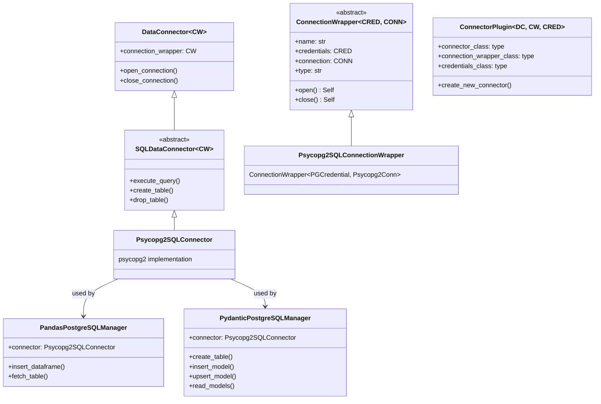

# Connection & Connector Architecture

## Part 1: Multi-Source Connection Configuration

### Overview

The connection configuration system supports loading configurations from multiple sources with configurable precedence. This enables flexible configuration management where sensitive values can be overridden via environment variables, while keeping base configurations in TOML files.

## Architecture Components

### 1. ConnectionConfigSource (Abstract Base Class)

Located in: `core/nld/connector/base/config_source.py`

Base class defining the interface for all configuration sources:

```python
import abc
from typing import Optional

from nld.connector.base.config_source import ConnectionConfigs

class ConnectionConfigSource(abc.ABC):
    @abc.abstractmethod
    def load(self) -> Optional[ConnectionConfigs]:
        """Load connection configurations from this source."""
        pass

    @abc.abstractmethod
    def is_available(self) -> bool:
        """Check if this source is available."""
        pass

    @abc.abstractmethod
    def get_priority(self) -> int:
        """Get the priority of this source (higher = higher priority)."""
        pass
```

### 2. TomlConnectionConfigSource

Loads configurations from TOML files (typically `secrets.toml`).

**Features:**
- Parses TOML structure with connections and profiles
- Supports file existence checking
- Configurable priority (default: 10)
- Optional `required` flag to enforce file existence

**TOML Format:**
```toml
[connection_name]
type = "connection_type"
param1 = "value1"
param2 = "value2"

[profile_name.connection_name]
param1 = "override_value1"
```

### 3. EnvironmentConnectionConfigSource

Loads configurations from environment variables.

**Features:**
- Configurable prefix (default: `NLD__DATA_CONNECTION`)
- Higher default priority (20) to override TOML
- Case-insensitive parameter names (converted to lowercase)

**Environment Variable Format:**
```bash
# Default profile parameters
NLD__DATA_CONNECTION__<CONNECTION_NAME>__<PARAM>=value

# Profile-specific parameters
NLD__DATA_CONNECTION__<CONNECTION_NAME>__<PROFILE_NAME>__<PARAM>=value

# Special parameters
NLD__DATA_CONNECTION__<CONNECTION_NAME>__TYPE=connection_type
NLD__DATA_CONNECTION__<CONNECTION_NAME>__CUSTOM_CONNECTOR=path.to.CustomClass
```

**Examples:**
```bash
# Snowflake connection
NLD__DATA_CONNECTION__SNOW_OPENDATA__TYPE=snowflake
NLD__DATA_CONNECTION__SNOW_OPENDATA__ACCOUNT=dummy.eu-west-3.aws
NLD__DATA_CONNECTION__SNOW_OPENDATA__USER=OPENDATA_USER
NLD__DATA_CONNECTION__SNOW_OPENDATA__PASSWORD=OPENDATA_PASSWORD

# Staging profile override
NLD__DATA_CONNECTION__SNOW_OPENDATA__STAGING__DATABASE=OPENDATA_STAGING

# Azure connection
NLD__DATA_CONNECTION__AZURE_OPENDATA__TYPE=azure_blob_storage
NLD__DATA_CONNECTION__AZURE_OPENDATA__STORAGE_ACCOUNT_NAME=dummy_storage
```

### 4. ConnectionConfigLoader

Manages multiple sources and merges configurations with precedence.

**Features:**
- Accepts list of sources
- Automatically sorts sources by priority (lowest to highest)
- Merges configurations with higher priority sources overriding lower
- Separate merging for default profiles and named profiles

**Merging Behavior:**
1. Process sources in priority order (lowest to highest)
2. For each connection:
   - Type and custom_connector: Overridden if provided by higher priority
   - Default profile: Parameters merged, higher priority overrides
   - Profiles: Each profile merged separately, higher priority adds/overrides parameters

## Usage

### Basic Usage with from_sources()

The simplest way to use multi-source loading:

```python
from nld.connector.base.config import ConnectionConfigs

# Load from all available sources (TOML + environment variables)
configs = ConnectionConfigs.from_sources("/path/to/config/directory")

# Use the configs
connection = configs.get_connection_config("snow_opendata")
params = connection.get_parameters_for_profile("staging")
```

### Custom Source Configuration

For more control, create sources and loader manually:

```python
from nld.connector.base.config_loader import ConnectionConfigLoader
from nld.connector.base.config_source import (
    TomlConnectionConfigSource,
    EnvironmentConnectionConfigSource,
)

# Create sources with custom priorities
sources = [
    TomlConnectionConfigSource(
        file_path="/path/to/secrets.toml",
        priority=10,
        required=True  # Fail if file doesn't exist
    ),
    EnvironmentConnectionConfigSource(
        prefix="NLD__DATA_CONNECTION",
        priority=20
    ),
]

# Load and merge
loader = ConnectionConfigLoader(sources)
configs = loader.load()
```

### Adding Custom Sources

Implement the `ConnectionConfigSource` interface:

```python
from typing import Optional
from nld.connector.base.config_source import ConnectionConfigSource, ConnectionConfigs

class CustomConfigSource(ConnectionConfigSource):
    def __init__(self, priority: int = 15):
        self.priority = priority

    def is_available(self) -> bool:
        # Check if source is available
        return True

    def get_priority(self) -> int:
        return self.priority

    def load(self) -> Optional[ConnectionConfigs]:
        # Load and return ConnectionConfigs
        # Return None if source is unavailable
        pass
```

## Default Configuration in NldExecContext

The system is automatically configured in `NldExecContext.init_profiles()`:

```python
# core/nld/task/context/context.py
from typing import Optional
from nld.connector.base.config_source import ConnectionConfigs

@classmethod
def init_profiles(cls, nld_profile_root_folder_path: Optional[str] = None):
    profile_root_folder_path = cls.get_profile_root_folder_path(
        nld_profile_root_folder_path
    )

    # Load from multiple sources with precedence
    # 1. secrets.toml (priority: 10)
    # 2. Environment variables (priority: 20 - higher)
    connection_configs = ConnectionConfigs.from_sources(profile_root_folder_path)

    # ... rest of initialization
```

## Precedence Rules

### Priority Values

- **Lower number** = Lower priority (loaded first)
- **Higher number** = Higher priority (overrides lower)

**Default Priorities:**
- TOML files: **10**
- Environment variables: **20**

### Merging Examples

#### Example 1: Simple Override

**secrets.toml:**
```toml
[myconn]
type = "snowflake"
account = "toml_account"
user = "toml_user"
password = "toml_password"
```

**Environment variables:**
```bash
NLD__DATA_CONNECTION__MYCONN__ACCOUNT=env_account
```

**Result:**
```python
config.type = "snowflake"           # From TOML
config.default_profile = {
    "account": "env_account",       # Overridden by env
    "user": "toml_user",            # From TOML
    "password": "toml_password"     # From TOML
}
```

#### Example 2: Profile Merging

**secrets.toml:**
```toml
[myconn]
type = "snowflake"
account = "base_account"

[staging.myconn]
database = "staging_db"
warehouse = "staging_wh"
```

**Environment variables:**
```bash
NLD__DATA_CONNECTION__MYCONN__STAGING__WAREHOUSE=env_wh
NLD__DATA_CONNECTION__MYCONN__STAGING__ROLE=env_role
```

**Result:**
```python
# Default profile
config.default_profile = {
    "account": "base_account"
}

# Staging profile
config.profiles["staging"] = {
    "database": "staging_db",       # From TOML
    "warehouse": "env_wh",          # Overridden by env
    "role": "env_role"              # Added by env
}

# When getting staging profile parameters (merged with default):
staging_params = {
    "account": "base_account",      # Inherited from default
    "database": "staging_db",       # From staging profile
    "warehouse": "env_wh",          # From staging profile
    "role": "env_role"              # From staging profile
}
```

## Selecting a Profile at Connection Time

A profile is resolved when a connector is opened, not only when reading
raw parameters. `NldExecutionContext.get_data_connector` and
`load_connector` accept an optional `profile_name`:

```python
# Default profile — parameters declared directly on the connection
connector = execution_context.get_data_connector("my_postgres")

# Named profile, merged over the default profile (named values win)
connector = execution_context.get_data_connector(
    "my_postgres", profile_name="staging"
)
```

When `profile_name` is omitted, the connector opens with
`default_profile`. When supplied, the named profile is merged over
`default_profile` via `ConnectionConfig.get_parameters_for_profile`, so
named values override the defaults. An unknown profile name raises
`UnavailableConnectionProfileException`.

The first `get_data_connector` call for a connection lazy-loads it under
the requested profile; the profile is fixed for the lifetime of that
loaded connector.

### Enumerating Selectable Profiles

`ConnectionConfig.get_available_profile_names()` returns every profile a
caller can select:

- `"default"` whenever the connection declares parameters directly (a
  non-empty `default_profile`),
- each named profile from `profiles`,
- `"default"` as the sole fallback when the connection declares neither.

This differs from `get_profile_names()`, which returns only the named
profiles. Use `get_available_profile_names()` for listings that must
surface the implicit default alongside named profiles.

### CLI Surface

`--profile-name` selects the profile on the subcommands that open a
connector:

- `nld connection debug`, `nld connection export-env-var`, and
  `nld connection get-structure` open the named connection under the
  selected profile.
- `nld flow state` read subcommands (`execution get-state`,
  `execution get-history`, `execution get-steps`,
  `incremental get-state`, `incremental get-planned`) select the
  credential profile of the state backend connection they read from.

Omitting the flag uses the default profile. `nld connection list` takes
no `--profile-name`; it reports each connection's selectable profiles
via `get_available_profile_names()`.

## Testing

Comprehensive tests are available in `tests/unit/connector/base/test_config_sources.py`:

- `test_toml_source_basic`: Basic TOML loading
- `test_environment_source_basic`: Basic environment variable loading
- `test_loader_with_precedence`: Multi-source precedence
- `test_loader_merge_profiles`: Profile merging from different sources

Run tests:
```bash
pytest tests/unit/connector/base/test_config_sources.py -v
```

## Migration Guide

### For Users

No changes required! The system automatically:
1. Looks for `secrets.toml` in the profile directory
2. Loads environment variables with `NLD__DATA_CONNECTION` prefix
3. Merges them with proper precedence

### For Developers

To add a new configuration source:

1. Create a class inheriting from `ConnectionConfigSource`
2. Implement required methods: `load()`, `is_available()`, `get_priority()`
3. Return `ConnectionConfigs` object from `load()`
4. Add to the sources list in your loader

Example:
```python
from typing import Optional
from nld.connector.base.config_source import ConnectionConfigSource, ConnectionConfigs

class VaultConfigSource(ConnectionConfigSource):
    def __init__(self, vault_url: str, priority: int = 25):
        self.vault_url = vault_url
        self.priority = priority

    def is_available(self) -> bool:
        return self._can_connect_to_vault()

    def get_priority(self) -> int:
        return self.priority

    def load(self) -> Optional[ConnectionConfigs]:
        # Fetch from vault and build ConnectionConfigs
        pass
```

---

## Part 2: Connector Engine Architecture

### Terminology

| Term | Definition |
|------|-----------|
| **Engine** | The driver/protocol used to connect to a backend. Examples: psycopg2, DuckDB, snowflake-connector-python. Each engine has its own connection wrapper and connector implementation. |
| **Adapter** | A data interface layer that translates between Python data structures and backend operations. Examples: Pandas (DataFrames), Pydantic (models). Adapters are scoped to a specific engine because they depend on engine-specific APIs. |
| **Connector** | The high-level interface for interacting with a backend. A connector type (e.g., PostgreSQL) can have multiple engines. |

### Base Layer

The base connector layer supports multi-engine patterns through generic type parameters:

```python
DataConnector[CONNECTION_WRAPPER: ConnectionWrapper[Any, Any]]
SQLDataConnector[CONNECTION_WRAPPER: ConnectionWrapper[Any, Any]]
ConnectionWrapper[CREDENTIAL_TYPE, CONNECTION_TYPE]
```

Each engine produces a different `ConnectionWrapper` specialization, and the
connector is parameterized by it. The `ConnectorPlugin` supports a
`custom_connector_class` parameter for engine selection.

### Directory Convention

Connectors follow this directory structure:

```
connector/<type>/
├── __init__.py                      → Plugin (default engine), backward-compat exports
├── <type>_credential.py             → shared across all engines
├── <type>_data_type.py              → shared data type definitions
├── engine/
│   └── <engine-name>/
│       ├── __init__.py
│       ├── connector.py             → engine-specific connector
│       ├── connection.py            → engine-specific connection wrapper
│       ├── query_builder.py         → engine-specific query building
│       ├── utils.py                 → engine-specific utilities
│       └── adapter/
│           ├── pandas/              → DataFrame adapter (engine-specific)
│           └── pydantic/            → Pydantic model adapter (engine-specific)
└── service/
    └── structure_reader.py          → engine-agnostic service
```

### PostgreSQL Connector Structure

```
nld/connector/postgresql/
├── __init__.py                      → Plugin (default: psycopg2 engine)
├── postgresql_credential.py         → shared across all engines
├── postgresql_data_type.py          → shared data type definitions
├── engine/
│   └── psycopg2/
│       ├── __init__.py
│       ├── connector.py             → Psycopg2SQLConnector
│       ├── connection.py            → Psycopg2SQLConnectionWrapper
│       ├── query_builder.py         → Psycopg2SQLQueryBuilder
│       ├── utils.py                 → Psycopg2SQLUtil
│       └── adapter/
│           ├── pandas/
│           │   ├── dataframe_manager.py → PandasPostgreSQLManager
│           │   └── structure_mapper.py  → PostgreSQLPandasMapper
│           └── pydantic/
│               ├── model_manager.py     → PydanticPostgreSQLManager
│               └── structure_mapper.py  → PostgreSQLPydanticStructureMapper
└── service/
    └── structure_reader.py          → PostgreSQLStructureReader
```

### DuckDB as Shared Engine

DuckDB is a standalone in-memory SQL engine for Parquet file operations. It has
no dependency on any specific connector type and lives in a shared location:

```
nld/connector/duckdb/
├── __init__.py
└── duckdb_engine.py                 → DuckDBEngine class
```

### Adapter Scoping

Adapters are scoped to a specific engine because they depend on engine-specific APIs:

| Adapter | Engine dependency | Specific API used |
|---------|------------------|-------------------|
| `PandasPostgreSQLManager` | psycopg2 | `psycopg2.extras.execute_values()` for batch inserts |
| `PydanticPostgreSQLManager` | psycopg2 | `psycopg2.sql.SQL()`, `sql.Identifier()`, `sql.Literal()` |

If a new engine needs DataFrame or Pydantic model support, it must provide its
own adapter implementations using that engine's API. Adapters live under the
engine they depend on:

```
connector/<type>/engine/<engine>/adapter/<adapter-name>/
```

### Class Hierarchy



### Engine Selection

Engine selection happens at the plugin level. The default engine is the primary
driver (psycopg2 for PostgreSQL).

```python
# Default: uses psycopg2 engine
connector = plugin.create_new_connector(name="pg", credentials_dict={...})

# Explicit engine: uses custom connector class
connector = plugin.create_new_connector(
    name="pg",
    credentials_dict={...},
    custom_connector_class=DuckDBPostgreSQLConnector,
)
```

For configuration-driven engine selection, the `ConnectionConfig` can include an
`engine` parameter that the factory resolves to the appropriate connector class.
