## Execution and Incremental Design

This document describes the execution logging and incremental processing architecture.

### Table of Contents

1. [Overview](#1-overview)
   - 1.1 [Architecture Diagram](#11-architecture-diagram)
   - 1.2 [Engine Architecture](#12-engine-architecture)
   - 1.3 [Flow Execution Workflow](#13-flow-execution-workflow)
2. [Incremental Processing Module](#2-incremental-processing-module)
   - 2.1 [Purpose](#21-purpose)
   - 2.2 [Key Classes](#22-key-classes)
   - 2.3 [State Classes Hierarchy](#23-state-classes-hierarchy)
   - 2.4 [Loading Strategies](#24-loading-strategies)
   - 2.5 [Incremental Types](#25-incremental-types)
   - 2.6 [Factory Pattern](#26-factory-pattern)
   - 2.7 [Backend and Engine Implementations](#27-backend-and-engine-implementations)
3. [Execution Logging Module](#3-execution-logging-module)
   - 3.1 [Purpose](#31-purpose)
   - 3.2 [Key Classes](#32-key-classes)
   - 3.3 [FlowExecutionInfo Properties](#33-flowexecutioninfo-properties)
   - 3.4 [FlowStepExecutionInfo Properties](#34-flowstepexecutioninfo-properties)
   - 3.5 [Step Tracking Decorator](#35-step-tracking-decorator)
   - 3.6 [Backend and Engine Implementations](#36-backend-and-engine-implementations)
4. [State Management Module](#4-state-management-module)
   - 4.1 [Purpose](#41-purpose)
   - 4.2 [Key Classes](#42-key-classes)
   - 4.3 [FlowStateManager Composition](#43-flowstatemanager-composition)
   - 4.4 [Dual State Backend (Primary + Optional Secondary)](#44-dual-state-backend-primary--optional-secondary)
   - 4.5 [Planned-state slot](#45-planned-state-slot)
5. [Processing Lifecycle](#5-processing-lifecycle)
   - 5.1 [Phase 1: Initialization](#51-phase-1-initialization)
   - 5.2 [Phase 2: Source Discovery](#52-phase-2-source-discovery)
   - 5.3 [Phase 3: Processing Determination](#53-phase-3-processing-determination)
   - 5.4 [Phase 4: Execution](#54-phase-4-execution)
   - 5.5 [Phase 5: Completion](#55-phase-5-completion)
6. [Usage in DataFlowTask](#6-usage-in-dataflowtask)
   - 6.1 [Defining a Task with Incremental Logic](#61-defining-a-task-with-incremental-logic)
7. [File Reference](#7-file-reference)
   - 7.1 [Incremental Module](#71-incremental-module)
   - 7.2 [Execution Module](#72-execution-module)
   - 7.3 [State Module](#73-state-module)

---

## 1. Overview

The flow state management system consists of three interconnected modules:

| Module | Purpose |
|--------|---------|
| **Incremental** | Determines what data needs to be processed based on loading strategy |
| **Execution** | Tracks flow and step execution metrics and history |
| **State** | Orchestrates both modules through a unified facade |

### 1.1 Architecture Diagram

```
┌──────────────────────────────────────────────────────────────────────────┐
│                          FlowStateManager                                │
│                       (Unified Facade Pattern)                           │
├────────────────────────────────────┬─────────────────────────────────────┤
│       ExecutionStateManager        │       IncrementalStateManager       │
│  ┌───────────────────────────────┐ │ ┌─────────────────────────────────┐ │
│  │ FlowExecutionInfo             │ │ │ Latest Incremental State        │ │
│  │ FlowExecutionHistory          │ │ │ Source State                    │ │
│  │ ExecutionBackendStateManager  │ │ │ Processing State                │ │
│  └───────────────────────────────┘ │ │ Post-Processing State           │ │
│               │                    │ │ IncrementalBackendStateManager  │ │
│               │                    │ └─────────────────────────────────┘ │
│               │                    │                 │                   │
└───────────────┼────────────────────┴─────────────────┼───────────────────┘
                │                                      │
                ▼                                      ▼
       ┌─────────────────┐                   ┌─────────────────┐
       │    Execution     │                   │   Incremental   │
       │     Backend      │                   │     Backend     │
       │ (S3, PG, Local)  │                   │ (S3, PG, Local) │
       │  ┌─────────────┐ │                   │  ┌───────────┐  │
       │  │   Engine     │ │                   │  │  Engine    │  │
       │  │  (pydantic,  │ │                   │  │ (pydantic, │  │
       │  │   duckdb)    │ │                   │  │  duckdb)   │  │
       │  └─────────────┘ │                   │  └───────────┘  │
       └─────────────────┘                   └─────────────────┘
```

### 1.2 Engine Architecture

An **engine** is a processing abstraction layer that determines **how** data is
serialized and queried within a backend. It is separate from the **backend**
(which determines **where** data is stored).

Each backend implementation is paired with an engine through a naming convention:

```
{backend_type}_with_{engine}.py
```

| Engine | Default Format | Supported Formats | Description |
|--------|---------------|-------------------|-------------|
| `pydantic` | json | json, parquet | Standard Python object serialization. Full dataset loading. This is the **default engine** when none is specified. |
| `duckdb` | parquet | parquet only | SQL-based processing via DuckDB. Supports optimized queries without full dataset loading. |

**Engine selection** is handled by the factories. When `engine=None`, it defaults
to `"pydantic"`:

```python
def _get_module_name(self, backend_type: str, engine: str | None) -> str:
    effective_engine = engine if engine else "pydantic"
    return f"{backend_type}_with_{effective_engine}"
```

**DuckDB-specific optimizations** available when using the duckdb engine:

| Method | Description |
|--------|-------------|
| `get_state_summary()` | Count total and succeeded states without loading full dataset |
| `retrieve_keys_by_status(statuses)` | Filter keys by status using SQL |
| `get_execution_count()` | Count executions without loading full dataset |
| `supports_optimized_queries()` | Returns `True` for DuckDB implementations |

### 1.3 Flow Execution Workflow

The following diagram shows the complete state retrieval and update workflow
during a `DataFlowTask.run()` execution. The flow is orchestrated by the
`DataFlowTask` which delegates state operations to the `FlowStateManager`,
which in turn coordinates the `ExecutionStateManager` and
`IncrementalStateManager`. Both managers persist state to their respective
backends.

```mermaid
sequenceDiagram
    participant Task as DataFlowTask
    participant StateManager as FlowStateManager
    participant Exec as ExecutionStateManager
    participant Incr as IncrementalStateManager
    participant ExecBE as Execution Backend
    participant IncrBE as Incremental Backend

    Note over Task: ── PRE-PROCESSING ──

    rect rgb(230, 240, 255)
        Note right of Task: get_latest_execution_state()
        Task->>StateManager: get_latest_execution_state()
        StateManager->>Exec: get_latest_execution_state()
        Exec->>ExecBE: retrieve_latest_execution_state()
        ExecBE-->>Exec: ExecutionState + ExecutionHistory
    end

    rect rgb(230, 255, 230)
        Note right of Task: get_incremental_state()<br/>Skipped entirely when<br/>tracks_state = False.

        alt tracks_state = True
            alt supports_planned_state AND backend_supports_planned_state<br/>AND --planned-state-policy ≠ RECOMPUTE
                Task->>StateManager: get_planned_processing_state()
                StateManager->>Incr: get_planned_processing_state()
                Incr->>IncrBE: read_state_plan + read_planned_processing_state
                IncrBE-->>Incr: FlowPlannedProcessingState | None

                alt plan available AND (TRUST OR is_planned_processing_state_fresh)
                    Task->>StateManager: use_planned_processing_state(plan)
                    StateManager->>Incr: use_planned_processing_state(plan)
                    Note right of Incr: Adopts the plan's processing<br/>state and records the plan
                else plan missing under STRICT
                    Task->>Task: raise NoPlannedStateException
                else plan stale under STRICT
                    Task->>Task: raise StalePlannedStateException
                else otherwise
                    Task->>Task: compute_incremental_state()
                end
            else otherwise
                Task->>Task: compute_incremental_state()
            end

            Note right of Task: compute_incremental_state()<br/>resolves the processing state<br/>from retrieve_current_state →<br/>optional retrieve_source_state →<br/>optional determine_logically_<br/>deleted_entries →<br/>determine_processing_state.
        end
    end

    rect rgb(220, 245, 255)
        Note right of Task: save_execution_start()
        Task->>StateManager: save_execution_start()
        StateManager->>Exec: save_execution_start()
        Exec->>ExecBE: save_execution_info_start(info)
        Note right of ExecBE: Upserts execution info header<br/>with commit=True for<br/>immediate visibility.
    end

    Note over Task: ── FLOW EXECUTION ──

    rect rgb(255, 250, 220)
        Task->>Task: run_flow()
        Note right of Task: Executes the actual data<br/>processing (SQL query,<br/>Python task, etc.)

        alt immediate_step_persistence = True (default)
            Task->>StateManager: save_step_completed(step)
            StateManager->>Exec: save_step_completed(step)
            Exec->>ExecBE: save_step_info(step)
            Note right of ExecBE: Inserts each step with<br/>commit=True. Step name is<br/>tracked in _saved_step_names<br/>for deduplication at final save.
        else immediate_step_persistence = False
            Note right of Task: Steps accumulate in memory.<br/>Saved in batch at end via<br/>save_all_execution_infos().
        end
    end

    Note over Task: ── STATUS UPDATE ──

    rect rgb(255, 240, 230)
        alt Success
            Task->>StateManager: update_execution_status_to_completed()
            StateManager->>Exec: update_execution_status_to_completed()
            alt auto_processing_state_transition=True
                StateManager->>Incr: processing_state.set_to_succeeded()
            end
        else Failure
            Task->>StateManager: update_execution_status_to_failed(error)
            StateManager->>Exec: update_execution_status_to_failed(error)
            alt auto_processing_state_transition=True
                StateManager->>Incr: processing_state.set_to_failed(error)
            end
        end
        Note right of StateManager: by_key tasks update per-key<br/>processing state inside run_flow()
    end

    Note over Task: ── POST-PROCESSING ──

    rect rgb(240, 230, 255)
        alt tracks_state = True AND no partial persistence
            Note right of Task: post_processing_for_state()
            Task->>StateManager: save_processed_state()
            StateManager->>Incr: save_processed_state()
            Incr->>IncrBE: write_processing_state(ProcessingState)
            Note right of IncrBE: Persists processing state<br/>with status and timestamps

            Task->>StateManager: create_post_processing_state()
            StateManager->>Incr: create_post_processing_state()
            Note right of Incr: If succeeded: updates<br/>last_pull_to_timestamp.<br/>If failed: preserves<br/>previous state unchanged.

            Task->>StateManager: save_post_processing_state()
            StateManager->>Incr: save_post_processing_state()
            Incr->>IncrBE: write_post_processing_state(FlowState)
            Note right of IncrBE: Upserts the updated or<br/>unchanged incremental state
        end
    end

    rect rgb(245, 235, 235)
        Note right of Task: post_processing_for_execution()
        Task->>StateManager: update_global_execution_state()
        StateManager->>Exec: update_global_execution_state()
        Note right of Exec: Appends to execution history.<br/>Builds new_execution_state only<br/>when strategy is not BACKFILL.

        Task->>StateManager: save_all_execution_infos()
        StateManager->>Exec: save_all_execution_infos()
        Exec->>ExecBE: save_all_execution_infos(info, history, state)
        Note right of ExecBE: Always saves execution info<br/>and step history.<br/>Only updates execution state<br/>for FULL, DELTA, BACKFILL_DELTA.
    end
```



**Key behaviors:**

- **On success:** the `FlowStateManager` transitions both the execution info
  to SUCCEEDED and the incremental processing state to SUCCEEDED. The
  post-processing state is updated with new timestamps or key statuses.
- **On failure:** the execution info and processing state are both marked
  FAILED. The post-processing state preserves the previous incremental state
  unchanged, so the next run retries from the same point.
- **On backfill:** the execution history is updated with the backfill run
  entry, but the execution state record is left unchanged. This ensures the
  next regular (DELTA) run still sees the previous state timestamps.
- **Processing state transition** is controlled by the
  `auto_processing_state_transition` flag on `FlowIncrementalDefinition`.
  When `True` (by_source_tst, no_increment), the base `FlowStateManager`
  automatically transitions the processing state alongside the execution
  state. When `False` (by_key), the child task is responsible for updating
  per-key processing states inside `run_flow()`.
- **Incremental step persistence** is controlled by the
  `immediate_step_persistence` flag on `IncrementalConfig`. When `True`
  (default), each step is saved to the backend immediately after completion
  via `save_step_completed()`. When `False`, steps accumulate in memory
  and are saved in a single batch at the end via `save_all_execution_infos()`.
  The deduplication mechanism (`_saved_step_names`) ensures steps already
  persisted incrementally are not re-inserted during the final batch save.
- **Step activation flags** on `FlowIncrementalDefinition` control which
  pre/post-processing steps are executed. `tracks_state` gates all state
  operations (retrieval, processing determination, persistence). When
  `False` (e.g. `no_increment`), no state methods run and no
  `@track_flow_step` entries are logged. `tracks_logical_deletion` gates
  logical deletion determination within the state block. When `False`
  (e.g. `by_source_tst`), that step is skipped since timestamp-based
  incremental processing has no concept of logical deletion.
- **Planned-state consumption** is controlled by
  `supports_planned_state` on `FlowIncrementalDefinition` (and the
  matching `supports_planned_state` ClassVar on
  `IncrementalBackendStateManager`). When both are `True`,
  `get_incremental_state` consults the planned-state slot per
  `--planned-state-policy`; otherwise it always falls through to
  `compute_incremental_state`. A consumed plan is transitioned to
  `COMPLETED` in `post_processing_for_plan` after a successful run; a
  failed run leaves it `PLANNED` so the next run can retry it.

---

## 2. Incremental Processing Module

### 2.1 Purpose

Manages different data loading strategies with a pluggable architecture. Determines which data items need to be processed based on historical state and current source state.

### 2.2 Key Classes

| Class | Description |
|-------|-------------|
| `FlowIncrementalDefinition` | Defines metadata for an incremental type including state classes, parameters, and step activation flags |
| `FlowIncrementalParams` | Abstract base for incremental parameters validation |
| `FlowIncrementalLogic` | Links definition, parameters, and logic together |
| `IncrementalStateManager` | Abstract state manager handling four state objects; holds an optional `secondary_incremental_state_backend_manager` that mirrors processing-state writes (post-processing state stays primary-only) |
| `IncrementalBackendStateManager` | Abstract interface for backend state persistence |
| `IncrementalConfig` | YAML-level per-flow configuration with `type`, `persist_initial_processing_state`, and `immediate_step_persistence` |

#### Definition vs Config vs Parameters

These three classes serve distinct roles in the incremental architecture:

| Class | Scope | Set by | When resolved | Purpose |
|-------|-------|--------|---------------|---------|
| `FlowIncrementalDefinition` | Per incremental **type** | Python code (class-level constant) | At import time | Declares the incremental type's capabilities: state classes, step activation flags, partial persistence support. Shared by all flows using the same incremental type. |
| `IncrementalConfig` | Per **flow** | YAML flow definition | At flow definition load | Per-flow behavioral settings: which incremental type to use, whether to persist initial state or steps immediately. Different flows using the same incremental type can have different configs. |
| `FlowIncrementalParams` | Per **execution** | CLI flags / runtime params | At task construction | Runtime parameters for a single execution: `--full` flag, backfill keys, limits. Resolved into a loading strategy (FULL, DELTA, BACKFILL). |

**How they compose:**

```
FlowIncrementalLogic (class-level on DataFlowTask)
├── definition: FlowIncrementalDefinition   ← type-level capabilities
└── parameter_class: type[FlowIncrementalParams]  ← creates runtime params

DataFlowDefinition (YAML)
└── incremental: IncrementalConfig          ← per-flow settings

At runtime:
  FlowIncrementalLogic.definition  → checked by DataFlowTask for step flags
  IncrementalConfig                → checked by DataFlowTask for persistence settings
  FlowIncrementalParams            → resolved strategy drives processing logic
```

#### IncrementalConfig Properties

| Property | Type | Default | Description |
|----------|------|---------|-------------|
| `type` | str | (required) | Incremental type name (e.g., `by_key`, `by_source_tst`) |
| `persist_initial_processing_state` | bool | `True` | When `True`, processing state is saved to backend immediately after determination |
| `immediate_step_persistence` | bool | `True` | When `True`, each step is saved to backend immediately after completion. When `False`, steps are saved in a single batch at the end. |

### 2.3 State Classes Hierarchy

```
FlowState (base)                    FlowSourceState (base)           FlowProcessingState (base)
├── ByKeyState                      ├── ByKeySourceState             ├── ByKeyProcessingState
│   └── keys: dict[str, SingleKey]  │   └── keys: dict[str, Source]  │   └── keys: dict[str, Processing]
├── BySourceTstState                ├── BySourceTstSourceState        ├── BySourceTstProcessingState
│   └── last_pull_to_timestamp      │                                 │   ├── pull_from_timestamp
│                                   │                                 │   ├── pull_to_timestamp
│                                   │                                 │   ├── processing_status
│                                   │                                 │   ├── process_error_message
│                                   │                                 │   └── processing_completed_at
└── NoIncrementState (empty)        └── NoIncrementSourceState       └── NoIncrementProcessingState
```

**State model display contract**

Every state model owns its own operator-facing text rendering so the generic
`nld flow state` renderer (`nld/flow/task/data_flow_state_renderers.py`) stays
free of strategy-specific field knowledge. Each strategy implements these
base-class methods on its own state models:

| Method | Declared on | Purpose |
|--------|-------------|---------|
| `render_state_text()` | `FlowState` and `FlowProcessingState` (abstract) | The multi-line text block that `nld flow state incremental get-state` prints — the `FlowState` implementation backs the default current-state view, the `FlowProcessingState` implementation backs `--processing-only` and the `compute` output. |
| `get_display_log()` | `FlowProcessingState` (abstract) | One-line run summary logged during execution. |
| `get_pull_timestamps()` | `FlowProcessingState` (base default returns `(None, None)`) | Overridden by timestamp strategies (`by_source_tst`) to expose the pull window; left as the default by strategies without one. |

A new incremental type therefore implements `render_state_text()` on both its
`FlowState` and its `FlowProcessingState` subclass. Strategy-specific rendering
helpers — for example `by_key`'s per-status counts and key samples
(`render_by_key_entries` in `nld/flow/incremental/impl/by_key/state.py`) — live
in the type's own `state.py`, never in the generic renderer.

### 2.4 Loading Strategies

| Strategy | Description |
|----------|-------------|
| `FULL` | Process all data from source |
| `DELTA` | Process only changes since last successful execution |
| `BACKFILL` | Re-process specific keys or ranges |
| `BACKFILL_DELTA` | Re-process with delta logic |

### 2.5 Incremental Types

#### 2.5.1 by_key

Tracks state at key-level granularity. Each key has its own status, timestamps, and metadata.

**State Statuses:**

| Status | Description |
|--------|-------------|
| `NOT_PROCESSED` | Key has never been processed |
| `SUCCEEDED` | Key was successfully processed |
| `FAILED` | Key processing failed |
| `DELETED` | Key was marked for deletion |

**Processing Statuses:**

| Status | Description |
|--------|-------------|
| `TO_BE_PROCESSED` | Key will be processed in this run |
| `EXCLUDED` | Key is excluded from processing |
| `TO_BE_DELETED` | Key will be deleted |
| `SUCCEEDED` | Processing completed successfully |
| `FAILED` | Processing failed |

**Processing Logic:**

```python
def update_processing_state(self):
    if strategy in [DELTA, BACKFILL_DELTA]:
        # Process keys not yet successfully processed
        for key in source_state.keys:
            if key not in latest_state or latest_state[key].status != SUCCEEDED:
                processing_state[key] = TO_BE_PROCESSED
    elif strategy == BACKFILL:
        # Use limit or specific keys list
        keys_to_process = params.keys or source_state.keys[:params.limit]
    elif strategy == FULL:
        # Process all keys
        for key in source_state.keys:
            processing_state[key] = TO_BE_PROCESSED
```

#### 2.5.2 by_source_tst

Tracks state based on source timestamps. Uses timestamp ranges to determine which
data to pull on each execution.

**State Properties:**

| Property | Type | Description |
|----------|------|-------------|
| `last_pull_to_timestamp` | datetime | End of the last successfully pulled range |

**Processing Logic:**

```python
def update_processing_state(self):
    if strategy == DELTA:
        # Pull from last successful end timestamp to now
        processing_state.pull_from_timestamp = latest_state.last_pull_to_timestamp
        processing_state.pull_to_timestamp = current_datetime()
    elif strategy == FULL:
        # Pull all data from the beginning to now
        processing_state.pull_from_timestamp = None
        processing_state.pull_to_timestamp = current_datetime()
```

**Supported Strategies:** `FULL`, `DELTA`, `BACKFILL`, `BACKFILL_DELTA`

**CLI parameters:** `--full`, `--with-delta`, `--pull-from`, `--pull-to`. These
are declared in `BY_SOURCE_TST_INCREMENTAL_DEFINITION.param_definitions`
(`nld/flow/incremental/impl/by_source_tst/logic.py`); the executor merges them into
the task's init params via `DataFlowDefinition.get_init_params_keys()`. A flag
not listed in `param_definitions` will not reach `BySourceTstFlowIncrementalParams`
and `resolve_strategy()` will fall back to `DELTA`.

#### 2.5.3 no_increment

Minimal implementation for full-load scenarios. Does not track historical state.

#### 2.5.4 Step Activation Flags

`FlowIncrementalDefinition` carries boolean flags that control which
pre-processing and post-processing steps are executed by `DataFlowTask`.
When a flag is `False`, the corresponding step methods are **not called** and
no `@track_flow_step` entries are recorded, preventing dummy log entries for
steps that have no meaningful work for a given incremental type.

| Flag | Description | Default | no_increment | by_source_tst | by_key |
|------|-------------|:-------:|:------------:|:-------------:|:------:|
| `tracks_state` | All state steps: retrieve incremental state, determine/save processing state, post-processing for state | `True` | `False` | `True` | `True` |
| `tracks_logical_deletion` | Determine logically deleted entries (only evaluated when `tracks_state` is `True`) | `True` | `False` | `False` | `True` |
| `requires_source_state_retrieval` | Call `retrieve_source_state()` (only evaluated when `tracks_state` is `True`) | `False` | `False` | `False` | `True` |
| `supports_planned_state` | Strategy can produce a `PLANNED` precomputed plan-time detailed state (consumed by `--planned-state-policy` on `nld flow execute`, written by `nld flow state incremental compute --persist`) | `False` | `False` | `True` | `True` |

Each incremental definition overrides only the flags whose default does
not match. `tracks_state` and `tracks_logical_deletion` default to
`True`; `requires_source_state_retrieval` and `supports_planned_state`
default to `False` so a new incremental type opts in explicitly when it
implements the corresponding entry points.

The flags are checked in `DataFlowTask.get_incremental_state()` (the
single entry point invoked from `pre_processing()`) and
`DataFlowTask.post_processing()`:

```python
def get_incremental_state(self) -> None:
    definition = self.incremental_definition
    if not definition.tracks_state:
        return

    # Plans require both the strategy and the backend to opt in.
    # When either is off, recompute the processing state directly.
    if (
        not definition.supports_planned_state
        or not self.state_manager.backend_supports_planned_state
    ):
        self.compute_incremental_state()
        return

    # Honour --planned-state-policy (PlannedStatePolicy.{AUTO, TRUST,
    # RECOMPUTE, STRICT}); RECOMPUTE skips the planned-state slot, AUTO
    # adopts a fresh plan and falls back to compute, TRUST adopts the
    # plan as-is, STRICT fails when no plan exists or the plan is stale.
    ...

def compute_incremental_state(self, save_step_log_to_backend: bool = True) -> None:
    definition = self.incremental_definition
    if not definition.tracks_state:
        return

    self.retrieve_latest_incremental_state()
    if save_step_log_to_backend:
        self._save_last_step_to_backend()

    if definition.requires_source_state_retrieval:
        self.retrieve_source_state()
        if save_step_log_to_backend:
            self._save_last_step_to_backend()

    if definition.tracks_logical_deletion:
        self.determine_logically_deleted_entries()
        if save_step_log_to_backend:
            self._save_last_step_to_backend()

    self.determine_processing_state()
    if save_step_log_to_backend:
        self._save_last_step_to_backend()

    if (
        self.incremental_config is not None
        and self.incremental_config.persist_initial_processing_state
    ):
        self.persist_initial_processing_state()
        if save_step_log_to_backend:
            self._save_last_step_to_backend()

def post_processing(self) -> None:
    if (
        self.incremental_definition.tracks_state
        and not self.state_manager.was_partial_state_persistence_used()
    ):
        self.post_processing_for_state()
    self.post_processing_for_plan()
    self.post_processing_for_execution()
    self.post_processing_at_end()
```

`get_incremental_state` is the orchestrating entry point: it picks
between consuming a `PLANNED` plan and recomputing the processing
state. `compute_incremental_state` keeps the pure recompute pipeline
and is what `get_incremental_state` falls back to when plans are off,
when no plan exists under AUTO/RECOMPUTE, or when an AUTO plan turns
out to be stale. `post_processing_for_plan` transitions a consumed plan
to `COMPLETED` on a successful run (see §4.5).

`determine_processing_state` is a pure computation step: it calls
`state_manager.init_processing_state()` followed by
`state_manager.update_processing_state()` to build the processing state
in memory. Persistence to the live processing-state slot is handled by
the separate `persist_initial_processing_state` step, which runs only
when `IncrementalConfig.persist_initial_processing_state` is `True`.
Splitting computation and persistence lets callers reuse the
computation without writing to the live slot.

`compute_incremental_state` accepts a `save_step_log_to_backend`
parameter (default `True`). When `False`, every nested step still runs,
but the per-step calls to `_save_last_step_to_backend()` are suppressed
— used by compute-only callers (e.g. the `nld flow state` CLI compute
path) that need the in-memory state without writing execution-history
rows for what was not an execution.

### 2.6 Factory Pattern

`IncrementalStateManagerFactory` dynamically loads implementations using a
backend + engine naming convention:

```python
# State manager module path
"nld.flow.incremental.{incremental_name}.manager"

# Backend module path (engine-aware)
"nld.flow.incremental.{incremental_name}.backend.{backend_type}_with_{engine}"
```

The factory resolves backends with a fallback mechanism:
1. Try loading `{backend_type}_with_{engine}` for the specified incremental type.
2. If not found, try loading `base_with_{engine}` as a fallback.
3. If the base module is abstract, raise an `ImplementationException`.

Results are cached using key `{backend_type}_{engine}` to avoid repeated imports.

### 2.7 Backend and Engine Implementations

| Incremental Type | Backend | pydantic | duckdb |
|------------------|---------|----------|--------|
| by_key | s3_blob_storage | ✅ | ✅ |
| by_key | postgresql | ✅ | ❌ |
| by_key | bigquery | ✅ | ❌ |
| by_key | duckdb | ✅ | ❌ |
| by_key | local | ✅ | ✅ |
| by_source_tst | postgresql | ✅ | ❌ |
| by_source_tst | bigquery | ✅ | ❌ |
| by_source_tst | snowflake | ✅ | ❌ |
| by_source_tst | duckdb | ✅ | ❌ |
| by_source_tst | local | ✅ | ❌ |
| no_increment | base (pass-through) | ✅ | ✅ |

**File naming pattern for backends:**

```
impl/{incremental_type}/backend/{backend_type}_with_{engine}.py
```

**Examples:**
- `impl/by_key/backend/s3_blob_storage_with_pydantic.py`
- `impl/by_key/backend/s3_blob_storage_with_duckdb.py`
- `impl/by_key/backend/postgresql_with_pydantic.py`
- `impl/by_key/backend/local_with_pydantic.py`

**Adding a New Incremental Backend:**

1. Create the backend module following the naming convention
   `{backend_type}_with_{engine}.py`.
2. Implement `IncrementalBackendStateManager` interface:

```python
class MyBackendStateManager(IncrementalBackendStateManager):
    param_definitions = [...]

    def retrieve_current_state(self) -> FlowState:
        pass

    def write_processing_state(self, state: FlowProcessingState):
        pass

    def write_post_processing_state(self, state: FlowState):
        pass
```

3. The factory automatically discovers the class via module inspection.

---

## 3. Execution Logging Module

### 3.1 Purpose

Tracks flow and step execution metrics, timing, status, and maintains execution history.

### 3.2 Key Classes

| Class | Description |
|-------|-------------|
| `FlowExecutionInfo` | Complete execution metadata including timing, status, and steps |
| `FlowStepExecutionInfo` | Per-step execution details with metrics |
| `FlowExecutionHistory` | List of all historical FlowExecutionInfo objects |
| `FlowExecutionState` | Wrapper containing last processed execution |
| `ExecutionStateManager` | Manages execution state operations including incremental step persistence; holds an optional `secondary_execution_state_backend_manager` for dual-write mirroring |
| `ExecutionBackendStateManager` | Abstract interface for backend storage with `save_execution_info()` (current run), `save_execution_history_complete()` (consolidated history, default no-op for row-based backends), `save_execution_state()`, `save_execution_info_start()`, and `save_step_info()`. The `save_all_execution_infos()` orchestrator on the same class invokes them in order. |

### 3.3 FlowExecutionInfo Properties

| Property | Type | Description |
|----------|------|-------------|
| `flow_uid` | str | Unique execution identifier |
| `namespace` | str | Flow namespace |
| `name` | str | Flow name |
| `instance_name` | str | Instance identifier |
| `requestor` | str | Who requested the execution |
| `data_load_strategy` | FlowLoadingStrategies | Loading strategy used |
| `started_at` | datetime | Execution start time |
| `ended_at` | datetime | Execution end time |
| `execution_status` | FlowExecutionStatus | SUCCEEDED, FAILED, SUCCEEDED_WITH_WARNING |
| `execution_error` | str | Error message if failed |
| `pull_from` | datetime | Start of incremental pull range (propagated from processing state) |
| `pull_to` | datetime | End of incremental pull range (propagated from processing state) |
| `previous_layer_last_updated_at` | datetime | MAX timestamp from previous layer (loaded from target table) |
| `source_extracted_at` | datetime | MAX source extraction timestamp (loaded from target table) |
| `source_last_updated_at` | datetime | MAX source last update timestamp (loaded from target table) |
| `steps` | list[FlowStepExecutionInfo] | List of step executions |

### 3.4 FlowStepExecutionInfo Properties

| Property | Type | Description |
|----------|------|-------------|
| `step_name` | str | Step identifier |
| `started_at` | datetime | Step start time |
| `ended_at` | datetime | Step end time |
| `duration_seconds` | float | Execution duration |
| `step_status` | FlowStepExecutionStatus | Step status |
| `step_error` | str | Error message if failed |
| `query` | str | Query executed (if applicable) |
| `source_entries` | int | Number of source entries processed |
| `target_entries_insert` | int | Number of inserts |
| `target_entries_update` | int | Number of updates |
| `target_entries_delete` | int | Number of deletes |

### 3.5 Step Tracking Decorator

The `@track_flow_step` decorator automatically manages `FlowStepExecutionInfo`
lifecycle. It supports both static and dynamic step names:

```python
# Static step name
@track_flow_step(step_name="Extraction")
def my_processing_step(self):
    # Step execution is automatically tracked
    pass

# Dynamic step name via callable
@track_flow_step(
    step_name=lambda self, key, **kw: f"Process key {key}",
)
def process_key(self, key: str) -> None:
    ...
```

When `step_name` is a callable, it receives `(self, *args, **kwargs)` from the
decorated method and must return a string. All existing static string usages
are unaffected.

### 3.6 Backend and Engine Implementations

| Backend | pydantic | duckdb |
|---------|----------|--------|
| s3_blob_storage | ✅ | ✅ |
| postgresql | ✅ | ❌ |
| bigquery | ✅ | ❌ |
| snowflake | ✅ | ❌ |
| duckdb | ✅ | ❌ |
| local | ✅ | ✅ |

The read-only accessors `get_latest_execution_info` and
`get_execution_history` have default implementations on
`ExecutionBackendStateManager` derived from
`retrieve_latest_execution_state`, so every backend supports the read
API used by the `nld flow state` CLI out of the box. Row-based backends
(PostgreSQL, BigQuery, Snowflake, DuckDB) override these with optimised
variants that join step-history rows in a dedicated query.

---

## 4. State Management Module

### 4.1 Purpose

Orchestrates both execution and incremental state through a unified facade pattern.

### 4.2 Key Classes

| Class | Description |
|-------|-------------|
| `FlowStateManager` | Central facade combining execution + incremental |
| `FlowByKeyStateManager` | Concrete implementation for by_key |
| `FlowBySourceTstStateManager` | Concrete implementation for by_source_tst |
| `FlowNoIncrementStateManager` | Concrete implementation for no_increment |
| `FlowStateManagerFactory` | Creates complete FlowStateManager instances |

### 4.3 FlowStateManager Composition

```python
class FlowStateManager:
    execution_state_manager: ExecutionStateManager
    incremental_state_manager: IncrementalStateManager

    # Properties delegate to composed managers
    @property
    def current_execution_info(self):
        return self.execution_state_manager.current_execution_info

    @property
    def execution_state(self):
        return self.execution_state_manager.previous_execution_state

    @property
    def processing_state(self):
        return self.incremental_state_manager.processing_state
```

`FlowStateManager.update_processing_state()` also propagates pull timestamps
from the processing state to the execution info via
`_propagate_pull_timestamps_to_execution_info()`. This copies `pull_from` and
`pull_to` from `FlowProcessingState.get_pull_timestamps()` to the
`FlowExecutionInfo`, making them available for execution logging.

### 4.4 Dual State Backend (Primary + Optional Secondary)

A flow definition may declare a secondary state backend in addition to
the primary via `state_backend_connector`:

```yaml
state_backend_connector:
  primary: postgres_metadata
  secondary:
    connector: s3_data_target
    params:
      file_format: parquet
```

Each side is a `StateBackendConnectorConfig(connector: str, params:
dict[str, Any])`. The bare-string shorthands —
`state_backend_connector: postgres_metadata` at the root and
`primary: postgres_metadata` on a side — are normalised to
`{primary: {connector: ...}}` / `{connector: ...}` by `field_validator`s
on `StateBackendConnector` and `DataFlowDefinition` (see
`core/nld/flow/definition/state_backend_connector.py`).

Backend-specific knobs live in `params` so primary and secondary can
differ. For example, an S3 secondary mirroring a PostgreSQL primary can
declare its own `file_format` without pushing that key onto the shared
model.

When both a project default and a flow value declare
`state_backend_connector`, `merge_state_backend_connectors` merges them:
flow `connector` wins per side, and `params` merge field-by-field with
flow params overriding project params.

The S3 base derives `s3_root_path` at backend construction time via
`determine_parameters_for_flow_definition` (declared on
`S3BackendMixin` and inherited by both the execution and incremental S3
state backends), reading the composed `S3Structure.s3_root_path`
(`s3_root_prefix` + `s3_folder_path`, defaulting to the structure name)
instead of relying on the surrounding task to hand-roll the path.

**Wiring.** `FlowStateManagerFactory.create_flow_state_manager` takes a
`state_backend_connector_wrapper: StateBackendConnectorWrapper | None`
and a `data_flow_definition: DataFlowDefinition | None`, then passes
them to:

- `ExecutionStateManagerFactory.create_execution_state_manager(
  state_backend_connector_wrapper, data_flow_definition, engine)` —
  builds the primary `ExecutionBackendStateManager` and, when
  `secondary` is set on the wrapper, a second one attached as
  `secondary_execution_state_backend_manager` on `ExecutionStateManager`.
- `IncrementalStateManagerFactory.create_incremental_state_manager(
  state_backend_connector_wrapper, data_flow_definition, engine,
  flow_namespace, flow_name, flow_uid)` — same pattern, exposed as
  `secondary_incremental_state_backend_manager`.

Each side of the wrapper builds independently. Backend parameter
precedence per side is **derived < `state_backend_connector.config.params`
< explicit kwargs**: parameters returned by the backend class's
`determine_parameters_for_flow_definition` are seeded first, then
overridden by the YAML `params` declared on that side of the wrapper,
then by any explicit keyword arguments. The primary and secondary
sides do not share `params`; an S3 secondary mirroring a PostgreSQL
primary derives `s3_root_path` from the typed structure and merges its
own `params` (e.g. `file_format`) on top.

**Read/write semantics.**

| Operation | Primary | Secondary |
|-----------|---------|-----------|
| All reads (latest execution state, processing state, history lookup) | Yes | Never |
| `save_execution_info_start`, `save_step_info`, `save_execution_info`, `save_execution_state` | Yes | Mirrored |
| `save_execution_history_complete` (consolidated history artifact) | Yes | **Never** |
| `write_processing_state` / `write_partial_processing_state` (incremental) | Yes | Mirrored |
| `write_post_processing_state` / `write_partial_post_processing_state` (incremental) | Yes | **Never** |

The primary remains authoritative. Each secondary call is wrapped in
`try/except` and logs a warning via `log_warn` on failure — the secondary
is best-effort, and a failure never aborts the flow. This design lets a
centralised metadata store (e.g. PostgreSQL) own the source-of-truth
state while a per-run artifact copy is co-located with the data on a
target connector (e.g. S3) without making the target the source of truth.

### 4.5 Planned-state slot

The planned-state slot stores a **precomputed plan-time detailed
state** — the work a flow's next run would do, resolved without
starting the run. The detailed state mirrors the live processing state
but is plan-time only: it omits or renames the execution-outcome
fields a plan cannot carry. It is independent of the live
processing-state slot: persisting
a plan never touches the live slot, and a recomputing run never
reads the planned slot. The writers are `nld flow state incremental
compute --persist` and the equivalent `nld flow execute
--state-compute-only` short-circuit; `nld flow execute
--planned-state-policy` controls how a subsequent run consumes the
plan (see the `how-to-get-incremental-info` skill).

**Two-layer opt-in.** Planned-state engagement is gated on both the
strategy and the backend; either off means a plan can never exist for
that flow.

| Layer | Field | Default | Built-in / mixin values |
|-------|-------|---------|-------------------------|
| Strategy | `FlowIncrementalDefinition.supports_planned_state` | `False` | `by_key=True`, `by_source_tst=True`, `no_increment=False` |
| Backend | `IncrementalBackendStateManager.supports_planned_state` (`ClassVar[bool]`) | `False` | `PostgreSQLIncrementalBackendMixin=True`, `S3IncrementalBackendMixin=True`; other backends inherit `False` |

`FlowStateManager.backend_supports_planned_state` exposes the backend
layer to callers; `True` requires a primary incremental backend that
opts in. `nld flow execute --planned-state-policy`,
`nld flow state incremental compute --persist`, and
`nld flow state incremental get-planned` all check the AND of the two
layers and emit a "not supported" notice when the result is `False`,
instead of letting the backend read raise.

**Model.** Three records in `core/nld/flow/incremental/models/state.py`:

- `FlowStatePlan` — lifecycle metadata only: `plan_state_uid`,
  `flow_namespace`, `flow_name`, `status`, `strategy`, `computed_at`,
  `status_changed_at`, `requestor`, `executed_by_flow_uid`.
- `FlowPlannedProcessingDetailedState[ProcessingState]` — the
  strategy-specific plan-time payload, keyed on `plan_state_uid` so it
  maps 1:1 onto the persisted planned row. It is generic over the live
  processing-state type purely to type its two converters:
  `to_processing_state(flow_uid)` builds the live state to execute from
  (defaulting the execution-outcome fields), and
  `from_processing_state(plan_state_uid, processing_state)` builds the
  plan-time detail from a freshly computed live state. Each strategy
  extends it with exactly the fields its planned row persists.
- `FlowPlannedProcessingState[DetailedState]` — extends `FlowStatePlan`
  with the `detailed_state` payload (a generic bound to
  `FlowPlannedProcessingDetailedState`); `to_state_plan()` returns the
  lifecycle metadata without the payload.

`status` is one of the `IncrementalPlanStatus` values:

| Status | Meaning |
|--------|---------|
| `PLANNED` | Active plan; at most one per `(flow_namespace, flow_name)`. |
| `CANCELLED` | Superseded by a newer plan, or cancelled explicitly. |
| `COMPLETED` | Consumed by a run; `executed_by_flow_uid` records which. |

`core/nld/flow/incremental/backend/plan.py` carries the
backend-agnostic row form `BackendStatePlanRow` plus
`state_plan_to_row` / `row_to_state_plan` helpers; connector mixins
project `FlowStatePlan` through this row to persist it.

**Primary backend only.** A plan is written and read on the **primary**
backend exclusively — the planned state is the single source of truth
for a precomputed plan. The secondary backend (the informational mirror
of the live processing state, §4.4) is never involved.

**Manager surface.** `FlowStateManager` exposes the following (each
delegating to `IncrementalStateManager`, which holds the primary
backend manager):

| Method | Behaviour |
|--------|-----------|
| `save_planned_processing_state(processing_flow_state, plan_state_uid, computed_at, requestor=None)` | Build the `PLANNED` plan and persist it. The strategy-specific detailed state — built from the freshly computed live state via `from_processing_state` — is written first; every other `PLANNED` state plan for the flow is then transitioned to `CANCELLED`; finally that state plan is written. |
| `get_planned_processing_state(plan_state_uid=None)` | Return the named plan, or the latest `PLANNED` plan by `computed_at`, as a `FlowPlannedProcessingState` (or `None`). Assembled from a state plan + its detailed-state payload via `definition.planned_processing_state_class`. |
| `get_planned_processing_states()` | Return every `PLANNED` state plan for the flow, newest first — backs `nld flow state incremental get-planned`. |
| `is_planned_processing_state_fresh(planned_processing_state)` | Whether a plan is still consistent with the latest baseline. The default returns `True`; strategies whose processing state derives from the latest incremental state override it (see "Per-strategy freshness" below). Consulted by AUTO and STRICT modes of `--planned-state-policy`. |
| `use_planned_processing_state(planned_processing_state)` | Convert the plan's detailed state to the live processing state for this run via `detailed_state.to_processing_state(flow_uid)`, record the plan on the state manager as `used_planned_processing_state`, and propagate its pull timestamps to the current `FlowExecutionInfo` (mirrors `update_processing_state`). |
| `update_plan_state_to_completed(plan_state_uid, executed_by_flow_uid)` | Transition a consumed plan to `COMPLETED`. Invoked by `DataFlowTask.post_processing_for_plan` on success. |
| `update_plan_state_to_cancelled(plan_state_uid)` | Transition a `PLANNED` plan to `CANCELLED`. |
| `used_planned_processing_state` (property) | The plan adopted by `use_planned_processing_state`, or `None`. Drives `post_processing_for_plan` and is also surfaced for renderers. |
| `backend_supports_planned_state` (property) | Backend-layer capability (`IncrementalBackendStateManager.supports_planned_state`); `False` when there is no primary backend at all. |

**Per-strategy freshness.** `is_planned_processing_state_fresh`
defaults to `True` so a strategy with explicit windows (no implicit
baseline) is always fresh. The built-ins override it:

- `by_key` — every plan is considered fresh: a plan may legitimately
  re-request a key that a later run already processed, so the baseline
  state cannot make a key plan stale.
- `by_source_tst` — `BACKFILL` and `FULL` plans (explicit windows) are
  always fresh. `BACKFILL_DELTA` plans are fresh only when the plan's
  `status_changed_at` is later than the baseline
  `last_pull_to_timestamp`. `DELTA` plans require the same condition
  *and* equality between the plan's `pull_from_timestamp` and the
  baseline watermark (DELTA derives its window from it). A `None`
  baseline (first run) makes every plan fresh by definition.

`NoPlannedStateException` (code `42002`) and
`StalePlannedStateException` (code `42003`) are raised by
`get_incremental_state` under STRICT mode when no plan is available or
the available plan is stale.

**Backend surface.** `IncrementalBackendStateManager` exposes one
composed read plus two sets of opt-in primitives:

| Method | Layer | Behaviour |
|--------|-------|-----------|
| `read_planned_processing_states()` | composed | Return the `PLANNED` state plans, newest first — composed from `read_state_plans()`. |
| `read_state_plan(plan_state_uid)` | state-plan primitive | Return a single state plan scoped to this flow. |
| `read_state_plans()` | state-plan primitive | Return every state plan for this flow, any status. |
| `write_state_plan(state_plan)` | state-plan primitive | Insert or update one state plan. |
| `read_planned_processing_state(plan_state_uid)` | detailed-state primitive | Read the strategy-specific detailed-state payload for a plan. |
| `write_planned_processing_state(plan_state_uid, detailed_state)` | detailed-state primitive | Persist the strategy-specific detailed-state payload for a new `PLANNED` plan. |

The state-plan primitives are provided by the connector mixin (one
shared implementation per connector type). The detailed-state
primitives are provided by the per-strategy backend (the table or file
layout depends on the strategy's `FlowPlannedProcessingDetailedState`
subtype).

**Lifecycle lives on the state manager, not the backend.**
`IncrementalStateManager` owns cancel-on-supersede, the `COMPLETED`
and `CANCELLED` transitions, and the assembly of the typed
`FlowPlannedProcessingState` from a state plan plus its detailed-state
payload. The backend is reduced to persistence primitives and the
single composed `read_planned_processing_states()`; it never
re-implements lifecycle rules. `save_planned_processing_state` writes
the detailed state first, then iterates `read_state_plans()` to flip
every other `PLANNED` plan to `CANCELLED` via `write_state_plan`, then
writes that state plan — so the slot holds at most one `PLANNED` plan
per flow and a reader never sees a state plan without its detailed-state
payload.

**Storage layout (state plan + per-strategy detailed state).** The
state plan carries the lifecycle metadata; the strategy-specific
detailed state lives in its own per-strategy slot keyed by
`plan_state_uid`.

- **PostgreSQL** — connector mixin
  `PostgreSQLIncrementalBackendMixin`
  (`core/nld/flow/incremental/backend/postgresql/backend_mixin.py`)
  persists state plans to the shared table `_nld_incremental_plans`
  via `BackendStatePlanRow`. Each per-strategy backend creates and
  owns its detailed-state table
  (`_nld_incremental_plans_by_key_planned_processing_state`,
  `_nld_incremental_plans_by_source_tst_planned_processing_state`),
  whose columns are the plan-time fields the strategy carries:
  `by_source_tst` holds `strategy` and the `pull_from_timestamp` /
  `pull_to_timestamp` window; `by_key` holds one row per key with
  `planned_processing_status` and `parameters`.
- **S3 blob** — connector mixin `S3IncrementalBackendMixin`
  (`core/nld/flow/incremental/backend/s3_blob_storage/backend_mixin.py`)
  persists all state-plan metadata for a flow in a single index file
  at `<state-root>/state_plans.<ext>`, keyed by `plan_state_uid` and
  encoded per the connector's `file_format` (`json` writes the full
  Pydantic envelope; `parquet` writes a rows table against
  `get_state_plans_index_schema()`, derived from `BackendStatePlanRow`
  via `PyArrowPydanticStructureMapper`). `read_state_plan` and
  `read_state_plans` resolve to one S3 GET regardless of plan-history
  length; `write_state_plan` is a single read-modify-write on the
  index. The mixin assumes a single writer per flow, matched by the
  cancel-on-supersede ordering in `IncrementalStateManager`. The
  per-strategy backend writes the detailed-state payload as a
  per-plan file under `<state-root>/plans/<plan_state_uid>/` — for
  `by_key`, `by_key_planned_processing_state.<ext>` carrying the
  `ByKeyPlannedProcessingDetailedState` — with the same `file_format`
  dispatch (JSON writes the full envelope; parquet writes a per-key
  rows table against `get_by_key_planned_processing_detail_schema()`
  and carries the envelope `flow_uid` / `strategy` in PyArrow schema
  metadata so it round-trips losslessly).

Completing or cancelling a plan updates only the state-plan record's
`status` / `status_changed_at` (and `executed_by_flow_uid` on
completion); the detailed-state payload is preserved so a consumed
plan stays auditable.

Which connector/engine combinations implement these methods (and the
execution-side read accessors) is tabulated in `backends/` (per
connector) and `incremental/` (per strategy).

---

## 5. Processing Lifecycle

### 5.1 Phase 1: Initialization

```python
# Create execution info
execution_info = FlowExecutionInfo(
    flow_uid="unique-id",
    flow_namespace="my_namespace",
    flow_name="my_flow",
    data_load_strategy=FlowLoadingStrategies.DELTA
)

# Create state manager via factory (default pydantic engine)
state_manager = FlowStateManagerFactory().create_flow_state_manager(
    incremental_type="by_key",
    flow_execution_info=execution_info,
    state_backend_connector_wrapper=state_backend_connector_wrapper,
    data_flow_definition=data_flow_definition,
)

# Or with DuckDB engine for optimized queries
state_manager = FlowStateManagerFactory().create_flow_state_manager(
    incremental_type="by_key",
    flow_execution_info=execution_info,
    state_backend_connector_wrapper=state_backend_connector_wrapper,
    data_flow_definition=data_flow_definition,
    engine="duckdb",
)
```

### 5.2 Phase 2: Source Discovery

```python
# Extract source state (application-specific)
source_state = ByKeySourceState()
for key in discover_source_keys():
    source_state.add_key(key, timestamp=key.last_modified)

# Set source state
state_manager.set_source_state(source_state)
```

### 5.3 Phase 3: Processing Determination

```python
# Initialize and update processing state
state_manager.init_processing_state()
state_manager.update_processing_state()

# Result: processing_state contains decisions
# - TO_BE_PROCESSED: Keys to process
# - EXCLUDED: Keys to skip
```

### 5.4 Phase 4: Execution

```python
# Process each key
for key in state_manager.processing_state.get_keys_to_process():
    try:
        process_key(key)
        state_manager.processing_state.set_to_succeeded(key)
    except Exception as error:
        state_manager.processing_state.set_to_failed(
            key_name=key,
            error=str(error)
        )
```

### 5.5 Phase 5: Completion

```python
# Create post-processing state (merges results with history)
state_manager.create_post_processing_state()

# Update execution status
state_manager.update_execution_status_to_completed()

# Persist states
state_manager.save_processed_state()
state_manager.save_post_processing_state()
state_manager.save_all_execution_infos()
```

#### Execution State: Previous vs New

The `ExecutionStateManager` maintains two execution state objects:

| Attribute | Set by | Purpose |
|-----------|--------|---------|
| `previous_execution_state` | `get_latest_execution_state()` | Loaded from backend at start of run |
| `new_execution_state` | `build_new_execution_state()` | Built at end of run with carried-forward timestamps |

When `update_global_execution_state()` runs, the current execution is always
appended to the execution history. For non-backfill strategies,
`build_new_execution_state()` also creates the new state. If the current
execution has `None` for technical timestamps (`previous_layer_last_updated_at`,
`source_extracted_at`, `source_last_updated_at`) — e.g., because no rows were
updated due to `IS DISTINCT FROM` optimization — the values are carried forward
from `previous_execution_state.last_processed`. For `BACKFILL` strategy,
`new_execution_state` is not built, leaving the previous state unchanged.

`ExecutionStateManager.save_all_execution_infos()` orchestrates three
backend methods:

| Method | Always called | What it persists | Mirrored to secondary? |
|--------|---------------|------------------|------------------------|
| `save_execution_info()` | Yes | Current run's execution info (header + steps not already saved incrementally) | Yes |
| `save_execution_history_complete()` | Yes | Consolidated execution history artifact (no-op for row-based backends — they already extend history through per-row inserts; overridden by artifact backends like S3 to rewrite the consolidated file) | **No** — primary only |
| `save_execution_state()` | Only for FULL, DELTA, BACKFILL_DELTA | Execution state record (with carried-forward timestamps) | Yes |

This split ensures that backfill runs are recorded in the execution history
while the global execution state remains unchanged for the next regular run,
and that the secondary backend (when configured) only ever holds per-execution
artifacts — never the global history file. Secondary write failures are
logged via `log_warn` and swallowed; the primary remains authoritative.

---

## 6. Usage in DataFlowTask

The `DataFlowTask` base class integrates state management with separate backends:

```python
class DataFlowTask(BaseTask, abc.ABC):
    # Optional class-level default. May be left as None when the
    # task is meant to be configured per-flow via the YAML
    # ``incremental`` config (e.g. SQLFlowTask).
    _INCREMENTAL_LOGIC: ClassVar[FlowIncrementalLogic[Any] | None] = None

    def init_state_manager(self) -> FlowStateManager[Any, Any, Any]:
        return FlowStateManagerFactory().create_flow_state_manager(
            incremental_type=self.incremental_logic.definition.category.lower(),
            flow_execution_info=self.flow_execution_info,
            state_backend_connector_wrapper=self._state_backend_connector_wrapper,
            data_flow_definition=self.data_flow_definition,
            **self._incremental_init_params,
        )
```

State-manager parameters come from two sources: values derived from the
typed flow context via the backend class's
`determine_parameters_for_flow_definition`, and per-side YAML under
`state_backend_connector.<side>.params`. Task subclasses do not inject
backend parameter overrides — `_incremental_init_params` carries
incremental-logic params only (e.g. `pull_field_name`,
`delta_period_*`, CLI flags), and the factory filters them against
each backend's declared `param_definitions`.

The single source of truth for "which incremental logic does this task
use at runtime" is the ``incremental_logic`` instance property, which
delegates to ``DataFlowDefinition.resolve_incremental_logic`` whenever
a flow definition is attached. Resolution priority is: per-flow
``incremental`` config in YAML → task class ``_INCREMENTAL_LOGIC``
ClassVar → ``NO_INCREMENT_FLOW_INCREMENTAL_LOGIC`` fallback. The
result is cached on the definition. There is no class-level entry
point: ``DataFlowTask.get_incremental_logic()`` and the
``get_init_params()`` override that appended incremental params have
been removed. Class-level introspection of the ClassVar default is
exposed by ``get_class_incremental_logic()`` (returns ``None`` when
unset). Internal call sites — ``DataFlowTask.__init__``,
``init_state_manager``, ``incremental_definition``,
``DataFlowDefinition.get_init_params_keys``,
``data_flow_info``, and the CLI parser
``parse_parameters_from_cli_for_data_flow_task`` — all read through
the resolver.

### 6.1 Defining a Task with Incremental Logic

```python
from nld.flow.incremental.by_key.logic import ByKeySourceFullFlowIncrementalLogic

class MyDataFlowTask(DataFlowTask):
    _INCREMENTAL_LOGIC = ByKeySourceFullFlowIncrementalLogic

    def run(self):
        # 1. Discover source
        self.state_manager.set_source_state(self.get_source_state())

        # 2. Determine what to process
        self.state_manager.init_processing_state()
        self.state_manager.update_processing_state()

        # 3. Process keys
        for key in self.state_manager.processing_state.get_keys_to_process():
            self.process_key(key)

        # 4. Finalize
        self.state_manager.create_post_processing_state()
        self.state_manager.save_post_processing_state()
```

---

## 7. File Reference

### 7.1 Incremental Module

The module is organised under `core/nld/flow/incremental/` into five
subpackages: `models/` (Pydantic models and definitions shared across
types — state, logic, config, plan), `base/` (abstract managers and SQL
filter contract), `backend/` (connector-specific planned-state
persistence mixins), `services/` (factory + registry), and `impl/`
(built-in types). `models/` is a leaf layer; `base/` depends downward on
it.

| File | Purpose |
|------|---------|
| `base/manager.py` | Abstract `IncrementalStateManager` (owns the planned-state lifecycle, §4.5) and `IncrementalBackendStateManager` (state-plan + processing-state persistence primitives, §4.5) |
| `base/sql_filter_manager.py` | Abstract SQL filter contract for incremental WHERE-clause injection |
| `models/logic.py` | Abstract `FlowIncrementalLogic`, `FlowIncrementalDefinition` (with step activation flags), and `FlowIncrementalParamDefinition` |
| `models/state.py` | Base state classes (`FlowState`, `FlowSourceState`, `FlowProcessingState`) and the planned-state models `FlowStatePlan`, `FlowPlannedProcessingState`, `FlowPlannedProcessingDetailedState` (§4.5) |
| `models/config.py` | `IncrementalConfig` with `type`, `persist_initial_processing_state`, `immediate_step_persistence` |
| `models/manifest.py` | `FlowIncrementalTypeManifest` describing a registered incremental type |
| `backend/plan.py` | `BackendStatePlanRow` and `state_plan_to_row` / `row_to_state_plan` helpers — the backend-agnostic row form of a state plan |
| `backend/postgresql/backend_mixin.py` | `PostgreSQLIncrementalBackendMixin` — state-plan persistence primitives for the planned-state slot on PostgreSQL |
| `backend/s3_blob_storage/backend_mixin.py` | `S3IncrementalBackendMixin` — state-plan persistence primitives for the planned-state slot on S3 |
| `models/referential.py` | Enums for states, selections, granularities, and `IncrementalPlanStatus` (§4.5) |
| `models/events.py`, `models/request.py`, `models/constants.py` | Shared events, request, and constant models |
| `services/factory.py` | `IncrementalStateManagerFactory` — resolves logic/manager/backend through the registry with engine resolution |
| `services/registry.py` | `FlowIncrementalTypeRegistry` — single lookup boundary for built-in and external types, seeded from `additional_incremental_types` in `nld_project.yml` |
| `impl/__init__.py` | Registers built-in `by_key`, `by_source_tst`, `no_increment` manifests on first import |
| `impl/by_key/logic.py` | ByKey parameter definitions |
| `impl/by_key/manager.py` | ByKeyStateManager with strategy-based logic |
| `impl/by_key/state.py` | ByKeyState, ByKeySourceState, ByKeyProcessingState |
| `impl/by_key/schema.py` | ByKey schema utilities |
| `impl/by_key/sql_filter_manager.py` | ByKey SQL filter (key-based IN clause) |
| `impl/by_key/backend/base_with_pydantic.py` | Base pydantic engine for by_key |
| `impl/by_key/backend/base_with_duckdb.py` | Base DuckDB engine for by_key |
| `impl/by_key/backend/s3_blob_storage_with_pydantic.py` | S3 backend with pydantic engine |
| `impl/by_key/backend/s3_blob_storage_with_duckdb.py` | S3 backend with DuckDB engine |
| `impl/by_key/backend/postgresql_with_pydantic.py` | PostgreSQL backend with pydantic engine |
| `impl/by_key/backend/bigquery_with_pydantic.py` | BigQuery backend with pydantic engine |
| `impl/by_key/backend/duckdb_with_pydantic.py` | DuckDB backend with pydantic engine |
| `impl/by_key/backend/local_with_pydantic.py` | Local filesystem backend with pydantic engine |
| `impl/by_key/backend/local_with_duckdb.py` | Local filesystem backend with DuckDB engine |
| `impl/by_source_tst/logic.py` | BySourceTst parameter definitions |
| `impl/by_source_tst/manager.py` | BySourceTstStateManager with timestamp-based logic |
| `impl/by_source_tst/state.py` | BySourceTstState, BySourceTstSourceState, BySourceTstProcessingState |
| `impl/by_source_tst/sql_filter_manager.py` | BySourceTst SQL filter (timestamp-based) |
| `impl/by_source_tst/backend/base_with_pydantic.py` | Base pydantic engine for by_source_tst |
| `impl/by_source_tst/backend/postgresql_with_pydantic.py` | PostgreSQL backend with pydantic engine |
| `impl/by_source_tst/backend/bigquery_with_pydantic.py` | BigQuery backend with pydantic engine |
| `impl/by_source_tst/backend/snowflake_with_pydantic.py` | Snowflake backend with pydantic engine |
| `impl/by_source_tst/backend/duckdb_with_pydantic.py` | DuckDB backend with pydantic engine |
| `impl/by_source_tst/backend/local_with_pydantic.py` | Local filesystem backend with pydantic engine |
| `impl/no_increment/logic.py` | NoIncrement parameter definitions |
| `impl/no_increment/manager.py` | NoIncrementStateManager (no-op) |
| `impl/no_increment/state.py` | Empty state classes |
| `impl/no_increment/sql_filter_manager.py` | NoIncrement SQL filter (pass-through) |
| `impl/no_increment/backend/base_with_pydantic.py` | Base pydantic engine (pass-through) |
| `impl/no_increment/backend/base_with_duckdb.py` | Base DuckDB engine (inherits from pydantic) |

### 7.2 Execution Module

| File | Purpose |
|------|---------|
| `execution_info.py` | FlowExecutionInfo, FlowStepExecutionInfo, history classes |
| `batch_execution_info.py` | Batch execution info aggregation for multi-flow runs |
| `manager.py` | ExecutionStateManager and ExecutionBackendStateManager (with default read accessors) |
| `factory.py` | ExecutionStateManagerFactory with engine resolution |
| `decorator.py` | @track_flow_step decorator |
| `events.py` | Execution lifecycle events |
| `schema.py` | PyArrow schema definitions for execution history artifacts |
| `utils.py` | Execution-side helpers |
| `backend/s3_blob_storage_base.py` | Shared S3 execution backend base |
| `backend/s3_blob_storage_with_pydantic.py` | S3 backend with pydantic engine |
| `backend/s3_blob_storage_with_duckdb.py` | S3 backend with DuckDB engine |
| `backend/postgresql_with_pydantic.py` | PostgreSQL backend with pydantic engine |
| `backend/bigquery_with_pydantic.py` | BigQuery backend with pydantic engine |
| `backend/snowflake_with_pydantic.py` | Snowflake backend with pydantic engine |
| `backend/duckdb_with_pydantic.py` | DuckDB backend with pydantic engine |
| `backend/local_with_pydantic.py` | Local filesystem backend with pydantic engine |
| `backend/local_with_duckdb.py` | Local filesystem backend with DuckDB engine |
| `backend/migrations/s3_blob_storage_to_parquet.py` | Migration helper for S3 execution artifacts |

### 7.3 State Module

| File | Purpose |
|------|---------|
| `manager/base.py` | FlowStateManager facade combining execution + incremental |
| `manager/by_key.py` | FlowByKeyStateManager |
| `manager/by_source_tst.py` | FlowBySourceTstStateManager |
| `manager/no_increment.py` | FlowNoIncrementStateManager |
| `factory.py` | FlowStateManagerFactory (orchestrator with engine pass-through) |
| `config/state_backend_connector.py` | `StateBackendConnector` and `StateBackendConnectorConfig` models, validators, and merge helpers |
| `state_backend_connector_resolver.py` | `StateBackendConnectorWrapper` resolving primary + optional secondary sides |
| `events.py` | State lifecycle events |
