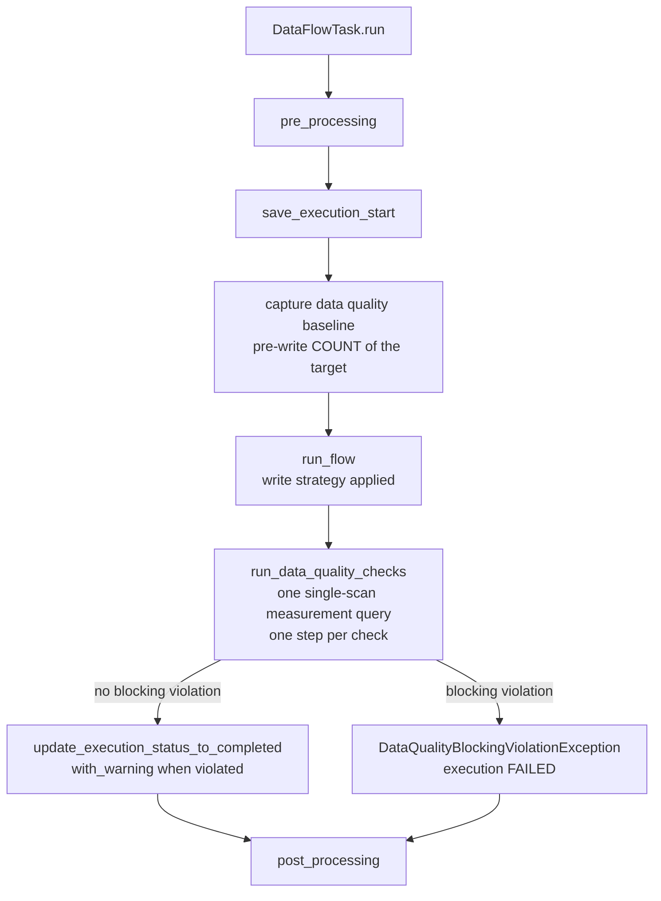

# Flow Data Quality Checks

This document is the reference for the nld-core data quality check system:
a post-write step of the flow execution lifecycle that evaluates rules
against the target structure and records the results as execution steps.
It complements `flow-design.md` (flow concepts), `flow-execute-internals.md`
(the `run()` pipeline the step is part of) and `flow-sql-execution.md`
(write strategies).

The implementation lives under `core/nld/flow/quality/` (models, rules,
registry, service, SQL measure builder), with the lifecycle hooks on
`DataFlowTask` (`core/nld/flow/task/data_flow_task.py`).

---

## 1. Lifecycle placement



- The **baseline** (a `COUNT(*)` of the target before the write) is captured
  only when a resolved check requires it (`row_count_growth`). A capture
  failure logs a warning and makes the dependent checks report themselves
  as skipped — a cold start never degrades the execution.
- Checks run **after** `run_flow()`, so after the write strategy and the
  SQL POST hooks. They apply to SQL flows, seed flows, and any
  `DataFlowTask` subclass that overrides `get_data_quality_context()` to
  expose its target connector and table path. Flows without a SQL target
  (e.g. S3 extractions) return None there and skip the step entirely.
- The task supplies that context **once per run**, when the quality
  service is created; the service then owns it for the whole run, which
  is why the baseline captured before the write is readable by the rules
  after it.
- A **measurement failure** (broken query, missing table) records a FAILED
  `Data Quality - Measurement` step and logs a warning, but never changes
  the execution status — like the technical-timestamps step, broken check
  infrastructure must not degrade an execution whose data was written.

## 2. Configuration — flow level only

Checks are configured exclusively in the flow definition's
`quality_checks` block. **No check runs without this block**: there are no
derived defaults and no project- or namespace-level check configuration.

```yaml
name: refined_web_hr_wttj_company
task_type: sql
write_strategy: UPSERT
quality_checks:
  checks:
    - rule: row_count_growth
      severity: warning
    - rule: column_not_empty
      column: cd_company_slug
    - rule: column_min_value
      column: nb_employees
      params:
        min: 0
      severity: blocking
    - rule: value_in_set
      columns:
        - cd_page_status
      params:
        values: [published, draft]
```

Accepted shorthands: `quality_checks: false` disables the whole step and
a bare list is promoted to `checks:`. The block uses `extra="forbid"` —
typos in keys fail validation instead of being silently dropped.

Per-check fields:

| Field | Meaning |
|---|---|
| `rule` | Rule name, validated against the rule registry at `check_coherence` time |
| `column` / `columns` | Target column(s), mutually exclusive; a `columns` list expands into one evaluated check per column |
| `params` | Rule-specific parameters, validated by the rule (unknown keys are errors) |
| `severity` | `warning` \| `error` \| `blocking` (case-insensitive, default `error`) |
| `enabled` | `false` keeps the check declared but skips it |

Declared checks are deduplicated per (rule, column) pair — the last
declaration wins. The `quality_checks` block is part of the flow
definition hash, so editing checks flags the flow as CHANGED on the next
`nld flow deploy`.

## 3. Built-in rules

| Rule | Scope | Required params | Optional params | Needs baseline |
|---|---|---|---|---|
| `row_count_growth` | table | — | — | yes |
| `column_not_empty` | column | — | `include_empty_strings` | no |
| `column_min_value` | column | `min` | `exclusive` | no |
| `column_unique` | column | — | — | no |
| `column_freshness` | column | `max_age_hours` | — | no |
| `value_in_set` | column | `values` | — | no |

NULL semantics: the threshold and set-membership counts never count NULLs
as violations (SQL three-valued logic), `column_unique` compares non-null
counts only (NULL keys never collide), and `column_freshness` treats
naive timestamps as UTC. NULL policing is `column_not_empty`'s job —
combine rules when NULLs must also be forbidden.

## 4. Status, severity and outcomes

A check result carries two orthogonal levels:

- **`status`** — what the rule found: `valid`, `warning` or `error`. Most
  rules are binary and only ever report `valid` or `error`, through the
  `resolve_binary_check_status(is_valid=…)` helper; a rule needing the
  middle ground — degraded but not broken — reports `warning` itself.
- **`severity`** — the level the check is *declared* with in the YAML
  (`warning` | `error` | `blocking`, default `error`). It decides how far
  a non-valid status escalates.

| Status | Declared severity | Step status | Execution status | Raises |
|---|---|---|---|---|
| `valid` | any | SUCCEEDED | — | no |
| `warning` | any | WARNING | `WARNING` (`SUCCEEDED_WITH_WARNING`) | no |
| `error` | `warning` | WARNING | `WARNING` | no |
| `error` | `error` | FAILED | `WARNING` | no |
| `error` | `blocking` | FAILED | `FAILED` | `DataQualityBlockingViolationException` (42004) |

- A `warning` **status** never fails a step whatever the declared
  severity: the rule already qualified its finding, so the severity can
  hold an error back but never escalate a warning.
- The `warning` and `error` severities never fail the run: the data is
  already written, the violation is a signal, not a rollback.
- `blocking` raises only **after every check result is recorded**, so
  diagnostics are never lost. The standard failure semantics then apply:
  batch runs skip transitive dependents, the incremental state does not
  advance (the next run reprocesses the same delta), and the finalized
  FAILED header is persisted to the execution history.
- A skipped check (e.g. row growth without a baseline) reports the `valid`
  status with the skip reason in its message.

The two levels are combined once, on the result itself — `is_valid`,
`is_step_failure` and `is_blocking` — so the step converter and the flow
task read a decision instead of recomposing the table above.

## 5. Result recording and display

Each evaluated check appends one execution step with the category
`DATA_QUALITY` and a unique name `Data Quality - <rule>[ - <column>]`.
The full result payload is carried in the step `metadata` dict — never in
new step columns, because the metadata backend tables are created once
and never ALTERed:

```json
{
  "rule": "column_min_value",
  "column": "nb_employees",
  "severity": "error",
  "status": "error",
  "violation_count": 18,
  "observed": -12,
  "expected": ">= 0",
  "message": "18 value(s) not >= 0"
}
```

- `violation_count` is the standardized number of rows not matching the
  check; rules whose violations are not row-scoped (freshness) leave it
  unset.
- `expected` is set only when it carries run-specific information (the
  captured baseline, a configured threshold or allowed set) — never when
  the rule name already implies it.
- Messages never repeat the column name (it is in the step name) nor the
  observed values (they are in the payload).

`nld flow state execution get-steps` renders the payload in a droppable
`check` column — `PASS|WARN|FAIL|SKIP [violations=N] [observed=…]
[expected=…]` — below the execution overview block. `WARN` covers both a
`warning` status and an `error` status held back by a `warning` severity.
Violations are logged at run time as
`Data quality check violated (<status>/<severity>): …`.

## 6. Measurement — one scan, engine-portable

All column measures of all checks are merged (deduplicated on alias) into
**one single-row aggregate SELECT** per flow, so N checks never cost N
table scans:

```sql
SELECT COUNT(*) AS "row_count",
       COUNT(cd_company_slug) AS "nn_cd_company_slug",
       MIN(nb_employees) AS "min_nb_employees",
       SUM(CASE WHEN nb_employees < 0 THEN 1 ELSE 0 END) AS "blw_nb_employees"
FROM acquisition_web_hr.refined_web_hr_wttj_company
```

The query is built with sqlglot (`core/nld/flow/quality/sql_measures.py`)
using the proven portability idiom: **column and table references stay
unquoted** (they resolve against the case the engine folded them to) and
**output aliases are quoted lowercase** (read back verbatim on every
dialect). The same SQL shape works on PostgreSQL, Snowflake, BigQuery,
and DuckDB with no per-engine override.

Measure kinds: `ROW_COUNT`, `NON_NULL_COUNT`, `DISTINCT_COUNT`,
`MIN_VALUE`, `MAX_VALUE`, `BELOW_THRESHOLD_COUNT`,
`ABOVE_THRESHOLD_COUNT`, `EMPTY_STRING_COUNT`, `NOT_IN_SET_COUNT`.

Alias caveat: deduplication assumes an alias uniquely identifies the
measure semantics. A rule whose parameterized measure could differ from
another rule's on the same column (e.g. a threshold count with a
different threshold) must use a rule-specific alias prefix instead of the
shared helpers.

## 7. Extensibility

External rules are `DataQualityRule` subclasses registered from
`nld_project.yml`:

```yaml
additional_quality_rules:
  - name: column_percentage_range
    rule_class: assets.utils.quality_rules.ColumnPercentageRangeRule
```

The registry (`DataQualityRuleRegistry`) seeds the built-ins on import and
rejects name collisions eagerly at project load, but only the manifest is
registered there (`register_manifest`): importing `rule_class`, validating
that it subclasses `DataQualityRule` with a `name` matching the manifest,
and instantiating it are deferred to the first `get()`/`has()` lookup of the
rule name. Loading a project for its metadata (scheduling, catalog info)
therefore never imports that project's own Python code — mirroring the
`FlowIncrementalTypeRegistry`/`additional_incremental_types` pattern. See
the `how-to-create-a-new-data-quality-check` skill for the full authoring
walkthrough.

## 8. Critical files

| File | Role |
|---|---|
| `core/nld/flow/quality/models/config.py` | `DataQualityChecksConfig`, `DataQualityCheckConfig`, severity vocabulary |
| `core/nld/flow/quality/models/result.py` | `DataQualityCheckResult` (step payload shape), `DataQualityCheckStatus`, the outcome properties |
| `core/nld/flow/quality/models/context.py` | `DataQualityContext` — target connector, table path, captured baseline |
| `core/nld/flow/quality/models/manifest.py` | `DataQualityRuleManifest` (`additional_quality_rules` entry) |
| `core/nld/flow/quality/rules/` | `DataQualityRule` ABC + the six built-in rules |
| `core/nld/flow/quality/registry.py` | Rule registry singleton |
| `core/nld/flow/quality/service.py` | Check resolution, target context ownership, measurement, evaluation |
| `core/nld/flow/quality/sql_measures.py` | Measure kinds + portable aggregate query builder |
| `core/nld/flow/task/data_flow_task.py` | Lifecycle hooks (`get_data_quality_context`, baseline, `run_data_quality_checks`) |
| `core/nld/flow/exceptions.py` | `DataQualityBlockingViolationException` |
