# NLD Flow Deployment

This document describes the architecture of the **flow deployment subsystem** in
nld-core: the `nld flow deploy plan` and `nld flow deploy execute` CLI commands,
the manifest contract that links them, and the metadata backend that makes
deployments idempotent and auditable.

The deployment subsystem lives under `core/nld/flow/deploy/` and orchestrates
both **structure DDL** (CREATE / ALTER) and **flow backfills** (DML) for a set
of in-scope flows, in topological order, with cascade-skip on failure.

---

## 1. User stories

This section is the entry point for developers and operators. It walks through
every realistic deployment scenario as a **user story** with a sequence diagram
showing the developer's interaction with the CLI and the system. Internal
mechanics (planner / executor / metadata backend) are summarised in §2 and
detailed in §3 onward.

> Convention used in the diagrams below : the **Dev** is the engineer running
> the CLI. **CLI** is the `nld` entrypoint. **Planner** and **Executor** are
> the `FlowDeployPlanner` and `FlowDeployExecutor` tasks. **DB** is the
> metadata backend (PostgreSQL / BigQuery / Snowflake) and the target
> database rolled into one actor for readability.

### 1.1 Story A — "I just want to deploy whatever changed since last time" *(default)*

**Persona** : any developer iterating against a target environment.<br/>
**Goal** : run a single command that diffs the current state against what is
deployed, shows the plan, asks for confirmation, and applies it.

This is the **default** behavior of `nld flow deploy execute` — no flags
needed. A manifest is built in memory; nothing is written to
`.deployments/flows/`. **Backfill is suppressed by default** in this mode so
a one-shot deploy never rewrites historical data unintentionally — pass
`--with-backfill` to opt in.

**Commands** :

```bash
nld flow deploy execute                       # interactive, no backfill
nld flow deploy execute --with-backfill       # interactive, FULL backfill
nld flow deploy execute --no-interactive      # CI mode, skip the prompt
```

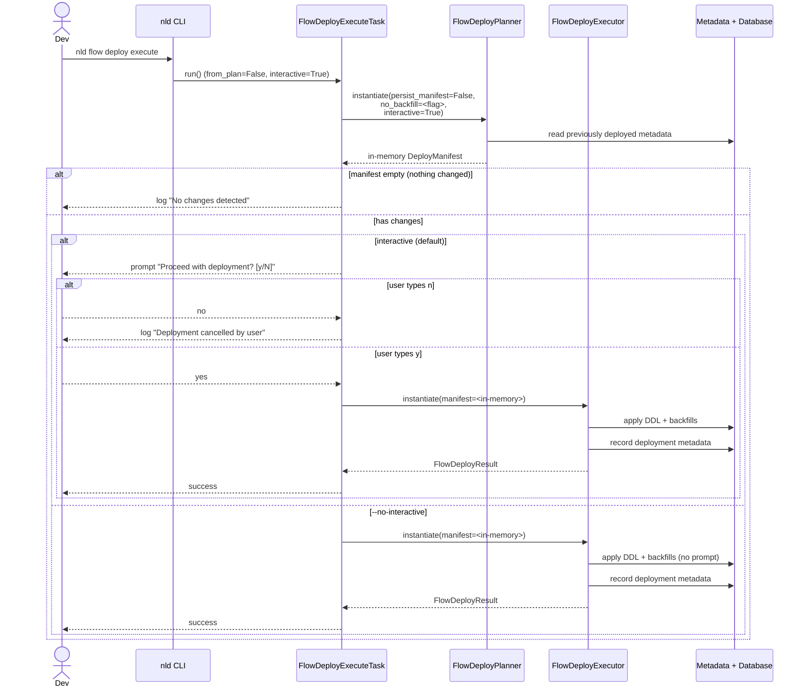

**Default suppression of backfill (no flags)** :

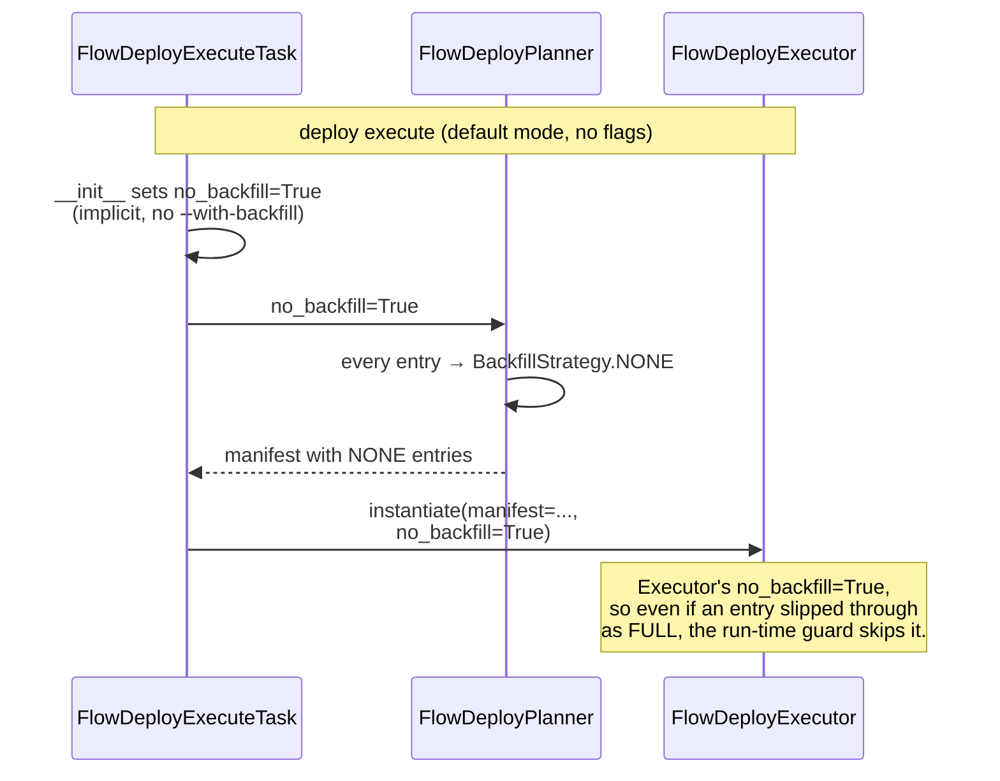

**`--with-backfill` opts in to backfill in default mode** :

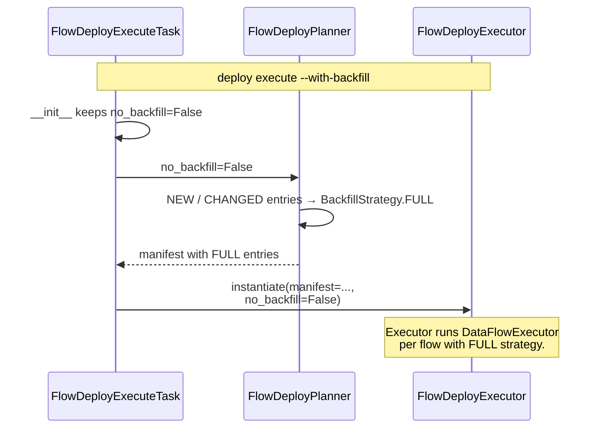

### 1.2 Story B — "I want a reviewable plan committed to git before applying"

**Persona** : team developer in a code-reviewed environment.<br/>
**Goal** : produce a manifest YAML that can be inspected, committed, and
reviewed before any DDL or backfill touches the database.

**Commands** :

```bash
nld flow deploy plan                               # writes a manifest
# review the YAML in .deployments/flows/<timestamp>_all.yaml
git add .deployments/flows/...
git commit -m "deploy: 3 new flows, 1 ALTER"
nld flow deploy execute --from-plan                # auto-discovers and applies
```

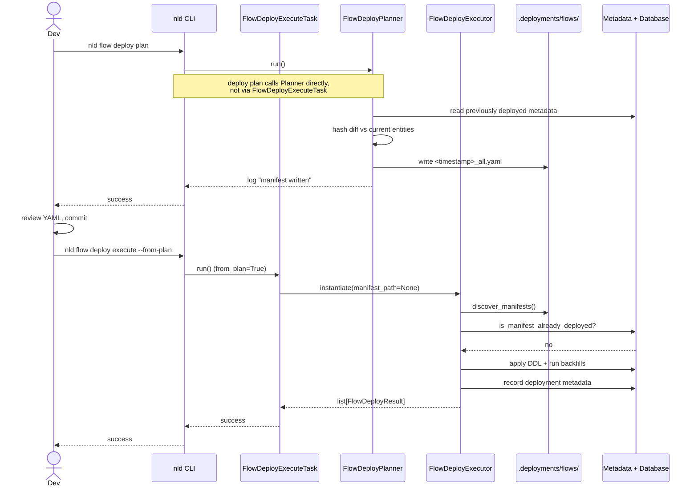

### 1.3 Story C — "I want to apply one specific manifest file"

**Persona** : operator picking up a peer-authored manifest.<br/>
**Goal** : skip auto-discovery and apply exactly one file.

`--manifest-path` automatically implies `--from-plan`.

**Commands** :

```bash
nld flow deploy execute --manifest-path .deployments/flows/20260514_120000_all.yaml
```

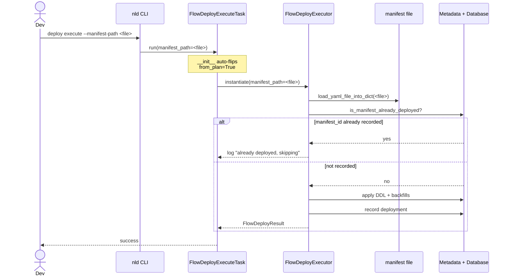

### 1.4 Story D — "I want to generate a plan without applying it"

**Persona** : developer preparing a deploy for review, or operator
auditing what would change.<br/>
**Goal** : produce a `DeployManifest` YAML in `.deployments/flows/` from the
current entity state without touching the database or the metadata backend.

`nld flow deploy execute --plan-only` (default in-memory mode) and
`nld flow deploy plan` are now **equivalent** : both call the planner with
`persist_manifest=True` and exit. `--plan-only` is **mutually exclusive**
with `--from-plan` and `--manifest-path` — generating a fresh plan and
applying an existing one are contradictory.

**Commands** :

```bash
nld flow deploy execute --plan-only        # equivalent to `deploy plan`
nld flow deploy plan                       # explicit planner command
```

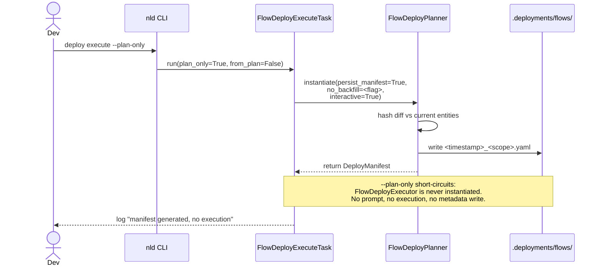

**Mutual exclusion** :

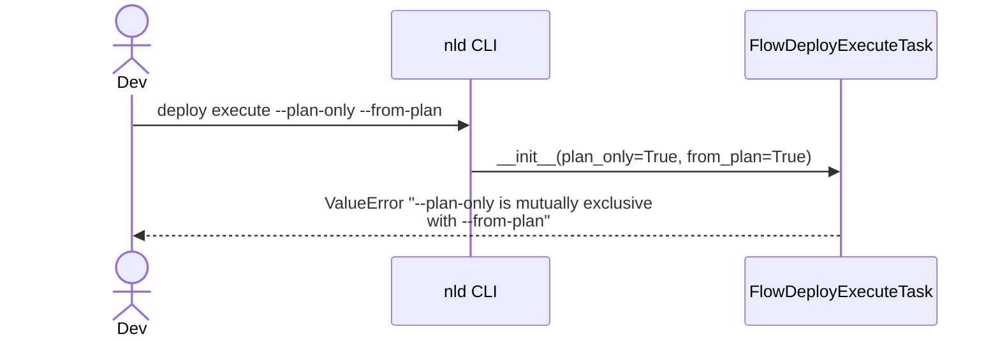

### 1.5 Story E — "I want to deploy from CI / a non-interactive script"

**Persona** : CI pipeline or scheduled deploy job.<br/>
**Goal** : run the default in-memory deploy without any prompt.

**Commands** :

```bash
nld flow deploy execute --no-interactive
nld flow deploy execute --no-interactive --no-backfill
```

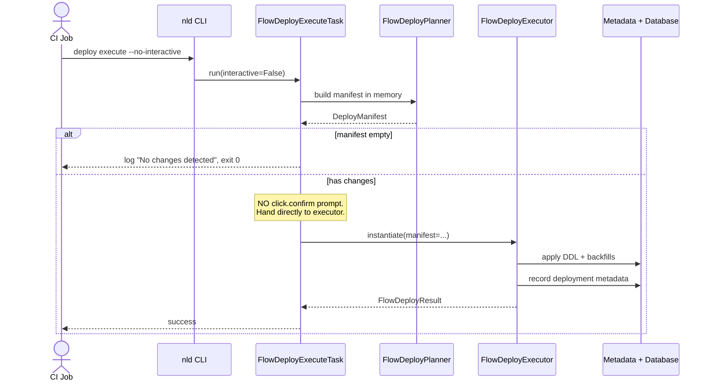

### 1.6 Story F — "I want to override a manifest's backfill strategy"

**Persona** : operator deploying a manifest that contains `FULL` entries
but who knows the database already holds the data.<br/>
**Goal** : apply DDL and record the deployment, but **skip** the backfill
that the manifest would otherwise trigger.

In **default mode**, backfill is already suppressed (Story A) so
`--no-backfill` is redundant. The flag is meant for **`--from-plan` mode**
where the manifest's `backfill_strategy` would otherwise drive a backfill.

**Commands** :

```bash
nld flow deploy execute --from-plan --no-backfill           # override manifest
```

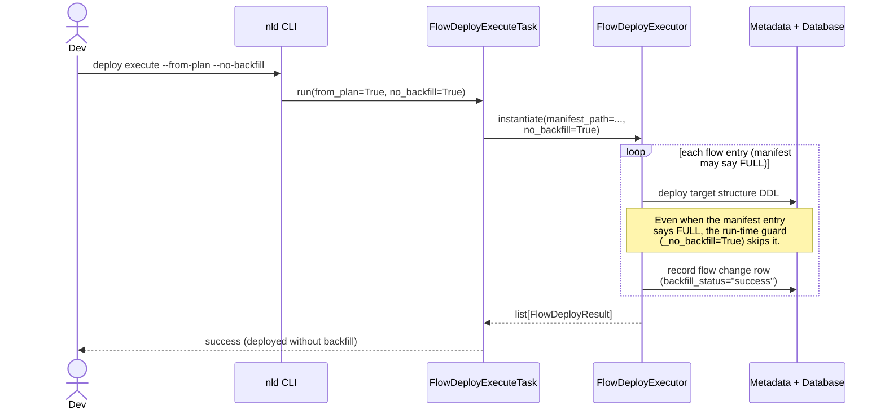

### 1.7 Story G — "A previous deployment failed, what happens on the next run?"

**Persona** : operator after a partial failure (a flow's backfill raised).<br/>
**Goal** : understand cascade-skip semantics and resume safely.

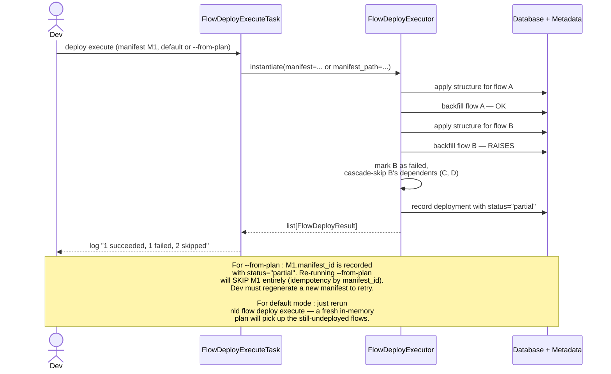

The **idempotency rule** : a manifest is identified by `manifest_id`. Once any
attempt has recorded that ID in `_nld_flow_deployment`, the manifest is
considered consumed. The default in-memory mode uses a fresh `manifest_id`
each run, so repeated invocations naturally retry until everything succeeds.

### 1.8 Story H — "I removed a flow, what gets deployed?"

**Persona** : developer cleaning up a deprecated flow.<br/>
**Goal** : understand what `REMOVED` does on deploy.

```mermaid
sequenceDiagram
    participant Task as FlowDeployExecuteTask
    participant Planner as FlowDeployPlanner
    participant Executor as FlowDeployExecutor
    participant DB as Metadata
    Task->>Planner: instantiate + run
    Planner->>DB: read previously deployed flows
    Planner->>Planner: detect flow X in metadata,<br/>missing from current entities
    Planner->>Planner: emit FlowDeployEntry(action=REMOVED,<br/>backfill_strategy=NONE)
    Planner-->>Task: manifest with REMOVED entry
    Task->>Executor: instantiate(manifest=...)
    Note over Executor,DB: REMOVED is recorded but does NOT<br/>drop tables. The structure_deploy<br/>subsystem only ALTERs / CREATEs;<br/>cleanup of the underlying table is<br/>a manual operation.
```

### 1.9 Story summary

| Story | Command | Manifest on disk | Interactive | Backfill |
|-------|---------|------------------|-------------|----------|
| A — default deploy | `execute` | **no** (in-memory) | yes (default) | **suppressed by default** ; pass `--with-backfill` to opt in |
| B — review-then-apply | `plan` then `execute --from-plan` | yes | n/a (manifest pre-baked) | governed by manifest entries |
| C — apply one manifest | `execute --manifest-path` | yes | n/a | per-entry strategy |
| D — generate plan only | `execute --plan-only` (≡ `deploy plan`) | yes (written) | n/a | not executed |
| E — CI / scripted | `execute --no-interactive` | no | **no prompt** | suppressed by default ; combine with `--with-backfill` to backfill in CI |
| F — override manifest backfill | `execute --from-plan --no-backfill` | yes | n/a | overrides manifest, suppresses globally |
| G — recover from failure | rerun (default) or new plan (`--from-plan`) | depends | depends | per-entry strategy |
| H — flow removed | rerun deploy | depends | depends | none (REMOVED → NONE) |

---

## 2. Pipeline overview

The `nld flow deploy execute` command is split into three layers, each
with a single responsibility:

1. **`FlowDeployExecuteTask`** (`core/nld/flow/task/flow_deploy_execute_task.py`)
   — the **orchestrator**. The CLI wires its flags here. It validates
   mutual-exclusion rules, decides whether to plan in memory or load a
   pre-generated manifest, and instantiates the underlying tasks.
2. **`FlowDeployPlanner`** (`core/nld/flow/deploy/flow_deploy_planner.py`)
   — produces a `DeployManifest` from the current entity state and
   (optionally) writes it to `.deployments/flows/`.
3. **`FlowDeployExecutor`** (`core/nld/flow/deploy/flow_deploy_executor.py`)
   — applies a `DeployManifest`. Either the in-memory manifest passed by
   the orchestrator, a single `manifest_path`, or auto-discovered files
   in `.deployments/flows/`. The executor never calls the planner.

Two execution modes are exposed by the orchestrator:

1. **Default — in-memory plan** (Story A) : the orchestrator builds a
   `DeployManifest` in memory via
   `FlowDeployPlanner(persist_manifest=False)`, optionally prompts the user,
   and hands the manifest to `FlowDeployExecutor(manifest=...)`. Nothing
   is written to `.deployments/flows/`. **Backfill is suppressed by
   default** — pass `--with-backfill` to opt in. This is the right mode
   for everyday iteration and CI automation.
2. **`--from-plan` — manifest-based** (Stories B, C, D) : the orchestrator
   skips the planner; the executor loads a pre-generated `DeployManifest`
   from `.deployments/flows/` (auto-discovery) or from `--manifest-path`.
   This is the right mode for code-reviewed deployments where the
   manifest is committed to git. `--manifest-path` automatically implies
   `--from-plan`.

Both modes share the same `_execute_deployment` body inside the
executor — DDL apply, interleaved backfill, cascade-skip, deployment
metadata recording — and use the same `DeployManifest` schema.

The manifest is the **contract** in either mode. It carries:

- `manifest_id` — UUID used to dedupe re-runs against the metadata backend
  (only persisted in `--from-plan` mode; in default mode each run gets a
  fresh ID).
- `scope` — the planner inputs (`flow_name`, `namespace`, `upstream`,
  `downstream`).
- `flows` — `FlowDeployEntry` list with action (`NEW`, `CHANGED`, `UNCHANGED`,
  `REMOVED`), backfill strategy, and per-hash change information.
- `structures` — `StructureDeployEntry` list with action
  (`CREATE`, `ALTER`, `NONE`) and field / characterisation diffs.
- `links` — `DeployLink` edges describing flow → structure and structure → flow
  dependencies, used by the executor for ordering and cascade-skip.

The standalone `nld flow deploy plan` command continues to write a manifest
YAML to `.deployments/flows/<timestamp>_<scope>.yaml` for review-then-apply
workflows.

### 2.1 Internal interaction at a glance

The CLI talks to **`FlowDeployExecuteTask`** (the orchestrator). The
orchestrator owns the routing logic and is the only layer that imports
both `FlowDeployPlanner` and `FlowDeployExecutor`.

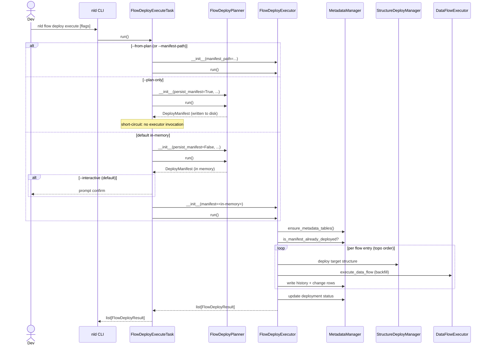

---

## 3. Orchestrator — `FlowDeployExecuteTask`

`core/nld/flow/task/flow_deploy_execute_task.py` is a `StandardTask` and
the **single CLI entry point** for `nld flow deploy execute`. It owns:

- The CLI flag set : `from_plan`, `interactive`, `manifest_path`,
  `no_backfill`, `plan_only`, `with_backfill`.
- The mutual-exclusion checks (`--plan-only` ⊥ `--from-plan`,
  `--with-backfill` ⊥ `--from-plan`, `--with-backfill` ⊥ `--no-backfill`).
- The `--manifest-path` ⇒ `--from-plan` auto-implication.
- The default-suppression rule for backfill (default mode + no
  `--with-backfill` ⇒ `no_backfill = True`).
- The interactive confirmation prompt before applying an in-memory plan.
- Routing : decide whether to invoke `FlowDeployPlanner`,
  `FlowDeployExecutor`, or both, and in what order.

### 3.1 Public surface

```python
class FlowDeployExecuteTask(StandardTask):
    def __init__(
        self,
        from_plan: bool = False,
        interactive: bool = True,
        manifest_path: str | None = None,
        no_backfill: bool = False,
        plan_only: bool = False,
        with_backfill: bool = False,
    ) -> None: ...

    def run(self) -> list[FlowDeployResult]: ...
```

### 3.2 Routing decision tree

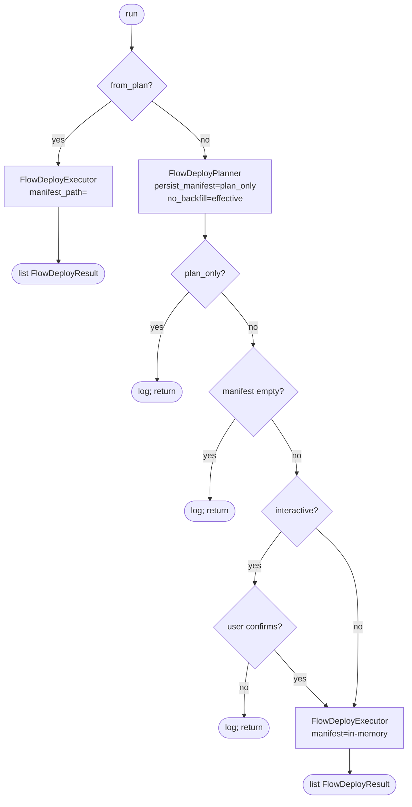

### 3.3 Why split this layer out?

Before this split, `FlowDeployExecutor` carried both the orchestration
state (`from_plan`, `interactive`, `with_backfill`) and the apply logic.
That made the executor harder to test in isolation and pulled the
planner import into a class whose stated responsibility was applying
manifests.

With the split:

- `FlowDeployExecutor` is **planning-agnostic**. It has no knowledge of
  `FlowDeployPlanner`. Its inputs are a manifest (in memory or on disk).
- `FlowDeployPlanner` is unchanged.
- `FlowDeployExecuteTask` is the only place that knows about both, which
  makes the routing logic obvious to the reader and easy to test in
  isolation by stubbing the planner / executor.

---

## 4. Planner — `FlowDeployPlanner`

`core/nld/flow/deploy/flow_deploy_planner.py` is a `StandardTask` that produces
a `DeployManifest` from the current state of entities.

### 4.0 Planner internal sequence

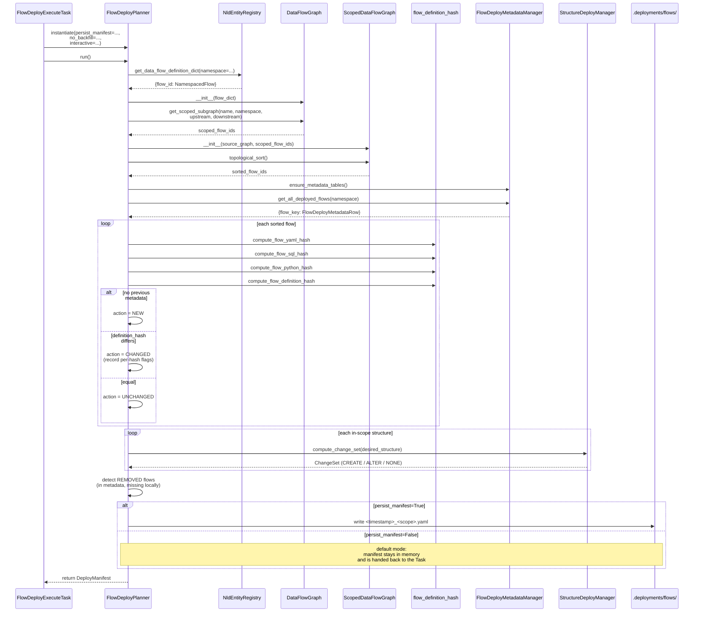

### 4.1 Pipeline

| Step | Description |
|------|-------------|
| 1 | Load all flow definitions from the entity registry. |
| 2 | Build a `DataFlowGraph` and resolve the in-scope flow IDs from `name` / `namespace` / `upstream` / `downstream`. |
| 3 | Topologically sort the scoped subgraph. |
| 4 | Read previously deployed flow rows (`FlowDeployMetadataRow`) from the metadata backend. |
| 5 | For each flow, compute YAML / SQL / Python / definition hashes and compare against the previous deployment to derive an action (`NEW`, `CHANGED`, `UNCHANGED`). |
| 6 | Build `StructureDeployEntry` for each in-scope structure that has a CREATE or ALTER diff against the live database (skipping structures managed by flow execution, external sources, and non-table structures). |
| 7 | Detect `REMOVED` flows (present in metadata, missing from the current state). |
| 8 | Assemble the `DeployManifest`, log metrics, and persist it to `.deployments/flows/`. |

### 4.2 Backfill strategy assignment

Inside `_build_flow_entry`, the default backfill strategy follows a simple rule:

- `--no-backfill` set → `BackfillStrategy.NONE`
- `action == UNCHANGED` → `BackfillStrategy.NONE`
- otherwise → `BackfillStrategy.FULL`

`COLUMN`-level backfill is recognised in the manifest schema but currently
falls back to `FULL` at execute time (see §5.4).

### 4.3 Persistence

The manifest filename encodes the scope and timestamp:

| Scope | Suffix |
|-------|--------|
| `--name my_flow` | `flow_my_flow` |
| `--namespace source.crm` | `ns_source_crm` |
| neither | `all` |

The full filename is `<YYYYMMDD_HHMMSS>_<suffix>.yaml`. A new
`persist_manifest=False` flag suppresses the disk write — used by the
executor's `--without-plan` mode to keep an in-memory plan transient.

---

## 5. Executor — `FlowDeployExecutor`

`core/nld/flow/deploy/flow_deploy_executor.py` applies one or more manifests.

### 5.0 Executor internal sequence (per manifest)

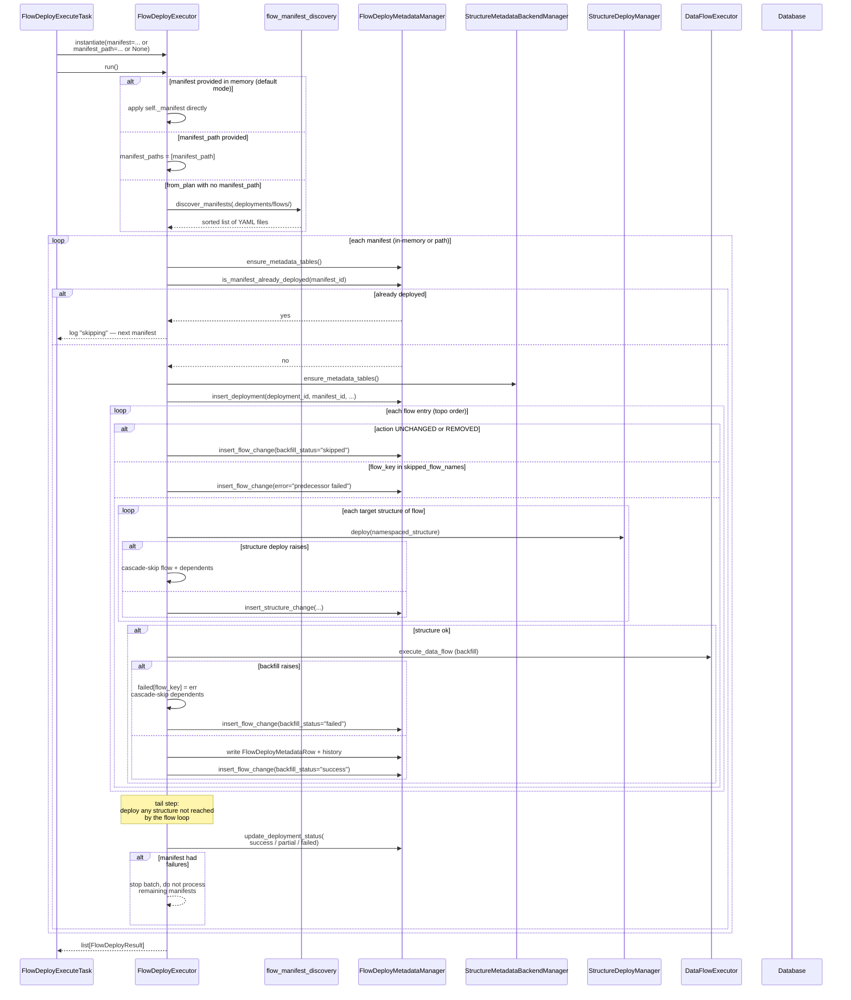

### 5.1 Manifest resolution

`run()` chooses the manifest source in this order:

1. **Default** (`--from-plan` not set) → build an in-memory plan (§8).
2. `--manifest-path <file>` set → auto-implies `--from-plan` and uses that
   single file.
3. `--from-plan` set without `--manifest-path` → `discover_manifests` lists
   all `.yaml` files under `<entities_root>/.deployments/flows/` in sorted
   order.

If multiple manifests are discovered, they are processed sequentially and
**execution stops on the first manifest with any failure**.

### 5.2 Idempotency

Before executing a manifest, the executor checks the metadata backend:

```sql
SELECT 1 FROM <metadata_schema>._nld_flow_deployment WHERE manifest_id = ?
```

If `manifest_id` is already recorded, the manifest is skipped. This makes the
auto-discovery loop safe to re-run.

### 5.3 Interleaved structure + flow execution

For each flow entry in the manifest's topological order:

1. Skip `UNCHANGED` and `REMOVED` flows (they are recorded as `skipped`).
2. Skip flows whose predecessors failed (cascade-skip via the `links`
   adjacency map).
3. Deploy each target structure of the flow that has not already been
   deployed. Failure here cascades-skip both the current flow and its
   dependents.
4. Run the backfill (`_execute_flow_backfill`) according to the entry's
   `backfill_strategy`, unless `--no-backfill` or `--plan-only` is set.
5. Record the deployment in the metadata backend.

After the flow loop, any structures that were not reached (e.g. structures
without a targeting flow in scope) are deployed as a tail step.

### 5.4 Backfill strategies

| Strategy | Behavior |
|----------|----------|
| `NONE` | No backfill executed. |
| `FULL` | `DataFlowExecutor.execute_data_flow` runs the flow end-to-end. |
| `COLUMN` | Currently falls back to `FULL`. The connector-specific column UPDATE path is reserved for future work. |

### 5.5 `--plan-only`

When `--plan-only` is set, the executor logs the DDL it would issue
(`[PLAN] Would execute: <sql>`) and skips both the actual DDL apply and any
metadata writes. Useful for reviewing the impact of a manifest before
applying it.

### 5.6 `--no-backfill`

When `--no-backfill` is set during execution, the per-flow backfill is
suppressed regardless of the entry's `backfill_strategy`. Structure DDL and
metadata bookkeeping still run. In default in-memory mode (§8), `--no-backfill`
also propagates to the planner so that no entry in the in-memory manifest is
assigned `FULL` to begin with.

---

## 6. Manifest schema

Defined in `core/nld/flow/deploy/flow_deploy_manifest.py`:

```python
class DeployManifest(NldBaseModel):
    manifest_id: str
    version: str = "1.0"
    created_at: datetime.datetime
    scope: DeployScope                         # name, namespace, upstream, downstream
    flows: list[FlowDeployEntry]
    structures: list[StructureDeployEntry] = []
    links: list[DeployLink] = []

class FlowDeployEntry(NldBaseModel):
    namespace: str
    flow_name: str
    action: FlowDeployAction                   # NEW | CHANGED | UNCHANGED | REMOVED
    backfill_columns: list[str] = []
    backfill_strategy: BackfillStrategy = BackfillStrategy.NONE
    hash_changes: FlowHashChanges | None = None

class StructureDeployEntry(StructureDeployManifestEntry):
    field_naming_change_mapping: dict[str, str] = {}
    # action, namespace, structure_name, field_diffs, characterisation_diffs

class DeployLink(NldBaseModel):
    source_id: str
    source_type: str          # "flow" or "structure"
    target_id: str
    target_type: str
```

---

## 7. Metadata backend

The deploy subsystem persists state in the metadata backend connector
configured on the project (`metadata_backend_connector`). All tables live
under the connector's active schema.

| Table | Purpose |
|-------|---------|
| `_nld_flow_deployment` | One row per manifest applied. Tracks `manifest_id`, totals, status (`success` / `partial` / `failed`), counts. |
| `_nld_flow_deployment_flow_change` | One row per flow-level change in a deployment. Records `backfill_status` and any `error_message`. |
| `_nld_flow_deployment_structure_change` | Links a flow deployment to a structure deployment for full traceability. |
| `_nld_flow_deploy_metadata` | Current-state row per flow (latest `flow_definition_hash`, `flow_yaml_hash`, etc.). |
| `_nld_flow_deploy_history` | Append-only history of flow deployments, with `previous_deployment_id` chaining. |

The structure-side metadata (per-structure deployment IDs and DDL history) is
managed by `StructureMetadataBackendManager` from the structure deploy
subsystem — see the `guide-structures` skill.

---

## 8. Default mode internals — in-memory plan

The default mode of `nld flow deploy execute` (no `--from-plan` flag)
collapses planning and execution into a single command.

1. The executor instantiates `FlowDeployPlanner` with
   `persist_manifest=self._plan_only`, `no_backfill=self._no_backfill`,
   and `interactive=self._interactive`.
2. The planner builds a `DeployManifest` from the current entity state.
   When `--plan-only` is set, the planner also writes the manifest YAML to
   `.deployments/flows/<timestamp>_<scope>.yaml`. Otherwise, the manifest
   stays in memory.
3. **`--plan-only` short-circuits** : the executor logs
   `--plan-only set: manifest generated, no execution.` and returns. No
   prompt, no DDL apply, no metadata write. Equivalent to
   `nld flow deploy plan`.
4. Otherwise, the executor logs a one-line summary
   (`<n> flow change(s), <m> structure change(s). Backfill suppressed: <bool>.`).
5. If the manifest is empty (no flows and no structures), the executor logs
   `No changes detected — nothing to deploy` and returns.
6. If `--interactive` is set (the default), the executor prompts with
   `click.confirm("Proceed with deployment?", default=False)`. If the user
   declines, the executor logs `Deployment cancelled by user` and returns.
7. Otherwise, the executor runs the standard `_execute_deployment` path on
   the in-memory manifest — full DDL apply, backfills, metadata recording.

### 8.1 Backfill is suppressed by default ; `--with-backfill` opts in

In default mode, the executor's `__init__` sets `no_backfill=True` whenever
`--with-backfill` is not passed:

```python
if not from_plan and not with_backfill:
    no_backfill = True
```

This produces a one-shot `deploy execute` that **never rewrites historical
data unintentionally**. To deploy AND backfill from current state in one
shot, the operator opts in explicitly with `--with-backfill`.

`no_backfill` is forwarded both to the planner constructor and kept on the
executor instance:

- **Planning phase** : `FlowDeployPlanner(no_backfill=<effective>)` →
  entries are emitted with `BackfillStrategy.NONE` (default) or `FULL`
  (with `--with-backfill`).
- **Execution phase** : `FlowDeployExecutor(no_backfill=<effective>)` →
  backfill is skipped at run time when `True`, even if a `FULL` entry
  slipped through.

Both layers are belt-and-braces by design : the planner controls what gets
written into the manifest, the executor controls what actually runs.

In `--from-plan` mode the planner is not invoked at all, so the manifest's
`backfill_strategy` entries drive the runtime behavior. `--no-backfill`
remains the override knob there.

### 8.2 `--interactive / --no-interactive`

| Flag | Behavior |
|------|----------|
| `--interactive` (default) | Show `click.confirm` prompt before applying. Required when the developer is at a terminal and wants a final review. |
| `--no-interactive` | Skip the prompt entirely and apply the in-memory plan straight through. The right choice for CI pipelines and scheduled jobs. |

The flag is forwarded to the planner as well. Has no effect in `--from-plan`
mode (manifests are pre-baked, no plan-time interactivity is meaningful at
execute time).

### 8.3 `--manifest-path` implies `--from-plan`

When the user passes `--manifest-path <file>`, the executor's `__init__`
auto-flips `from_plan=True`. This keeps existing CI / scripted callers using
`--manifest-path` working unchanged, and avoids the awkward case where the
user passes `--manifest-path` without realising the default mode would
ignore it.

```python
if manifest_path is not None:
    from_plan = True
```

### 8.4 `--plan-only` is mutually exclusive with `--from-plan`

`--plan-only` generates a fresh plan from the current state, while
`--from-plan` applies an already-generated manifest. Combining them is
contradictory. Enforced in `__init__`:

```python
if plan_only and from_plan:
    raise ValueError(
        "--plan-only is mutually exclusive with --from-plan ..."
    )
```

Since `--manifest-path` implies `--from-plan`, `--plan-only --manifest-path`
also raises.

### 8.5 `--plan-only` ≡ `nld flow deploy plan`

In default mode, `nld flow deploy execute --plan-only` and
`nld flow deploy plan` produce the same output : a manifest YAML in
`.deployments/flows/`. Both call `FlowDeployPlanner.run()` with
`persist_manifest=True` and exit. The two commands coexist for
discoverability — operators preferring an explicit planner command can
keep using `deploy plan`, while developers iterating on `deploy execute`
can stay on a single command and just add `--plan-only` when they want to
review the manifest before executing.

### 8.6 When to use which mode

| Scenario | Recommended command |
|----------|---------------------|
| Local iteration / ad-hoc deploy from current state (no backfill) | `nld flow deploy execute` |
| One-shot deploy + backfill from current state | `nld flow deploy execute --with-backfill` |
| CI pipeline (DDL only, no backfill) | `nld flow deploy execute --no-interactive` |
| CI pipeline (DDL + backfill) | `nld flow deploy execute --no-interactive --with-backfill` |
| Generate a manifest YAML for review | `nld flow deploy execute --plan-only` (or `nld flow deploy plan`) |
| Code-reviewed deploy from a committed manifest (with backfill per entry) | `nld flow deploy plan` then `nld flow deploy execute --from-plan` |
| Apply a manifest, override its backfill | `nld flow deploy execute --from-plan --no-backfill` |
| Apply a specific manifest file | `nld flow deploy execute --manifest-path <file>` |

---

## 9. CLI reference

### 9.1 `nld flow deploy plan`

| Option | Purpose |
|--------|---------|
| `--name <flow>` | Limit scope to a single flow. |
| `--namespace <ns>` | Limit scope to a namespace. |
| `--upstream` | Include upstream lineage. |
| `--downstream` | Include downstream lineage. |
| `--interactive / --no-interactive` | Toggle prompts (rename candidates, etc.). |
| `--no-backfill` | Suppress backfill in the resulting manifest. |
| `--root-folder-path <path>` | Override `nld_root_folder_path`. |

### 9.2 `nld flow deploy execute`

| Option | Purpose |
|--------|---------|
| (no flags) | **Default — in-memory plan mode.** Build a plan from the current state, prompt to confirm, apply. |
| `--from-plan` | Opt back into the manifest-based pipeline (auto-discover from `.deployments/flows/` or use `--manifest-path`). |
| `--manifest-path <file>` | Apply a single manifest file. Auto-implies `--from-plan`. |
| `--interactive / --no-interactive` | Show / skip the confirmation prompt in the default mode. Defaults to `--interactive`. Use `--no-interactive` for CI. Has no effect in `--from-plan` mode. |
| `--plan-only` | In default mode, write the planned manifest YAML to `.deployments/flows/` and exit — equivalent to `nld flow deploy plan`. Mutually exclusive with `--from-plan` and `--manifest-path`. |
| `--with-backfill` | Opt in to backfill in the default in-memory mode (suppressed by default to avoid rewriting historical data). Mutually exclusive with `--from-plan` and `--no-backfill`. |
| `--no-backfill` | Skip backfill. In `--from-plan` mode, overrides the manifest's `backfill_strategy` entries and skips globally. Redundant in default mode (already suppressed). |
| `--root-folder-path <path>` | Override `nld_root_folder_path`. |

---

## 10. Cross-references

- Structure DDL diff and apply, structure metadata history :
  `guide-structures` skill.
- Per-flow incremental processing (state managers, by_key / by_source_tst) :
  `guide-incremental` skill.
- Flow execution lifecycle, write strategies, SQL execution :
  `flow-design.md`, `flow-sql-execution.md`, `flow-execute-internals.md`
  (this same `guide-flows` skill).
