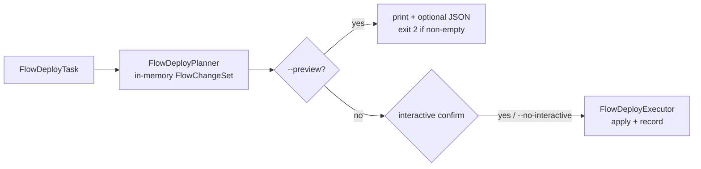

# NLD Flow Deployment

`nld flow deploy` is the flow-orchestrated deployment path: it detects which
flow definitions changed, deploys their target structures (same machinery as
`nld structure deploy`), records every flow's deployed version in the metadata
backend, and resolves flow-scoped deployment directives (renames, reloads).
Deployment changes shape and records state — it **never executes flows**, with
one exception: VIEW flows are re-executed to recreate dependent views that
table DDL had to drop.

## 1. CLI reference

```
nld flow deploy [--name <flow>] [--namespace <ns>]
                [--downstream] [--upstream]
                [--interactive | --no-interactive]
                [--preview] [--output <path>]
                [--adopt | --allow-drift | --rebuild]
```

| Option | Semantics |
|---|---|
| `--name` | Scope to one flow (bare names ambiguous across namespaces require `--namespace`) |
| `--namespace` | Scope to a namespace and its children |
| `--downstream` / `--upstream` | Expand the scope through the flow dependency graph (transitive, across structures) |
| `--interactive` / `--no-interactive` | Default `--interactive`: prompt (`Proceed with deployment?`, default No) before applying a non-empty change set. `--no-interactive` applies without prompting (CI) |
| `--preview` | Compute and print the change set (including structure DDL) against the live target, apply nothing. Exit `2` when changes are pending, `0` when in sync |
| `--output <path>` | With `--preview`, also write the change set as JSON |
| `--adopt` | On drift: record the live schema as a flagged `state_refresh` baseline, then deploy against it |
| `--allow-drift` | On drift: deploy against the live schema without recording a new baseline |
| `--rebuild` | Recreate in-scope structures from the assets, ignoring recorded and live state (destructive) |

Exit codes: `0` success (also empty change set, in-sync preview, or a declined
interactive prompt); `2` preview with pending changes; `1` on raised errors
(drift refusal, change-file errors, missing `metadata_backend_connector`,
unmanaged dependent view). Per-flow DDL failures inside a run are caught and
recorded (`partial`/`failed` run status) rather than turned into a nonzero
exit code.

Companion commands: `nld deploy impact --git-base <ref>` (repository-only
blast-radius analysis) and `nld structure deploy` (structure-only path).

## 2. Pipeline



The change set is never persisted; DDL is always recomputed against the live
target at plan time. The executor reuses the planner's per-(connection,
schema) structure deploy managers and their prefetched snapshots.

`FlowChangeSet` carries: `changeset_id`, `created_at`, the `scope`
(`flow_name`, `namespace`, `upstream`, `downstream`), `flows` (per-flow
action + which hash components changed), `structures` (per-structure action +
DDL), `links` (flow↔structure dependency edges used for cascade-skips), and
`pending_change_files`.

Actions: flows are `NEW | CHANGED | UNCHANGED | REMOVED`; structures are
`CREATE | ALTER | REBUILD | NONE | FAILED` (`FAILED` marks a planning error —
its flows cascade-skip at apply time).

## 3. Change detection

A flow's deployed version is its **definition hash** — SHA-256 over three
component hashes:

| Component | Covers |
|---|---|
| `flow_yaml_hash` | Every field of the flow YAML (runtime-only fields excluded) |
| `flow_sql_hash` | The flow's SQL file content (absent for non-SQL flows) |
| `flow_python_hash` | The source of the resolved task class |

A change in any component makes the flow `CHANGED`; the change set records
which components differ. A flow with no recorded state row is `NEW`. An
identical hash is `UNCHANGED` and drops out of the change set — redeploying an
unchanged project yields an empty change set and does nothing.

The first deploy of a flow records its baseline: state row upserted, history
row appended, a stable `uid` minted. From then on the `deployment_id` chain
(`previous_deployment_id`) tracks every version. Each deployed flow also
records its `target_structure_hash` and the hashes of its declared
predecessor structures.

**Removal is safe:** a previously deployed flow absent from the current scope
is `REMOVED` — recorded, nothing dropped, the target table survives. Cleanup
of the physical table is a deliberate manual step.

## 4. Scope expansion

The scope resolves over the flow dependency graph (directed, bipartite: flow
nodes and structure nodes; edges flow → target structure and predecessor
structure → flow — predecessors are declared in flow YAML, so the graph needs
no database):

- `--name` alone: exactly that flow.
- No scope options: every flow in the project (or the namespace subtree with
  `--namespace`).
- `--upstream` / `--downstream`: ancestors / descendants of the named flow (or
  of every node in the namespace), traversing through structures.

Flows deploy in topological order. Structures count as in-scope only when an
in-scope flow targets them. Excluded from structure deployment even when in
scope: views (recreated via VIEW flows), structures tagged `external_source`,
and structures tagged `target_structure_is_managed_by_flow_execution`.

## 5. Structure orchestration

Each in-scope flow's target structure resolves its deploy target from
`config/structure.yaml` (`mappings.<namespace>.{default_connection_name,
database_name, schema_name, tags}`, hierarchical namespace lookup) and deploys
through the same `StructureDeployManager` machinery as
`nld structure deploy` — one manager per (connection, schema) with a
schema-wide prefetched snapshot.

- The drift gate applies exactly as in structure deploy; `--adopt` /
  `--allow-drift` / `--rebuild` are the reconciliation paths (see
  `structure-deployment.md`).
- A structure with no schema diff still reaches the executor as `NONE` when a
  `backfill_default` directive targets it or under `--adopt` (so out-of-band
  tables get their baseline recorded).
- **Dependent views:** when table DDL requires dropping views, the executor
  drops them (deepest first) and re-executes the VIEW flows that manage them
  (shallowest first) after the DDL. A dependent view no nld VIEW flow manages
  fails the deploy before anything is dropped.

## 6. Deployment change files

Flow deploy resolves the pending `.deployments/<change_id>.yaml` change files
(chronological, exactly-once; full format and lifecycle in
`structure-deployment.md`). The flow-scoped directives:

- `rename_flow {from, to}` — moves the flow's state row (and `uid`) to the new
  name before the flow loop; the physical table follows the flow name, and the
  rename-target structure deploys first to free the old name. A new flow
  reclaiming the old name mints a fresh identity.
- `reload {flow, mode}` — schedules a deferred full refresh: the executor
  computes the flow's full-coverage processing state and persists it as a
  PLANNED plan with requestor `deploy:<deployment_id>`. Deploy never runs the
  flow; the next `nld flow execute` consumes the plan (TRUST) and marks it
  COMPLETED. Outcome recorded per directive: `planned full refresh
  (plan <uid>)`, `no-op (every run is already a full refresh)` for stateless
  flows, or a warning when the backend lacks planned-state support (manual
  `nld flow execute <flow> --full` advised). Inspect pending plans with
  `nld flow state incremental get-planned`.

A change file is recorded as applied (in `_nld_deployment_change`) only when
every directive resolved in the run; scoped deploys leave out-of-scope
directives pending.

## 7. Metadata tables

All flow-deploy metadata lives on the project's `metadata_backend_connector`
(required — deploy refuses without it), in that connection's active schema,
alongside the structure-side tables and the change-file applied-log:

| Table | Grain | Key content |
|---|---|---|
| `_nld_flow_state` | one row per flow (PK `namespace, flow_name`) | `deployment_id`, `uid`, `deployed_at`, the four hashes, `flow_yaml_snapshot`, `predecessor_hashes`, `target_structure_hash`, `last_deployment_id` |
| `_nld_flow_history` | append-only per flow deployment event (PK `deployment_id`) | hashes, snapshot, `diff_action` (`NEW`/`CHANGED`), `run_deployment_id`, `previous_deployment_id` |
| `_nld_flow_deployment` | one row per run (PK `deployment_id`) | `changeset_id`, `status` (`running` → `success`/`partial`/`failed`), started/completed timestamps, flow and structure counters |
| `_nld_flow_deployment_flow_change` | per flow entry per run | `status` (`success`/`failed`/`skipped`), `error_message`, `flow_history_id` |
| `_nld_flow_deployment_structure_change` | per structure deployment per run | links the run to each structure deployment |

## 8. Execution order and failure semantics

The executor: inserts the run row (`running`) → records planner-FAILED
structures (their flows cascade-skip) → applies `rename_flow` state moves →
deploys rename-target structures first → iterates flows in topological order,
deploying each flow's target structures immediately before recording the flow
(`UNCHANGED`/`REMOVED` skip) → deploys remaining in-scope structures → re-runs
queued VIEW flows → applies `reload` directives → records fully-applied change
files → updates the run row (`success`/`partial`/`failed` with counters).

A flow or structure failure cascade-skips its transitive dependents (BFS over
the change-set links); the run continues with the independent rest. A failed
flow gets no state/history row, so the next run recomputes the same change.

## 9. Configuration

| Key | Where | Role |
|---|---|---|
| `metadata_backend_connector` | `nld_project.yml` | Connection whose active schema hosts all deploy metadata; required for `nld flow deploy` and for change files |
| `mappings.<ns>.{default_connection_name, database_name, schema_name}` | `config/structure.yaml` | Deploy target per structure namespace |
| `additional_flow_task_types` | `config/flow.yaml` | Task-class resolution feeding the Python hash |
| `external_source`, `target_structure_is_managed_by_flow_execution` | structure tags | Exclude a structure from deployment |

## 10. Cross-references

- Structure-side mechanics (diff, DDL, drift model, rebuild, metadata hashes,
  change-file format): `structure-deployment.md`.
- Planned incremental state consumed by reloads: the `guide-incremental`
  skill and `nld flow state incremental get-planned`.
- Repository-only impact analysis: `nld deploy impact --git-base <ref>`.
