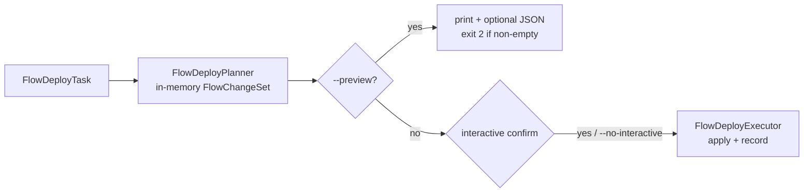

# NLD Flow Deployment

`nld flow deploy` is the flow-orchestrated deployment path: it detects which
flow definitions changed, deploys their target structures (same machinery as
`nld structure deploy`), records every flow's deployed version in the metadata
backend, and resolves flow-scoped deployment directives (renames, reloads).
Deployment changes shape and records state — it **never executes flows**, with
one exception: VIEW flows are re-executed to recreate dependent views that
table DDL had to drop.

## 1. CLI reference

```
nld flow deploy [--name <flow>] [--namespace <ns>]
                [--downstream] [--upstream]
                [--interactive | --no-interactive]
                [--preview] [--output <path>]
                [--adopt | --allow-drift | --rebuild]
```

| Option | Semantics |
|---|---|
| `--name` | Scope to one flow (bare names ambiguous across namespaces require `--namespace`) |
| `--namespace` | Deploy one deployment unit — opt-in: only a namespace declaring `deploy: {unit: true}` or a deploy group — the namespace and its descendants on the same deploy target, widened to its deploy group (§4b). With `--name`, it only locates the flow |
| `--downstream` / `--upstream` | Expand the scope through the flow dependency graph (transitive, across structures) |
| `--interactive` / `--no-interactive` | Default `--interactive`: prompt (`Proceed with deployment?`, default No) before applying a non-empty change set. `--no-interactive` applies without prompting (CI) |
| `--preview` | Compute and print the change set (including structure DDL) against the live target, apply nothing. Exit `2` when changes are pending, `0` when in sync |
| `--output <path>` | With `--preview`, also write the change set as JSON |
| `--adopt` | On drift: record the live schema as a flagged `state_refresh` baseline, then deploy against it |
| `--allow-drift` | On drift: deploy against the live schema without recording a new baseline |
| `--rebuild` | Recreate in-scope structures from the assets, ignoring recorded and live state (destructive) |

Exit codes: `0` success (also empty change set, in-sync preview, or a declined
interactive prompt); `2` preview with pending changes; `1` on raised errors
(drift refusal, change-file errors, missing `metadata_backend_connector`,
unmanaged dependent view, a target outside the namespace scope, a deploy
lock held by another run). Per-flow DDL failures inside a run are caught and
recorded (`partial`/`failed` run status) rather than turned into a nonzero
exit code.

Companion commands: `nld deploy impact --git-base <ref>` (repository-only
blast-radius analysis), `nld structure deploy` (structure-only path) and
`nld deploy unlock` (list or release deploy locks).

## 2. Pipeline


```mermaid
graph LR
    A[FlowDeployTask] --> B[FlowDeployPlanner<br/>in-memory FlowChangeSet]
    B --> C{--preview?}
    C -->|yes| D[print + optional JSON<br/>exit 2 if non-empty]
    C -->|no| E{interactive confirm}
    E -->|yes / --no-interactive| F[FlowDeployExecutor<br/>apply + record]
```

The change set is never persisted; DDL is always recomputed against the live
target at plan time. The executor reuses the planner's per-(connection,
schema) structure deploy managers and their prefetched snapshots.

`FlowChangeSet` carries: `changeset_id`, `created_at`, the `scope`
(`flow_name`, `namespace`, `upstream`, `downstream`), `flows` (per-flow
action + which hash components changed), `structures` (per-structure action +
DDL), `links` (flow↔structure dependency edges used for cascade-skips), and
`pending_change_files`.

Actions: flows are `NEW | CHANGED | UNCHANGED | REMOVED`; structures are
`CREATE | ALTER | REBUILD | NONE | FAILED` (`FAILED` marks a planning error —
its flows cascade-skip at apply time).

## 3. Change detection

A flow's deployed version is its **definition hash** — SHA-256 over three
component hashes:

| Component | Covers |
|---|---|
| `flow_yaml_hash` | Every field of the flow YAML (runtime-only fields excluded) |
| `flow_sql_hash` | The flow's SQL file content (absent for non-SQL flows) |
| `flow_python_hash` | The source of the resolved task class |

A change in any component makes the flow `CHANGED`; the change set records
which components differ. A flow with no recorded state row is `NEW`. An
identical hash is `UNCHANGED` and drops out of the change set — redeploying an
unchanged project yields an empty change set and does nothing.

The first deploy of a flow records its baseline: state row upserted, history
row appended, a stable `uid` minted. From then on the `deployment_id` chain
(`previous_deployment_id`) tracks every version. Each deployed flow also
records its `target_structure_hash` and the hashes of its declared
predecessor structures.

**Removal is safe:** a previously deployed flow absent from the project is
`REMOVED` — recorded, nothing dropped, the target table survives. Cleanup
of the physical table is a deliberate manual step.

The removal sweep runs only when the scope covers the full extent being
compared: an unscoped deploy sees the whole project, and a `--namespace`
deploy keeps it because the previously-deployed set is filtered by the same
unit membership rule. A deploy scoped by `--name` or `--upstream`/`--downstream`
sees only a subset of the project, so the sweep is skipped — deployed flows
outside the scope are not (wrongly) reported as `REMOVED`.

## 4. Scope expansion

The scope resolves over the flow dependency graph (directed, bipartite: flow
nodes and structure nodes; edges flow → target structure and predecessor
structure → flow — predecessors are declared in flow YAML, so the graph needs
no database):

- `--name` alone: exactly that flow.
- No scope options: every flow in the project (or the deployment unit with
  `--namespace`, §4b).
- `--upstream` / `--downstream`: ancestors / descendants of the named flow (or
  of every node in the namespace), traversing through structures.

Flows deploy in topological order. Structures count as in-scope only when an
in-scope flow targets them. Excluded from structure deployment even when in
scope: views (recreated via VIEW flows), structures tagged `external_source`,
and structures tagged `target_structure_is_managed_by_flow_execution`.

## 4b. Namespace deployment units and deploy groups

Deploying a namespace on its own is **opt-in**: `--namespace <ns>` is only
accepted for a namespace declaring `deploy: {unit: true}` (or a deploy group)
in the `namespaces` block of `nld_project.yml`. Any other namespace —
including one inside a declared namespace — refuses with
`NamespaceDeployNotEnabledError` before anything is read, naming the declared
namespace containing it; a project declaring nothing deploys as a whole
only. With `--name`, `--namespace` only locates the flow: a single flow
deploys without declaration or unit scoping.

```yaml
namespaces:
  marketing:
    deploy:
      unit: true          # nld flow deploy --namespace marketing
```

`--namespace <ns>` deploys one **deployment unit**: the namespace and every
descendant that resolves to the same **deploy target** — the connection,
database and schema of its nearest `namespaces.<ns>.structure` mapping. A
descendant mapped to another target is a unit of its own: it is left out and
named in the log (`deploy it with --namespace <child>`). Membership is
computed from the namespace configuration alone, so it also answers for the
namespace of a deployed flow that no longer exists in the project. Without
`--namespace`, the whole project deploys.

- **Schema boundary.** A selected flow whose target table belongs to a
  namespace outside the scope refuses the deploy with
  `NamespaceDeployScopeError` while planning — a preview refuses the same
  way, nothing is read from or written to a target. Views, external sources
  and tables managed by flow execution never count. A `--name` deploy has
  no unit scope, so the check does not apply to it.
- **Deploy groups.** Namespaces declaring the same
  `namespaces.<ns>.deploy.group` always deploy together: a member is
  deployable on its own, and deploying a member, or a declared ancestor whose
  unit contains a member, deploys every member's unit (groups overlapping
  each other close transitively), and a flow may target a table of another
  unit of its group.

  ```yaml
  namespaces:
    crm:
      deploy:
        group: customer
    support:
      deploy:
        group: customer
  ```
  The `deploy` facet applies to the namespace declaring it only — never to
  its descendants through a nearest-ancestor lookup — and is rejected on a
  wildcard key; a facet declaring neither `unit: true` nor a `group`, and a
  group with a single member (a typo in the other members' group name), fail
  the project load. `nld project info` lists the deployable namespaces and the
  deploy groups.
- **Metadata.** Previously deployed flows and `REMOVED` detection use the
  same membership rule, so a unit deploy never reads another unit's flows as
  `REMOVED` nor its own as `NEW`.
- **Deploy lock.** An applied run claims every target it may change (its
  units' targets; every mapped target for a full-project deploy) in
  `_nld_deployment_lock`, keyed `<connection>:<schema>`. Deploys of one
  target serialize — the second refuses with `DeploymentLockedError`,
  naming the holder — while deploys of distinct targets run concurrently.
  Planning and `--preview` take no lock; the lock is released when the run
  ends, even on failure. A deploy killed outright leaves it behind:
  `nld deploy unlock` lists the locks and
  `nld deploy unlock --target <connection>:<schema>` releases one.
- **Scope record.** Each applied run writes its scope (requested namespace
  or name, resolved units, groups, locked targets) to
  `_nld_deployment_scope`, joined to `_nld_flow_deployment` /
  `_nld_structure_deployment` on `deployment_id`.

## 5. Structure orchestration

Each in-scope flow's target structure resolves its deploy target from
the `namespaces` block of `nld_project.yml`
(`namespaces.<namespace>.structure.{default_connection_name, database_name,
schema_name, tags}`, hierarchical namespace lookup) and deploys
through the same `StructureDeployManager` machinery as
`nld structure deploy` — one manager per (connection, schema) with a
schema-wide prefetched snapshot.

- The drift gate applies exactly as in structure deploy; `--adopt` /
  `--allow-drift` / `--rebuild` are the reconciliation paths (see
  `structure-deployment.md`).
- A structure with no schema diff still reaches the executor as `NONE` when a
  `backfill_default` directive targets it or under `--adopt` (so out-of-band
  tables get their baseline recorded).
- **Dependent views:** when table DDL requires dropping views, the executor
  drops them (deepest first) and re-executes the VIEW flows that manage them
  (shallowest first) after the DDL. The VIEW flows are looked up in every
  namespace deploying to the same schema, not only in the deploy scope — a
  view another namespace owns on a shared schema is recreated all the same.
  When same-name views exist in several namespaces, every VIEW flow targeting
  that name is re-executed. A dependent view no nld VIEW flow manages fails
  the deploy before anything is dropped.

## 6. Deployment change files

Flow deploy resolves the pending `.deployments/<change_id>.yaml` change files
(chronological, exactly-once; full format and lifecycle in
`structure-deployment.md`). Flow-scoped directives live under `changes.flows`,
keyed by flow name (a rename by its pre-rename name):

```yaml
change_id: 2026-07-03_1100_reload-flows
changes:
  flows:
    sales.refined_order:
      - directive: reload
        mode: full
```

- `rename_flow` (`to`) — moves the flow's state row (and `uid`) to the new
  name before the flow loop; the physical table follows the flow name, and the
  rename-target structure deploys first to free the old name. A new flow
  reclaiming the old name mints a fresh identity.
- `reload` (`mode`, default `full`) — schedules a deferred full refresh: the executor
  computes the flow's full-coverage processing state and persists it as a
  PLANNED plan with requestor `deploy:<deployment_id>`. Deploy never runs the
  flow; the next `nld flow execute` consumes the plan (TRUST) and marks it
  COMPLETED. Outcome recorded per directive: `planned full refresh
  (plan <uid>)`, `no-op (every run is already a full refresh)` for stateless
  flows, or a warning when the backend lacks planned-state support (manual
  `nld flow execute <flow> --full` advised). Inspect pending plans with
  `nld flow state incremental get-planned`.

A namespace deploy applies the directives whose subject (the flow, the
structure, or a rename's new name) belongs to its scope; the others stay
pending and do not count as pending changes for its preview. Each resolved
directive is recorded in `_nld_deployment_change_directive` and never runs
again — a reload is planned once, not on every run. The file joins
`_nld_deployment_change` once every directive is recorded, possibly over
several deploys.

## 7. Metadata tables

All flow-deploy metadata lives on the project's `metadata_backend_connector`
(required — deploy refuses without it), in that connection's active schema,
alongside the structure-side tables and the change-file applied-log:

| Table | Grain | Key content |
|---|---|---|
| `_nld_flow_state` | one row per flow (PK `namespace, flow_name`) | `deployment_id`, `uid`, `deployed_at`, the four hashes, `flow_yaml_snapshot`, `predecessor_hashes`, `target_structure_hash`, `last_deployment_id` |
| `_nld_flow_history` | append-only per flow deployment event (PK `deployment_id`) | hashes, snapshot, `diff_action` (`NEW`/`CHANGED`), `run_deployment_id`, `previous_deployment_id` |
| `_nld_flow_deployment` | one row per run (PK `deployment_id`) | `changeset_id`, `status` (`running` → `success`/`partial`/`failed`), started/completed timestamps, flow and structure counters |
| `_nld_flow_deployment_flow_change` | per flow entry per run | `status` (`success`/`failed`/`skipped`), `error_message`, `flow_history_id` |
| `_nld_flow_deployment_structure_change` | per structure deployment per run | links the run to each structure deployment |
| `_nld_deployment_scope` | one row per applied run (PK `deployment_id`), flow and structure deploys | `command`, `requested_namespace`, `requested_name`, `unit_namespaces`, `deploy_groups`, `lock_keys` (JSON lists) |
| `_nld_deployment_lock` | one claim per run per target (PK `lock_key, holder_id`) | `acquired_at`, `command`, `scope`; the earliest claim holds the target |

## 8. Execution order and failure semantics

The executor: claims the deploy lock of the change set's targets → inserts
the run row (`running`) and its scope row → records planner-FAILED
structures (their flows cascade-skip) → applies `rename_flow` state moves →
deploys rename-target structures first → iterates flows in topological order,
deploying each flow's target structures immediately before recording the flow
(`UNCHANGED`/`REMOVED` skip) → deploys remaining in-scope structures → re-runs
queued VIEW flows → applies `reload` directives → records fully-applied change
files → updates the run row (`success`/`partial`/`failed` with counters) →
releases the lock.

A flow or structure failure cascade-skips its transitive dependents (BFS over
the change-set links); the run continues with the independent rest. A failed
flow gets no state/history row, so the next run recomputes the same change.

## 9. Configuration

| Key | Where | Role |
|---|---|---|
| `metadata_backend_connector` | `nld_project.yml` | Connection whose active schema hosts all deploy metadata; required for `nld flow deploy` and for change files |
| `namespaces.<ns>.structure.{default_connection_name, database_name, schema_name}` | `nld_project.yml` | Deploy target per structure namespace; also delimits the deployment units of `--namespace` |
| `namespaces.<ns>.deploy.unit` | `nld_project.yml` | Allows `--namespace <ns>` deploys (opt-in) |
| `namespaces.<ns>.deploy.group` | `nld_project.yml` | Deploy group: the namespaces sharing it always deploy together (members are deployable) |
| `flow.additional_flow_task_types` | `nld_project.yml` | Task-class resolution feeding the Python hash |
| `external_source`, `target_structure_is_managed_by_flow_execution` | structure tags | Exclude a structure from deployment |

## 10. Cross-references

- Structure-side mechanics (diff, DDL, drift model, rebuild, metadata hashes,
  change-file format): `structure-deployment.md`.
- Planned incremental state consumed by reloads: the `guide-incremental`
  skill and `nld flow state incremental get-planned`.
- Repository-only impact analysis: `nld deploy impact --git-base <ref>`.
