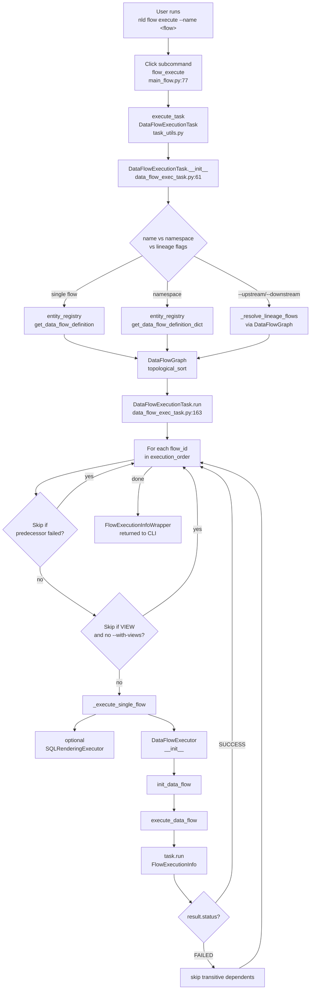
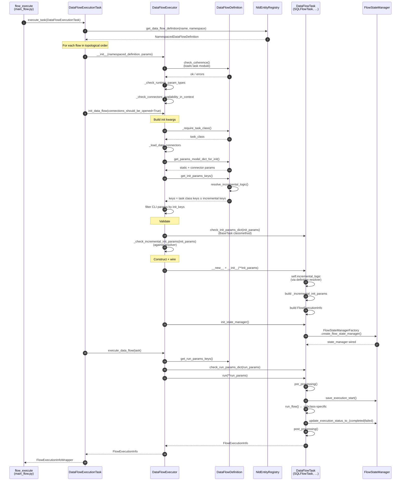
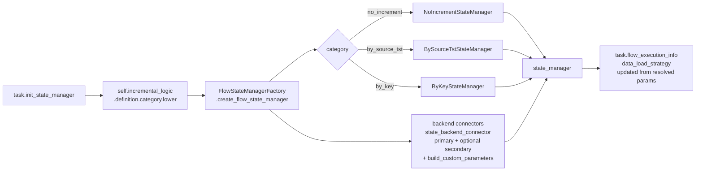

# Flow Execute — Internals

This document traces what happens between the user typing
`nld flow execute --name <flow>` (or `--namespace <ns>`) and the data
flow task's `run()` returning a `FlowExecutionInfo`. It complements
`flow-design.md` (high-level concepts) and `flow-sql-execution.md`
(SQL-specific write strategies and incremental filtering).

The diagrams use the canonical class names from `nld-core` and reference
absolute paths under `core/nld/...`.

---

## 1. End-to-end pipeline

The CLI command is a Click subcommand declared in
`core/nld/cli/flow/main_flow.py`. It does **not** instantiate the data
flow directly — instead it instantiates a `DataFlowExecutionTask`
(`core/nld/flow/task/data_flow_exec_task.py`), which is the orchestrator
that resolves the set of flows to run, sorts them topologically, and
delegates each one to a `DataFlowExecutor`
(`core/nld/flow/task/data_flow_executor.py`). The executor is responsible for the
per-flow lifecycle: validation, parameter assembly, task instantiation,
state-manager wiring, and the actual `run()` invocation.



---

## 2. `DataFlowExecutor` — per-flow lifecycle

`DataFlowExecutor` is constructed once per flow at
`data_flow_exec_task.py:299`. Its three public methods (`__init__`,
`init_data_flow`, `execute_data_flow`) split the lifecycle into three
phases that map cleanly onto the diagram below.



---

## 3. Init-parameter assembly (zoom-in on step 7)

The most failure-prone segment of the lifecycle is how init parameters
are assembled before `task_class(**init_params)`. There are four input
sources that get merged into a single dict, with explicit precedence
rules:

```mermaid
flowchart LR
    subgraph Sources
        S1[Static YAML params<br/>flow_definition.params<br/>runtime=False]
        S2[Connector instances<br/>resolved by name<br/>+ _connector suffix]
        S3[CLI parameters<br/>task_request.get_parameters]
        S4[Runtime params<br/>flow_definition.params<br/>runtime=True]
    end
    S0[NamespacedDataFlowDefinition<br/>injected as<br/>namespaced_data_flow_definition]
    S0 --> M[init_params dict]
    S1 -->|get_params_model_dict_for_init| M
    S2 -->|_get_data_connectors_init_params| M
    S3 -->|filter by<br/>definition.get_init_params_keys| M
    S4 -->|resolve_runtime_params<br/>filter by init_keys| M
    M --> V1[BaseTask.check_init_params_dict<br/>iterates task_class.get_init_params]
    M --> V2[_check_incremental_init_params<br/>iterates resolver param_definitions]
    V1 --> C[task_class(**init_params)]
    V2 --> C
```

Key invariants:

- **Single resolver path** — every callsite that asks "what params does
  this flow accept?" goes through `DataFlowDefinition.get_init_params_keys()`,
  which is `task_class.get_init_params_keys()` ∪
  `definition.resolve_incremental_logic().definition.param_definitions`.
- **No class-level appending of incremental params** — the task class's
  `get_init_params()` is the inherited `BaseTask` method. It exposes
  only the class's own init params. The incremental contribution is
  always added externally by the definition.
- **Two mandatory checks, two scopes** —
  `BaseTask.check_init_params_dict()` enforces the task class's own
  mandatory params; `DataFlowExecutor._check_incremental_init_params()`
  enforces mandatory incremental params from the resolved logic. They
  do not overlap.

---

## 4. Incremental logic resolution

Resolution lives entirely on `DataFlowDefinition.resolve_incremental_logic`
(`core/nld/flow/definition/flow_definition.py`). It is cached after the
first call in the private attribute `_resolved_incremental_logic`.

```mermaid
flowchart TD
    R[DataFlowDefinition<br/>.resolve_incremental_logic]
    R -->|cached?| RC[return cached logic]
    R -->|no cache| Q1{self.incremental<br/>is set?}
    Q1 -->|yes| F1[IncrementalStateManagerFactory<br/>.get_incremental_logic<br/>(strategy)]
    Q1 -->|no| Q2{task_class param<br/>provided?}
    Q2 -->|yes| TC[task_class<br/>.get_class_incremental_logic]
    Q2 -->|no| TM[_require_task_class<br/>then get_class_incremental_logic]
    TC --> Q3{is None?}
    TM --> Q3
    Q3 -->|yes| NI[NO_INCREMENT_FLOW_INCREMENTAL_LOGIC]
    Q3 -->|no| RES[resolved logic]
    F1 --> RES
    NI --> RES
    RES --> CACHE[cache + return]

    subgraph Consumers
        C1[DataFlowExecutor<br/>parse_parameters_from_cli_for_data_flow_task]
        C2[DataFlowExecutor<br/>_check_incremental_init_params]
        C3[DataFlowDefinition<br/>get_init_params_keys]
        C4[DataFlowTask<br/>incremental_logic property]
        C5[DataFlowInfoTask<br/>_resolve_incremental_display]
    end

    CACHE --> C1
    CACHE --> C2
    CACHE --> C3
    CACHE --> C4
    CACHE --> C5
```

The runtime accessor on a constructed task is the `incremental_logic`
**instance property** (`core/nld/flow/task/data_flow_task.py`). It
delegates to the resolver when a definition is attached, otherwise
falls back to the ClassVar, otherwise to `NO_INCREMENT`.

---

## 5. State-manager wiring (zoom-in on step 13)

`DataFlowTask.init_state_manager()` is invoked by the executor after
construction. It uses the `FlowStateManagerFactory` keyed off the
**resolved** incremental category (lowercase of `definition.category`,
e.g. `"by_source_tst"`), not the ClassVar. This is what makes a flow
declared as `incremental: by_source_tst` in YAML actually use the
`BySourceTstStateManager` even when its task class only declares
`_INCREMENTAL_LOGIC = NO_INCREMENT` as a default.



---

## 6. `task.run()` — the actual flow

Once the state manager is wired, `executor.execute_data_flow(task)`
calls `task.run(**run_params)`. The orchestration inside `run()` is
defined on `DataFlowTask` itself
(`core/nld/flow/task/data_flow_task.py:506`); subclasses only override
`run_flow()`.

```mermaid
flowchart TD
    R[DataFlowTask.run] --> P1[pre_processing]
    P1 --> P1a[pre_processing_at_start<br/>subclass hook]
    P1a --> P1b[get_latest_execution_state<br/>state_manager.get_latest_execution_state]
    P1b --> P1c{compute_incremental_state<br/>tracks_state?}
    P1c -->|yes| P1d[retrieve_latest_incremental_state<br/>retrieve_source_state (if requires_source_state_retrieval)<br/>determine_logically_deleted_entries<br/>determine_processing_state<br/>persist_initial_processing_state (if configured)]
    P1c -->|no| P2
    P1d --> P2[state_manager.save_execution_start]
    P2 --> RF[run_flow<br/>subclass implementation]
    RF -->|success| RU[update_execution_status_to_completed]
    RF -->|exception| RF2[update_execution_status_to_failed]
    RU --> POST[post_processing]
    RF2 --> POST
    POST --> POST1{tracks_state<br/>and not partial<br/>persistence used?}
    POST1 -->|yes| POST1a[post_processing_for_state<br/>save_processed_state<br/>create_post_processing_state<br/>save_post_processing_state]
    POST1 -->|no| POST2
    POST1a --> POST2[post_processing_for_execution<br/>update_global_execution_state<br/>save_all_execution_infos]
    POST2 --> POST3[post_processing_at_end<br/>subclass hook]
    POST3 --> END{flow_error?}
    END -->|yes| RAISE[re-raise]
    END -->|no| RET[return FlowExecutionInfo]
```

For a deeper dive into what `run_flow()` does for SQL flows
(write-strategy dispatch, incremental WHERE-clause injection, hook
execution), see `flow-sql-execution.md`.

### Secondary state backend mirror

When `state_backend_connector` is configured with a `secondary` connection
(see `flow-sql-execution.md` §8.3), `FlowStateManagerFactory` builds an
additional execution and incremental backend manager from that connector
and attaches them as `secondary_execution_state_backend_manager` and
`secondary_incremental_state_backend_manager` on the respective managers.
At runtime the manager fans writes out to the primary backend first, then
attempts the secondary call inside a `try/except` that logs a warning and
swallows the exception — the primary remains authoritative. Reads, the
consolidated execution-history write (`save_execution_history_complete`)
and post-processing incremental state writes are **never** mirrored.

---

## 7. Critical files

| File | Role |
|------|------|
| `core/nld/cli/flow/main_flow.py` | Click command registration (`flow_execute`). |
| `core/nld/flow/task/data_flow_exec_task.py` | `DataFlowExecutionTask` — multi-flow orchestrator. |
| `core/nld/flow/task/data_flow_dependency_graph.py` | `DataFlowDependencyGraphTask` — topological sort, lineage scoping. |
| `core/nld/flow/task/data_flow_executor.py` | `DataFlowExecutor` — per-flow lifecycle, init/run param assembly, mandatory checks. |
| `core/nld/flow/definition/flow_definition.py` | `DataFlowDefinition` — task module loading, `resolve_incremental_logic`, `get_init_params_keys`. |
| `core/nld/flow/task/data_flow_task.py` | `DataFlowTask` base — `__init__`, `incremental_logic` property, `run()` orchestration, pre/post processing. |
| `core/nld/flow/state/factory.py` | `FlowStateManagerFactory` — strategy-keyed state-manager construction. |
| `core/nld/flow/incremental/services/factory.py` | `IncrementalStateManagerFactory` — strategy-keyed `FlowIncrementalLogic` lookup. |

## 8. Cross-references

- `flow-design.md` — flow types, write strategies, dependency graph concepts.
- `flow-sql-execution.md` — SQL flow specifics (write strategies, incremental WHERE-clause injection).
- `execution-and-incremental-design.md` — incremental state model in depth (state classes, backends).
