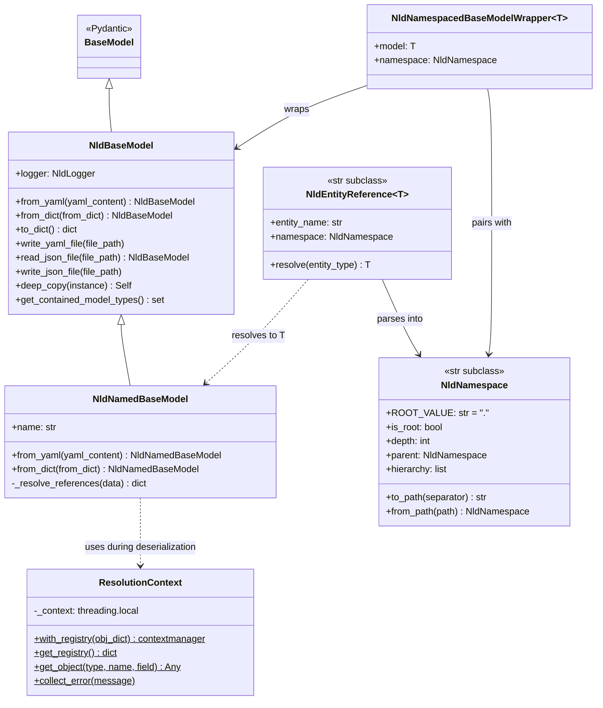
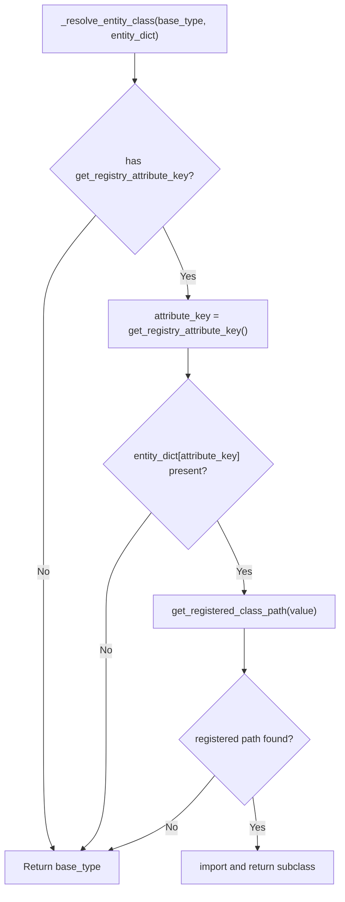
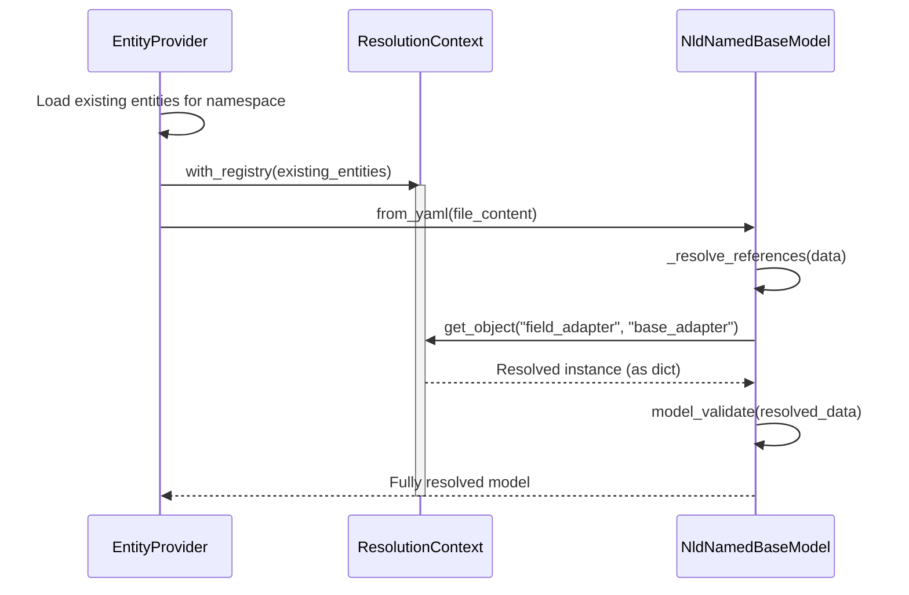

# NLD Base Model — Core Pydantic Layer

This document describes the core Pydantic foundation of nld-core: the
`NldBaseModel` hierarchy, namespaces, entity references, and the serialization /
reference-resolution machinery. These classes are the data-model layer every
entity is built on.

Companion documents (same folder):

- `entity-registry-design.md` — how entities are defined, stored, loaded, and
  retrieved (`EntityDefinition`, `EntityProvider`, `NldEntityRegistry`).
- `project-design.md` — how a running task consumes entities
  (`NldExecutionContext`, `TaskRequest`, `Project`, `StandardTask`).
- `project-catalog-design.md` — the multi-project `NldProjectCatalog`.

---

## 1. Class Hierarchy Overview



---

## 2. Core Pydantic Layer

### 2.1 NldBaseModel

**File:** `core/nld/pydantic/base_model.py`

Extended Pydantic `BaseModel` that adds JSON/YAML serialization, structured logging,
and deep copy support. All domain models in the framework inherit from this class.

**Key capabilities:**

| Capability | Methods |
|------------|---------|
| YAML I/O | `from_yaml()`, `write_yaml_file()` |
| JSON I/O | `read_json_file()`, `write_json_file()` |
| Dict conversion | `from_dict()`, `to_dict()` |
| Logging | `log_debug()`, `log_info()`, `log_warn()`, `log_error()`, `log_event()` |
| Cloning | `deep_copy(instance)` |
| Type introspection | `get_contained_model_types()` |

**Smart serialization:** `to_dict()` automatically strips redundant `name` fields from
nested `NldNamedBaseModel` instances, since the name is already used as the dictionary
key during serialization.

### 2.2 NldNamedBaseModel

**File:** `core/nld/pydantic/named_base_model.py`

Extends `NldBaseModel` with a required `name` field and string-to-object reference
resolution during deserialization. This is the base class for all entities that are
stored and retrieved by name (structures, fields, flows, adapters, etc.).

**Key additions over NldBaseModel:**

- Required `name: str` field for entity identification.
- Overridden `from_yaml()` and `from_dict()` that use `ResolutionContext` to resolve
  string references into full object instances during deserialization.
- Reference resolution works recursively through lists and dicts.

**Reference resolution flow:**

```
YAML field value: "base_adapter"    (a string)
       ↓
Field type annotation: FieldAdapter (from model definition)
       ↓
Type name conversion: FieldAdapter → "field_adapter" (camelCase → snake_case)
       ↓
Registry lookup: registry["field_adapter"]["base_adapter"]
       ↓
Result: resolved FieldAdapter instance (returned as dict for validation)
```

### 2.3 ResolutionContext

**File:** `core/nld/pydantic/named_base_model.py` (top of file)

Thread-safe context manager that holds a registry of already-loaded entities, enabling
string references to be resolved to actual objects during YAML deserialization.

**Usage pattern:**

```python
# Build registry from already-loaded entities
obj_dict = {"field_adapter": {"base_adapter": adapter_instance, ...}}

with ResolutionContext.with_registry(obj_dict):
    # Any from_yaml() / from_dict() call within this block
    # can resolve "base_adapter" → the actual FieldAdapter object
    model = MyModel.from_yaml(yaml_content)
```

**Key behaviors:**

- Uses `threading.local()` for thread safety.
- Errors are collected (not raised immediately) and reported together at the end
  of deserialization, giving a complete picture of all unresolved references.
- Type discovery uses camelCase-to-snake_case conversion on the field's type
  annotation to find the matching registry key.

### 2.4 NldNamespace

**File:** `core/nld/pydantic/namespace.py`

Validated, normalized namespace string that subclasses `str` for full backward
compatibility. Represents a hierarchical position in the entity tree using
dot-separated levels.

**Validation rules:**

- `None` or empty string normalizes to root (`"."`)
- Trailing dots are stripped (except for root)
- Slashes (`/`, `\\`) are rejected
- Leading dots (except root) and consecutive dots (`..`) are rejected

**Navigation examples:**

```python
ns = NldNamespace("source.raw.customers")

ns.is_root     # False
ns.depth       # 3
ns.parent      # NldNamespace("source.raw")
ns.hierarchy   # [NldNamespace("."), NldNamespace("source"),
               #  NldNamespace("source.raw"), NldNamespace("source.raw.customers")]

NldNamespace(".")        # Root namespace
NldNamespace(".").depth  # 0

# Path conversion
ns.to_path()                          # "source/raw/customers"
NldNamespace.from_path("source/raw")  # NldNamespace("source.raw")
```

### 2.5 NldNamespacedBaseModelWrapper

**File:** `core/nld/pydantic/namespaced_base_model_wrapper.py`

Generic wrapper that pairs a model instance with the namespace where it is stored.
This is the standard return type for entity retrieval methods, providing both the
entity and its storage location.

```python
wrapper = NldNamespacedBaseModelWrapper(
    model=my_structure,
    namespace=NldNamespace("source.raw"),
)
wrapper.model      # The Structure instance
wrapper.namespace  # NldNamespace("source.raw")
```

### 2.6 NldEntityReference

**File:** `core/nld/pydantic/entity_reference.py`

Generic `str` subclass that holds a dot-separated reference to a named entity
(`namespace.entity_name`). The type parameter `T` (bounded by `NldNamedBaseModel`)
controls the return type of `resolve()`, giving static type safety without casts.

**Parsing rules:**

| Input | Namespace | Entity Name |
|-------|-----------|-------------|
| `"source.my_table"` | `source` | `my_table` |
| `"ns1.ns2.my_table"` | `ns1.ns2` | `my_table` |
| `"my_table"` | `.` (root) | `my_table` |
| `".my_table"` | `.` (root) | `my_table` |

**Usage as a Pydantic field:**

```python
from nld.pydantic import NldEntityReference
from nld.structure import Structure

class DataFlowDefinition(NldNamedBaseModel):
    target_structure: NldEntityReference[Structure] | None = None
```

Pydantic deserializes the field from a plain string. The type parameter is used
only for static typing — the runtime schema is always a validated string.

**Resolving at runtime:**

```python
# resolve() returns T (e.g. Structure) — no cast needed
structure = definition.target_structure.resolve(
    entity_type=EntityTypeNames.STRUCTURE,
)
```

Resolution uses `NldExecutionContext.require_current().entity_registry` to look
up the entity by parsed namespace and name, then returns a deep copy. The registry
itself is documented in `entity-registry-design.md`.

---

## 3. Key Patterns (base model)

### 3.1 Dynamic Entity Class Resolution

**File:** `core/nld/service/model_read_util.py` — `_resolve_entity_class()`

When loading entities from YAML, the framework can dynamically resolve the
correct subclass to instantiate based on a registry key in the entity data.
This is a generic mechanism that works with any `NldBaseModel` subclass.

**Requirements for a model to support dynamic resolution:**

| Class Method | Description |
|-------------|-------------|
| `get_registry_attribute_key() -> str \| None` | Returns the entity dict key used for registry lookup (e.g. `"connector_type"`) |
| `get_registered_class_path(key_value) -> str \| None` | Returns the registered class path for a key value |
| `register_subclass(key_value, class_path)` | Registers a subclass class path for a key value |

If a model does not implement these methods, `_resolve_entity_class()` returns
the base type unchanged. Currently `Structure` implements this pattern, mapping
`connector_type` values to connector-specific subclasses (e.g.
`PostgreSQLStructure`).

**Resolution flow:**



Registration happens automatically when connector plugins are loaded by
`ConnectorFactory.load_plugin()`, which calls `Structure.register_subclass()`
if the plugin provides a `structure_class_path`.

### 3.2 ResolutionContext Pattern

The `ResolutionContext` (§2.3) enables YAML files to reference other entities by
name as plain strings, which get resolved to actual object instances during
deserialization.



**Error handling:** Errors are collected during resolution and raised together
at the end, providing a complete list of all unresolved references in a single
error message.
