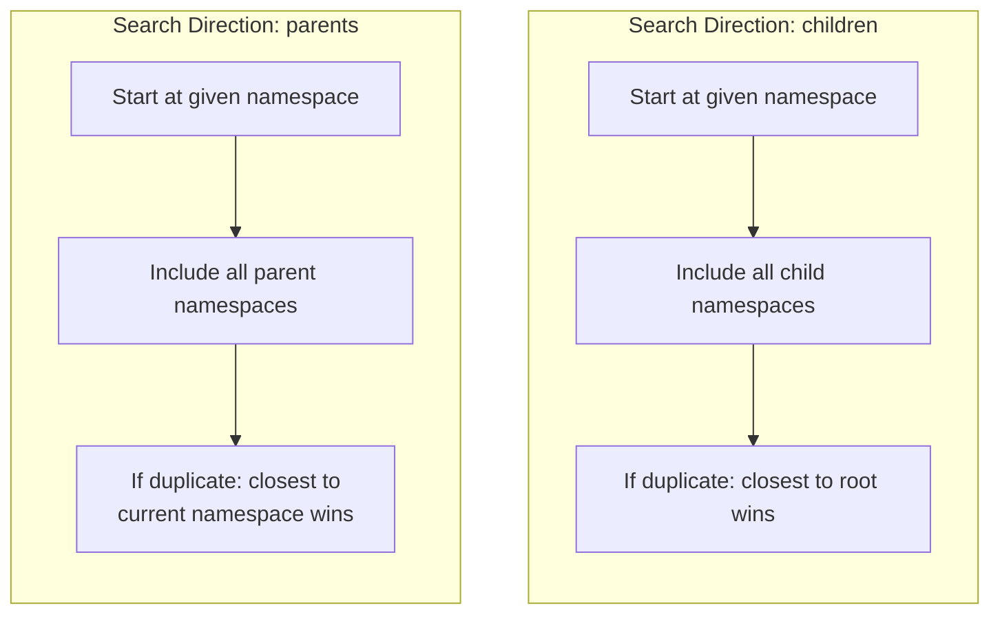

# NLD Entity Management & Registry

This document describes the entity-management layer of nld-core: how entity types
are declared (`EntityDefinition`), stored and retrieved (`EntityProvider`), and
exposed through typed accessors (`NldEntityRegistry`), plus how entities are
loaded from the filesystem and resolved across namespaces.

It builds on the core model layer in `base-model-design.md` (`NldBaseModel`,
`NldNamespace`, `NldEntityReference`, `ResolutionContext`). For how a running
task obtains a registry, see `project-design.md`.

---

## 1. EntityDefinition

**File:** `core/nld/service/entity_definition.py`

Metadata descriptor for an entity type. Tells the framework how to load, store,
and search for entities of a given type.

| Attribute | Type | Description |
|-----------|------|-------------|
| `name` | `str` | Entity type identifier (e.g., `"structure"`, `"flows"`) |
| `model_type` | `type` | Pydantic model class to deserialize into |
| `folder_name` | `str` | Folder path relative to entities root (e.g., `"structure"`) |
| `file_format` | `str` | `"yaml"` or `"jinja"` (default: `"yaml"`) |
| `search_direction` | `str` | `"children"` or `"parents"` (default: `"children"`) |
| `category` | `str \| None` | Display category for grouping |
| `display_name` | `str \| None` | Human-readable name |

## 2. Search Direction

Search direction controls how entities are discovered across the namespace hierarchy
and which duplicate takes priority when the same entity name exists in multiple
namespaces.

### Direction: `"children"` (default)

Searches from the given namespace **downward** into child namespaces.
When duplicates exist, the entity **closest to root** takes priority.

**Use case:** Data entities inherited downward (structures, fields, flows).

```
Namespace tree:        Lookup for "my_table" at namespace "source":

  .                    1. Check "source"         → found (v1)
  └── source           2. Check "source.raw"     → found (v2)
      └── raw          3. Check "source.raw.pg"  → not found
          └── pg
                       Result: v1 (closest to root wins)
```

### Direction: `"parents"`

Searches from the given namespace **upward** into parent namespaces.
When duplicates exist, the entity **closest to the current namespace** takes priority.

**Use case:** Configuration / vocabulary / governance entities inherited from
root (org, adapters, templates, business dictionary, structure & flow owners).

```
Namespace tree:        Lookup for "org_config" at namespace "source.raw":

  .                    1. Check "source.raw"  → not found
  └── source           2. Check "source"      → found (v2)
      └── raw          3. Check "."           → found (v1)

                       Result: v2 (closest to current namespace wins)
```

## 3. EntityProvider

**File:** `core/nld/service/entity_provider.py`

Core storage and retrieval service for all entities. Organizes entities in a
three-level dictionary structure.

**Internal data structure:**

```python
entities: dict[str, dict[NldNamespace, dict[str, NldBaseModel]]]
#         entity_type → namespace → entity_name → model_instance
```

**Key responsibilities:**

| Responsibility | Methods |
|----------------|---------|
| Entity storage | `replace_entity_type_entities()` |
| Inventory | `get_available_entity_types()`, `get_entity_type_namespaces()`, `get_all_namespaces()` |
| Single retrieval | `get_entity()` → `NldNamespacedBaseModelWrapper` |
| Batch retrieval | `get_entities()`, `get_entities_as_dict()`, `get_entity_keys()` |
| Namespace-aware retrieval | `get_entities_on_namespace()` (respects each type's search direction) |
| Required-definition resolution | `get_required_entity_definitions()` (transitive closure for selective loading) |
| File loading | `load_entities()`, `load_from_entity_definition()` |
| File writing | `write_entity()` |

**Priority resolution for duplicates:**

When an entity name exists in multiple namespaces:

- `"parents"` search → selects the **deepest** namespace (closest to current).
- `"children"` search → selects the **root** namespace (closest to root).
- Uses `select_by_namespace_priority()` utility internally.

## 4. NldEntityRegistry

**File:** `core/nld/service/nld_entity_registry.py`

Extends `EntityProvider` with typed convenience accessors for each standard entity
type. This is the primary interface used by application code to access entities.

**Standard entity types** (non-exhaustive — connector plugins and project
`additional_entity_definitions` extend the set):

| Entity Type | Model Class | Folder | Search Direction | Category |
|-------------|-------------|--------|-----------------|----------|
| `org` | `Organisation` | `config/org` | parents | Configuration |
| `field` | `Field` | `templates/field` | children | Structure |
| `structure` | `Structure` | `structure` | children | Structure |
| `structure_model` | `StructureModel` | `structure_model` | children | Structure |
| `structure_audit` | `StructureAudit` | `audits/structure` | children | Structure |
| `field_adapter` | `FieldAdapter` | `templates/field_adapter` | parents | Structure Configuration |
| `field_format_adapter` | `FieldFormatAdapter` | `templates/field_format_adapter` | parents | Structure Configuration |
| `field_template` | `FieldTemplate` | `templates/field_template` | parents | Structure Configuration |
| `structure_adapter` | `StructureAdapter` | `templates/structure_adapter` | parents | Structure Configuration |
| `flows` | `DataFlowDefinition` | `flows` | children | Data Flow |
| `scheduling` | `FlowTask` | `scheduling` | children | Data Flow |
| `business_dictionary` | `BusinessDictionary` | `business/dictionary` | parents | Vocabulary |
| `structure_owner` | `StructureOwner` | `governance/structure` | parents | Governance |
| `flow_owner` | `FlowOwner` | `governance/flow` | parents | Governance |

> The governance, scheduling, and business-dictionary entities have their own
> guides (`guide-governance`, `guide-scheduling`, `guide-business-dictionary`).

**Convenience method pattern (repeated for each entity type):**

```python
# Example for "structure" entity type
registry.get_structure_dict(namespace)          # dict[name → NamespacedStructure]
registry.get_structure_keys(namespace)          # list[str]
registry.list_structure_keys(namespace)         # list[str] (all descendants)
registry.get_structure(entity_key, namespace)   # NamespacedStructure
registry.get_structures(entity_keys, namespace) # list[NamespacedStructure]
registry.get_structures_as_dict(keys, ns)       # dict[name → NamespacedStructure]
```

## 5. Typed Wrappers

**File:** `core/nld/service/nld_entities.py`

Type-specific subclasses of `NldNamespacedBaseModelWrapper` that provide strong typing
for entity retrieval results — e.g. `NamespacedOrganisation` (wraps `Organisation`),
`NamespacedField`, `NamespacedFieldAdapter`, `NamespacedFieldTemplate`,
`NamespacedStructureAdapter`, `NamespacedStructure`, `NamespacedDataFlowDefinition`,
and the equivalents for the newer entities (`NamespacedFlowTaskModel`,
`NamespacedStructureOwner`, `NamespacedFlowOwner`).

---

## 6. Entity Loading from Filesystem

Entities are loaded from YAML files organized in a directory structure that maps
directly to namespaces.

```
entities_root/
├── config/org/
│   └── default.yml              → Organisation "default" at namespace "."
├── structure/
│   ├── customers.yml            → Structure "customers" at namespace "."
│   └── source/
│       └── raw/
│           └── raw_orders.yml   → Structure "raw_orders" at namespace "source.raw"
├── flows/
│   └── source/
│       └── raw/
│           ├── load_orders.yml  → DataFlowDefinition "load_orders" at namespace "source.raw"
│           └── load_orders.sql  → SQL query for the flow
└── templates/
    └── field_adapter/
        └── default_adapter.yml  → FieldAdapter "default_adapter" at namespace "."
```

**Process:**

1. `Project.load_entities()` calls `NldEntityRegistry.load_entities(root_directory)`.
2. For each `EntityDefinition`, scans `root_directory/<folder_name>/` for files.
3. Subdirectory path becomes the namespace (`source/raw/` → `NldNamespace("source.raw")`).
4. File name (without extension) becomes the entity name.
5. `ResolutionContext` is set up with already-loaded entities before deserialization,
   enabling cross-entity references.

### Selective / lazy entity loading

`load_entities` accepts an optional `requested_entity_definitions` filter so a
caller can load only the entity types it needs instead of the whole project.
`EntityProvider.get_required_entity_definitions` resolves the **transitive
closure** of a request — it introspects each entity's Pydantic model to follow
embedded sub-models and `NldEntityReference` targets — so, e.g., loading
`flows` no longer pulls in unrelated structure models. Every CLI command
declares the entity types it touches (`structure list` → `structure`,
`flow *` → `flows`, `business dict *` → `business_dictionary`, …) and loads only
those. Loading is **incremental**: multiple tasks in one process accumulate
definitions without reloading.

Two consequences worth remembering:

- **Accessors for a known-but-not-yet-loaded entity type return empty**
  (empty dict/list) **instead of raising** — matching the behaviour of a type
  with no files. Do not rely on an accessor raising to detect "not loaded".
- An `EntityDefinition` (or a project's additional-entity config) flagged
  `always_load` is loaded even under a selective load. Project-declared
  additional entities default to `always_load: true`, because tasks resolve them
  by key independently of any selective scope; set `always_load: false` to opt a
  custom entity out.

## 7. Namespace Resolution with Search Direction

When retrieving an entity, the search direction defined in `EntityDefinition`
determines which namespaces are scanned and which duplicate wins.



**Example:** Retrieving entities at namespace `"source.raw"`:

| Entity Type | Direction | Namespaces Searched | Priority |
|-------------|-----------|---------------------|----------|
| `structure` | children | `source.raw`, `source.raw.*` | Root (shallowest) |
| `org` | parents | `source.raw`, `source`, `.` | Deepest (closest to current) |
| `field_adapter` | parents | `source.raw`, `source`, `.` | Deepest (closest to current) |
| `flows` | children | `source.raw`, `source.raw.*` | Root (shallowest) |
