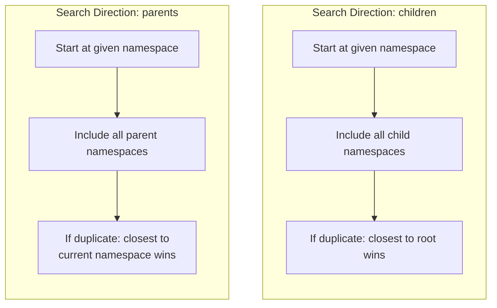

# NLD Entity Management & Registry

This document describes the entity-management layer of nld-core: how entity types
are declared (`EntityDefinition`), stored and retrieved (`EntityProvider`), and
exposed through typed accessors (`NldEntityRegistry`), plus how entities are
loaded from the filesystem and resolved across namespaces.

It builds on the core model layer in `base-model-design.md` (`NldBaseModel`,
`NldNamespace`, `NldEntityReference`, `ResolutionContext`). For how a running
task obtains a registry, see `project-design.md`.

---

## 1. EntityDefinition

**File:** `core/nld/service/entity_definition.py`

Metadata descriptor for an entity type. Tells the framework how to load, store,
and search for entities of a given type.

| Attribute | Type | Description |
|-----------|------|-------------|
| `name` | `str` | Entity type identifier (e.g., `"structure"`, `"flows"`) |
| `model_type` | `type` | Pydantic model class to deserialize into |
| `folder_name` | `str` | Folder path relative to entities root (e.g., `"structure"`) |
| `file_format` | `str` | `"yaml"` or `"jinja"` (default: `"yaml"`) |
| `search_direction` | `str` | `"children"` or `"parents"` (default: `"children"`) |
| `category` | `str \| None` | Display category for grouping |
| `display_name` | `str \| None` | Human-readable name |
| `always_load` | `bool` | Loaded even under a selective load (default: `False`) — see "Selective / lazy entity loading" |
| `allow_same_name_across_namespaces` | `bool` | Keep every copy of a name declared in several namespaces instead of picking one by priority (default: `False`; `True` for `structure` and `flows`) — see "Same-name entities across namespaces" |

## 2. Search Direction

Search direction controls how entities are discovered across the namespace hierarchy
and which duplicate takes priority when the same entity name exists in multiple
namespaces.

### Direction: `"children"` (default)

Searches from the given namespace **downward** into child namespaces.
When duplicates exist, the entity **closest to root** takes priority.

**Use case:** Data entities inherited downward (structures, fields, flows).

```
Namespace tree:        Lookup for "my_field" at namespace "source":

  .                    1. Check "source"         → found (v1)
  └── source           2. Check "source.raw"     → found (v2)
      └── raw          3. Check "source.raw.pg"  → not found
          └── pg
                       Result: v1 (closest to root wins)
```

Structures and flows search children too, but never choose among same-name
copies by depth — see "Same-name entities across namespaces" in §3.

### Direction: `"parents"`

Searches from the given namespace **upward** into parent namespaces.
When duplicates exist, the entity **closest to the current namespace** takes priority.

**Use case:** Configuration / vocabulary / governance entities inherited from
root (adapters, templates, field characterisation definitions, business
dictionary, structure & flow owners).

```
Namespace tree:        Lookup for "tracking" at namespace "source.raw":

  .                    1. Check "source.raw"  → not found
  └── source           2. Check "source"      → found (v2)
      └── raw          3. Check "."           → found (v1)

                       Result: v2 (closest to current namespace wins)
```

## 3. EntityProvider

**File:** `core/nld/service/entity_provider.py`

Core storage and retrieval service for all entities. Organizes entities in a
three-level dictionary structure.

**Internal data structure:**

```python
entities: dict[str, dict[NldNamespace, dict[str, NldBaseModel]]]
#         entity_type → namespace → entity_name → model_instance
```

**Key responsibilities:**

| Responsibility | Methods |
|----------------|---------|
| Entity storage | `replace_entity_type_entities()` |
| Inventory | `get_available_entity_types()`, `get_entity_type_namespaces()`, `get_all_namespaces()` |
| Single retrieval | `get_entity()` → `NldNamespacedBaseModelWrapper` |
| Batch retrieval | `get_entities()`, `get_entities_as_dict()`, `get_entity_keys()` |
| Namespace-aware retrieval | `get_entities_on_namespace()` (respects each type's search direction) |
| Required-definition resolution | `get_required_entity_definitions()` (transitive closure for selective loading) |
| File loading | `load_entities()`, `load_from_entity_definition()` |
| File writing | `write_entity()` |

**Priority resolution for duplicates:**

When an entity name exists in multiple namespaces:

- `"parents"` search → selects the **deepest** namespace (closest to current).
- `"children"` search → selects the **root** namespace (closest to root).
- Uses `select_by_namespace_priority()` utility internally.

**Same-name entities across namespaces:**

An entity type declared with `allow_same_name_across_namespaces=True` —
`structure` and `flows` among the built-ins — keeps every copy of a name instead
of selecting one by priority, so `sales.customer` and `marketing.customer` are
two distinct structures.

- **Bulk accessors** (`get_entities()`, `get_entities_as_dict()`,
  `get_entity_keys()`, `get_<entity>_dict()`) return every visible copy. A name
  held by a single copy is keyed by its bare name; a name held by several copies
  is keyed by each copy's qualified id (`<namespace>.<name>`, the wrapper `id`).
- **Single lookups** (`get_entity()`, `get_<entity>()`) accept the bare name or
  the qualified `<namespace>.<name>` key. Among several matching copies, the one
  stored in the requested namespace itself is returned; otherwise a single
  visible copy is returned, and several raise `AmbiguousEntityException`, which
  lists the candidate ids. Qualify the name, or pass the namespace holding the
  copy.

```
structure/sales/customer.yml       get_structure("customer", namespace="sales")      → sales.customer
structure/marketing/customer.yml   get_structure("sales.customer")                    → sales.customer
                                   get_structure("customer")                          → AmbiguousEntityException
                                   get_structure_dict() keys → ["marketing.customer", "sales.customer"]
```

`nld structure list` and `nld flow list` show the plain name next to its
namespace, same-name copies side by side.

## 4. NldEntityRegistry

**File:** `core/nld/service/nld_entity_registry.py`

Extends `EntityProvider` with typed convenience accessors for each standard entity
type. This is the primary interface used by application code to access entities.

**Standard entity types** (the project's `additional_entities` extend the set):

| Entity Type | Model Class | Folder | Search Direction | Category |
|-------------|-------------|--------|-----------------|----------|
| `field` | `Field` | `templates/field` | children | Structure |
| `structure` | `Structure` | `structure` | children (same name allowed across namespaces) | Structure |
| `structure_model` | `StructureModel` | `structure_model` | children | Structure |
| `structure_audit` | `StructureAudit` | `audits/structure` | children | Structure |
| `field_adapter` | `FieldAdapter` | `templates/field_adapter` | parents | Structure Configuration |
| `field_characterisation_definition` | `FieldCharacterisationDefinition` | `characterisations/field` | parents | Structure Configuration |
| `field_format_adapter` | `FieldFormatAdapter` | `templates/field_format_adapter` | parents | Structure Configuration |
| `field_template` | `FieldTemplate` | `templates/field_template` | parents | Structure Configuration |
| `structure_adapter` | `StructureAdapter` | `templates/structure_adapter` | parents | Structure Configuration |
| `structure_template` | `StructureTemplate` | `templates/structure_template` | parents | Structure Configuration |
| `flows` | `DataFlowDefinition` | `flows` | children (same name allowed across namespaces) | Data Flow |
| `scheduling` | `FlowTask` | `scheduling` | children | Scheduling |
| `business_dictionary` | `BusinessDictionary` | `business/dictionary` | parents | Vocabulary |
| `structure_owner` | `StructureOwner` | `governance/structure` | parents | Governance |
| `flow_owner` | `FlowOwner` | `governance/flow` | parents | Governance |

Seed CSV files live in a `seeds/` folder next to the entity folders without
being an entity type (`seeds/<ns path>/<structure>.csv`).

> The governance, scheduling, and business-dictionary entities have their own
> guides (`guide-governance`, `guide-scheduling`, `guide-business-dictionary`).

**Convenience method pattern (repeated for each entity type):**

```python
# Example for "structure" entity type
registry.get_structure_dict(namespace)          # dict[key → NamespacedStructure]
registry.get_structure_keys(namespace)          # list[str]
registry.list_structure_keys(namespace)         # list[str] (all descendants)
registry.get_structure(entity_key, namespace)   # NamespacedStructure
registry.get_structures(entity_keys, namespace) # list[NamespacedStructure]
registry.get_structures_as_dict(keys, ns)       # dict[key → NamespacedStructure]
```

The key is the entity name, or the qualified `<namespace>.<name>` for a name
held by several namespaces (see "Same-name entities across namespaces").

## 5. Typed Wrappers

Type-specific subclasses of `NldNamespacedBaseModelWrapper` that provide strong typing
for entity retrieval results — e.g. `NamespacedField`, `NamespacedFieldAdapter`,
`NamespacedFieldTemplate`, `NamespacedStructureAdapter`, `NamespacedStructure`,
`NamespacedDataFlowDefinition`, `NamespacedFlowTaskModel`,
`NamespacedStructureOwner`, `NamespacedFlowOwner`. Each is defined next to its
model; `core/nld/service/nld_entities.py` re-exports the field, structure,
flow and scheduling ones.

---

## 6. Entity Loading from Filesystem

Entities are loaded from YAML files organized in a directory structure that maps
directly to namespaces.

```
entities_root/
├── characterisations/field/
│   └── nps_score.yml            → FieldCharacterisationDefinition "nps_score" at namespace "."
├── structure/
│   ├── customers.yml            → Structure "customers" at namespace "."
│   └── source/
│       └── raw/
│           └── raw_orders.yml   → Structure "raw_orders" at namespace "source.raw"
├── flows/
│   └── source/
│       └── raw/
│           ├── load_orders.yml  → DataFlowDefinition "load_orders" at namespace "source.raw"
│           └── load_orders.sql  → SQL query for the flow
└── templates/
    └── field_adapter/
        └── default_adapter.yml  → FieldAdapter "default_adapter" at namespace "."
```

**Process:**

1. `Project.load_entities()` calls `NldEntityRegistry.load_entities(root_directory)`
   with the project's `NldEntityLayout`.
2. For each `EntityDefinition`, scans `root_directory/<folder_name>/` for files, then
   the `<folder_name>/` of every namespace folder (see below).
3. Subdirectory path becomes the namespace (`source/raw/` → `NldNamespace("source.raw")`).
4. File name (without extension) becomes the entity name.
5. `ResolutionContext` is set up with already-loaded entities before deserialization,
   enabling cross-entity references.

### Namespace folders

By default the tree is **type first**: one folder per entity type, the namespace
being the path below it. A namespace declared with `folder: true` in the
`namespaces` block of `nld_project.yml` is stored **namespace first** instead: its
entities live in `<namespace path>/<folder_name>/`, the namespace being the folder
namespace extended by the path below the entity folder. Shared entities
(templates, characterisations, governance…) typically stay type first at the root.

```
entities_root/                          namespaces: {source.web: {folder: true}}
├── templates/field_template/
│   └── rec_insert_tst.yml       → FieldTemplate at namespace "."
├── structure/
│   └── calendar.yml             → Structure "calendar" at namespace "."
└── source/web/                  ← namespace folder "source.web"
    ├── structure/
    │   └── offer.yml            → Structure "offer" at namespace "source.web"
    ├── flows/raw/
    │   ├── load_offer.yml       → DataFlowDefinition at namespace "source.web.raw"
    │   └── load_offer.sql
    └── seeds/
        └── country.csv          → seed of structure "source.web.country"
```

Both layouts resolve to the **same namespaces** (`source/web/flows/raw/x.yml` and
`flows/source/web/raw/x.yml` both hold flow `source.web.raw.x`), so moving a
namespace into its folder is a pure file move: same registry, same flow
definition hashes, no redeploy.

`NldEntityLayout` (`core/nld/pydantic/entity_layout.py`, exposed as
`project.entity_layout`) is the single path authority, used by loading,
`write_entity`, SQL and seed file resolution, Python flow task modules
(`<entity_path>.<folder path>.flows.<sub path>.<flow>`), flow definition hashes,
entity outputs written through `FileOutputService` and the `nld deploy impact`
path → asset mapping.

Rules:

- **One location per namespace** — a namespace is owned by the deepest declared
  folder containing it, or by the type-first tree when none does. Entities of a
  namespace found anywhere else raise `NamespaceFolderConflictException` (e.g.
  `structure/web/x.yml` while `web` is a namespace folder), so a namespace moves
  into its folder in one step, every entity type at once.
- Folders may be multi-level (`source.web`) and nested (`source` and `source.web`).
- `folder` must be a boolean, cannot be set on a wildcard key nor on the root, and
  no folder segment may reuse a top-level entity folder name: the first segment
  of every entity type's `folder_name` (`flows`, `structure`, `structure_model`,
  `audits`, `templates`, `characterisations`, `scheduling`, `business`,
  `governance`, and those of the project's `additional_entities`) or `seeds`.
- Additional entity roots (`additional_entity_paths`) are always read type first.

### Selective / lazy entity loading

`load_entities` accepts an optional `requested_entity_definitions` filter so a
caller can load only the entity types it needs instead of the whole project.
`EntityProvider.get_required_entity_definitions` resolves the **transitive
closure** of a request — it introspects each entity's Pydantic model to follow
embedded sub-models and `NldEntityReference` targets — so, e.g., loading
`flows` does not pull in unrelated structure models. Every CLI command
declares the entity types it touches (`structure list` → `structure`,
`flow *` → `flows`, `business dict *` → `business_dictionary`, …) and loads only
those. Loading is **incremental**: multiple tasks in one process accumulate
definitions without reloading.

Two consequences worth remembering:

- **Accessors for a known-but-not-yet-loaded entity type return empty**
  (empty dict/list) **instead of raising** — matching the behaviour of a type
  with no files. Do not rely on an accessor raising to detect "not loaded".
- An `EntityDefinition` (or a project's additional-entity config) flagged
  `always_load` is loaded even under a selective load. Project-declared
  additional entities default to `always_load: true`, because tasks resolve them
  by key independently of any selective scope; set `always_load: false` to opt a
  custom entity out.

### Namespace-scoped loading

`load_entities(namespace=...)` (on `EntityProvider`, `NldEntityRegistry`, `Project`
and `NldExecutionContext`) loads only the **lineage** of a namespace: its ancestors
(which it inherits from), itself and its descendants. Namespace folders outside
that lineage are not scanned at all. The scope applies to every entity type of
the provider, so a load with a different scope than the previous one clears the
registry and reloads instead of mixing scopes.

Read-only commands scope their load with their `--namespace` option: `structure
list/info/validate`, `structure model list/info`, `structure audit
list/info/render`, `flow list/info`, `scheduling list/info`, `business dict
list/find`, `ownership list`, `project info/entity-info`. Commands that need
cross-namespace lineage or resolve links to structures elsewhere keep a full load:
flow execute/deploy/state/deps, `deploy impact`, structure deploy, `structure
generate`, `structure model validate`, `structure audit run/validate`,
`ownership resolve`, `scheduling deps/validate`.

## 7. Namespace Resolution with Search Direction

When retrieving an entity, the search direction defined in `EntityDefinition`
determines which namespaces are scanned and which duplicate wins.


```mermaid
flowchart TB
    subgraph children["Search Direction: children"]
        direction TB
        C1["Start at given namespace"] --> C2["Include all child namespaces"]
        C2 --> C3["If duplicate: closest to root wins"]
    end

    subgraph parents["Search Direction: parents"]
        direction TB
        P1["Start at given namespace"] --> P2["Include all parent namespaces"]
        P2 --> P3["If duplicate: closest to<br/>current namespace wins"]
    end
```

**Example:** Retrieving entities at namespace `"source.raw"`:

| Entity Type | Direction | Namespaces Searched | Priority |
|-------------|-----------|---------------------|----------|
| `field` | children | `source.raw`, `source.raw.*` | Root (shallowest) |
| `structure` | children | `source.raw`, `source.raw.*` | Copy in `source.raw`, else the single visible copy, else ambiguous |
| `field_template` | parents | `source.raw`, `source`, `.` | Deepest (closest to current) |
| `field_adapter` | parents | `source.raw`, `source`, `.` | Deepest (closest to current) |
| `flows` | children | `source.raw`, `source.raw.*` | Copy in `source.raw`, else the single visible copy, else ambiguous |
