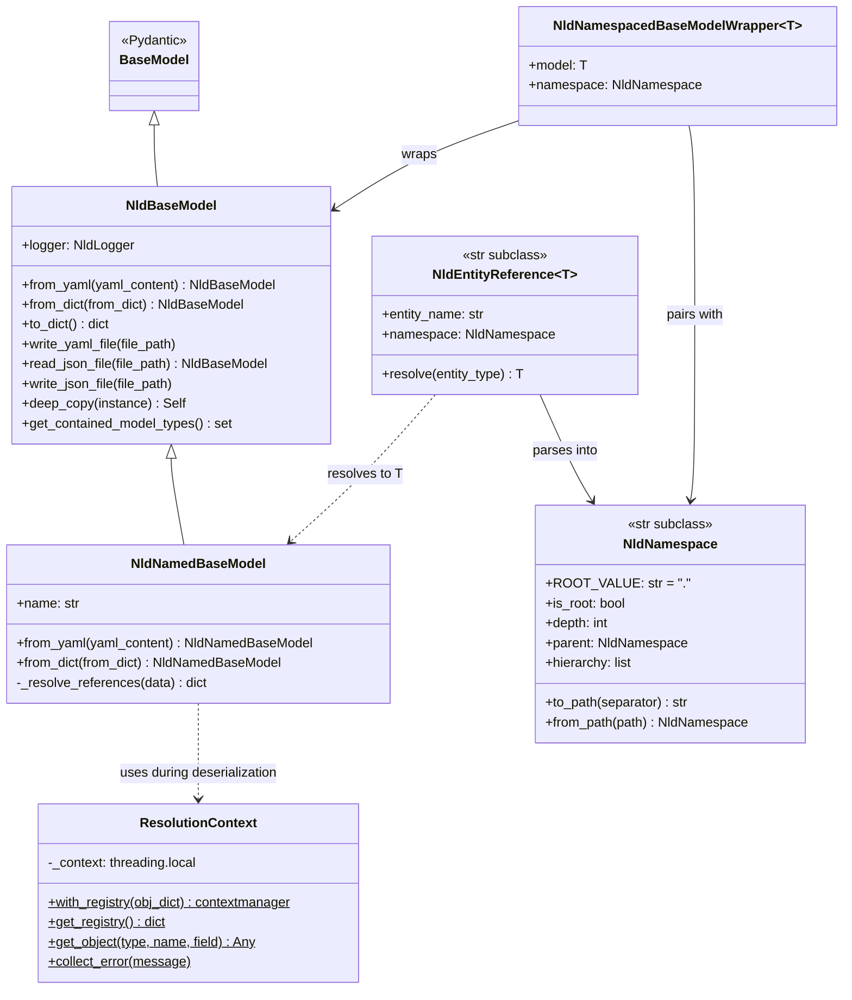
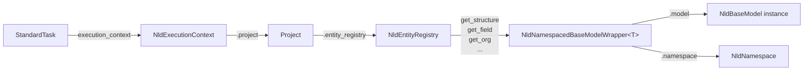
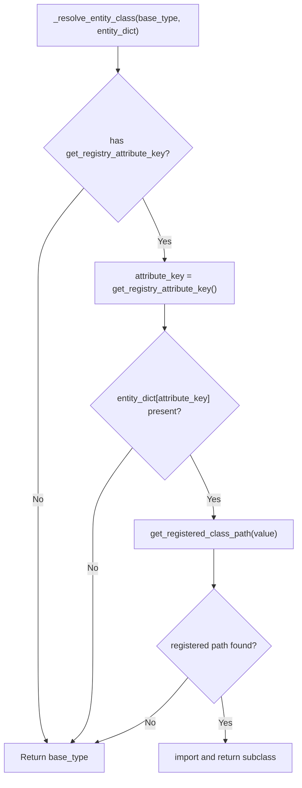
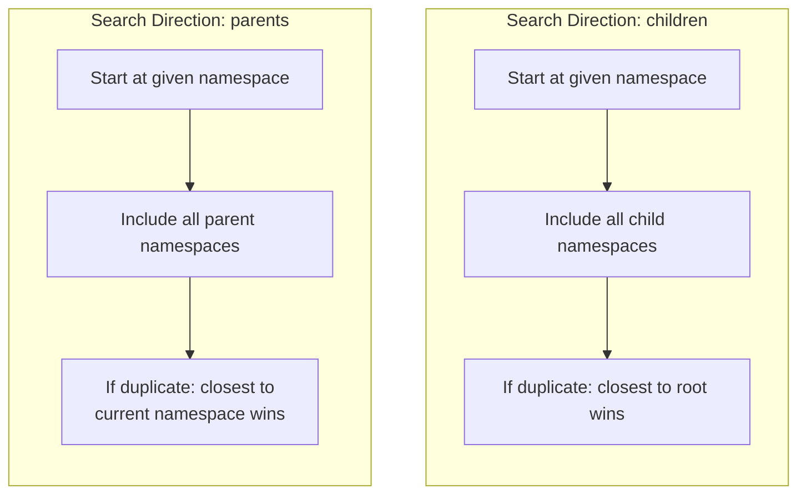
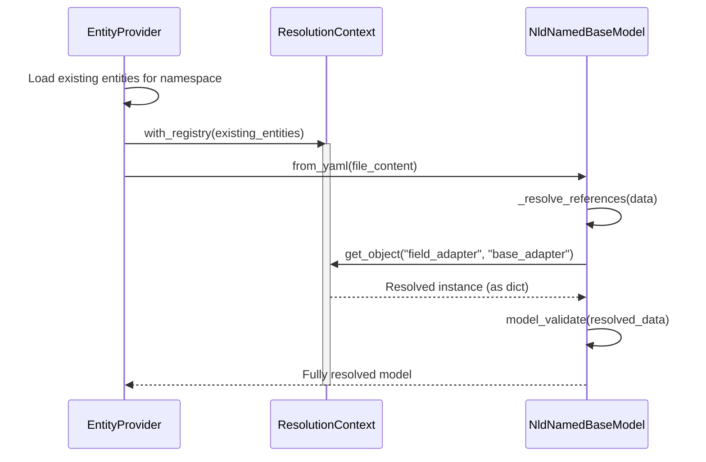

# NLD Base Model & Entity System Design

This document describes the architecture of the NldBaseModel hierarchy, entity management
system, and how context classes consume entities during task execution. These modules form
the foundational data model layer of nld-core.

---

## 1. Class Hierarchy Overview



---

## 2. Core Pydantic Layer

### 2.1 NldBaseModel

**File:** `core/nld/pydantic/base_model.py`

Extended Pydantic `BaseModel` that adds JSON/YAML serialization, structured logging,
and deep copy support. All domain models in the framework inherit from this class.

**Key capabilities:**

| Capability | Methods |
|------------|---------|
| YAML I/O | `from_yaml()`, `write_yaml_file()` |
| JSON I/O | `read_json_file()`, `write_json_file()` |
| Dict conversion | `from_dict()`, `to_dict()` |
| Logging | `log_debug()`, `log_info()`, `log_warn()`, `log_error()`, `log_event()` |
| Cloning | `deep_copy(instance)` |
| Type introspection | `get_contained_model_types()` |

**Smart serialization:** `to_dict()` automatically strips redundant `name` fields from
nested `NldNamedBaseModel` instances, since the name is already used as the dictionary
key during serialization.

### 2.2 NldNamedBaseModel

**File:** `core/nld/pydantic/named_base_model.py`

Extends `NldBaseModel` with a required `name` field and string-to-object reference
resolution during deserialization. This is the base class for all entities that are
stored and retrieved by name (structures, fields, flows, adapters, etc.).

**Key additions over NldBaseModel:**

- Required `name: str` field for entity identification.
- Overridden `from_yaml()` and `from_dict()` that use `ResolutionContext` to resolve
  string references into full object instances during deserialization.
- Reference resolution works recursively through lists and dicts.

**Reference resolution flow:**

```
YAML field value: "base_adapter"    (a string)
       ↓
Field type annotation: FieldAdapter (from model definition)
       ↓
Type name conversion: FieldAdapter → "field_adapter" (camelCase → snake_case)
       ↓
Registry lookup: registry["field_adapter"]["base_adapter"]
       ↓
Result: resolved FieldAdapter instance (returned as dict for validation)
```

### 2.3 ResolutionContext

**File:** `core/nld/pydantic/named_base_model.py` (top of file)

Thread-safe context manager that holds a registry of already-loaded entities, enabling
string references to be resolved to actual objects during YAML deserialization.

**Usage pattern:**

```python
# Build registry from already-loaded entities
obj_dict = {"field_adapter": {"base_adapter": adapter_instance, ...}}

with ResolutionContext.with_registry(obj_dict):
    # Any from_yaml() / from_dict() call within this block
    # can resolve "base_adapter" → the actual FieldAdapter object
    model = MyModel.from_yaml(yaml_content)
```

**Key behaviors:**

- Uses `threading.local()` for thread safety.
- Errors are collected (not raised immediately) and reported together at the end
  of deserialization, giving a complete picture of all unresolved references.
- Type discovery uses camelCase-to-snake_case conversion on the field's type
  annotation to find the matching registry key.

### 2.4 NldNamespace

**File:** `core/nld/pydantic/namespace.py`

Validated, normalized namespace string that subclasses `str` for full backward
compatibility. Represents a hierarchical position in the entity tree using
dot-separated levels.

**Validation rules:**

- `None` or empty string normalizes to root (`"."`)
- Trailing dots are stripped (except for root)
- Slashes (`/`, `\\`) are rejected
- Leading dots (except root) and consecutive dots (`..`) are rejected

**Navigation examples:**

```python
ns = NldNamespace("source.raw.customers")

ns.is_root     # False
ns.depth       # 3
ns.parent      # NldNamespace("source.raw")
ns.hierarchy   # [NldNamespace("."), NldNamespace("source"),
               #  NldNamespace("source.raw"), NldNamespace("source.raw.customers")]

NldNamespace(".")        # Root namespace
NldNamespace(".").depth  # 0

# Path conversion
ns.to_path()                          # "source/raw/customers"
NldNamespace.from_path("source/raw")  # NldNamespace("source.raw")
```

### 2.5 NldNamespacedBaseModelWrapper

**File:** `core/nld/pydantic/namespaced_base_model_wrapper.py`

Generic wrapper that pairs a model instance with the namespace where it is stored.
This is the standard return type for entity retrieval methods, providing both the
entity and its storage location.

```python
wrapper = NldNamespacedBaseModelWrapper(
    model=my_structure,
    namespace=NldNamespace("source.raw"),
)
wrapper.model      # The Structure instance
wrapper.namespace  # NldNamespace("source.raw")
```

### 2.6 NldEntityReference

**File:** `core/nld/pydantic/entity_reference.py`

Generic `str` subclass that holds a dot-separated reference to a named entity
(`namespace.entity_name`). The type parameter `T` (bounded by `NldNamedBaseModel`)
controls the return type of `resolve()`, giving static type safety without casts.

**Parsing rules:**

| Input | Namespace | Entity Name |
|-------|-----------|-------------|
| `"source.my_table"` | `source` | `my_table` |
| `"ns1.ns2.my_table"` | `ns1.ns2` | `my_table` |
| `"my_table"` | `.` (root) | `my_table` |
| `".my_table"` | `.` (root) | `my_table` |

**Usage as a Pydantic field:**

```python
from nld.pydantic import NldEntityReference
from nld.structure import Structure

class DataFlowDefinition(NldNamedBaseModel):
    target_structure: NldEntityReference[Structure] | None = None
```

Pydantic deserializes the field from a plain string. The type parameter is used
only for static typing — the runtime schema is always a validated string.

**Resolving at runtime:**

```python
# resolve() returns T (e.g. Structure) — no cast needed
structure = definition.target_structure.resolve(
    entity_type=EntityTypeNames.STRUCTURE,
)
```

Resolution uses `NldExecutionContext.require_current().entity_registry` to look
up the entity by parsed namespace and name, then returns a deep copy.

---

## 3. Entity Management Layer

### 3.1 EntityDefinition

**File:** `core/nld/service/entity_definition.py`

Metadata descriptor for an entity type. Tells the framework how to load, store,
and search for entities of a given type.

| Attribute | Type | Description |
|-----------|------|-------------|
| `name` | `str` | Entity type identifier (e.g., `"structure"`, `"flows"`) |
| `model_type` | `type` | Pydantic model class to deserialize into |
| `folder_name` | `str` | Folder path relative to entities root (e.g., `"structure"`) |
| `file_format` | `str` | `"yaml"` or `"jinja"` (default: `"yaml"`) |
| `search_direction` | `str` | `"children"` or `"parents"` (default: `"children"`) |
| `category` | `str \| None` | Display category for grouping |
| `display_name` | `str \| None` | Human-readable name |

### 3.2 Search Direction

Search direction controls how entities are discovered across the namespace hierarchy
and which duplicate takes priority when the same entity name exists in multiple
namespaces.

#### Direction: `"children"` (default)

Searches from the given namespace **downward** into child namespaces.
When duplicates exist, the entity **closest to root** takes priority.

**Use case:** Data entities inherited downward (structures, fields, flows).

```
Namespace tree:        Lookup for "my_table" at namespace "source":

  .                    1. Check "source"         → found (v1)
  └── source           2. Check "source.raw"     → found (v2)
      └── raw          3. Check "source.raw.pg"  → not found
          └── pg
                       Result: v1 (closest to root wins)
```

#### Direction: `"parents"`

Searches from the given namespace **upward** into parent namespaces.
When duplicates exist, the entity **closest to the current namespace** takes priority.

**Use case:** Configuration entities inherited from root (org, adapters, templates).

```
Namespace tree:        Lookup for "org_config" at namespace "source.raw":

  .                    1. Check "source.raw"  → not found
  └── source           2. Check "source"      → found (v2)
      └── raw          3. Check "."           → found (v1)

                       Result: v2 (closest to current namespace wins)
```

### 3.3 EntityProvider

**File:** `core/nld/service/entity_provider.py`

Core storage and retrieval service for all entities. Organizes entities in a
three-level dictionary structure.

**Internal data structure:**

```python
entities: dict[str, dict[NldNamespace, dict[str, NldBaseModel]]]
#         entity_type → namespace → entity_name → model_instance
```

**Key responsibilities:**

| Responsibility | Methods |
|----------------|---------|
| Entity storage | `replace_entity_type_entities()` |
| Inventory | `get_available_entity_types()`, `get_entity_type_namespaces()`, `get_all_namespaces()` |
| Single retrieval | `get_entity()` → `NldNamespacedBaseModelWrapper` |
| Batch retrieval | `get_entities()`, `get_entities_as_dict()`, `get_entity_keys()` |
| Namespace-aware retrieval | `get_entities_on_namespace()` (respects each type's search direction) |
| File loading | `load_entities()`, `load_from_entity_definition()` |
| File writing | `write_entity()` |

**Entity loading process:**

1. Scans the entity folder for YAML/Jinja files organized by subdirectory.
2. Subdirectory paths map to namespaces (`structure/source/raw/` → `NldNamespace("source.raw")`).
3. Uses `ResolutionContext` with already-loaded entities for reference resolution.
4. File name (without extension) becomes the entity name.

**Priority resolution for duplicates:**

When an entity name exists in multiple namespaces:

- `"parents"` search → selects the **deepest** namespace (closest to current).
- `"children"` search → selects the **root** namespace (closest to root).
- Uses `select_by_namespace_priority()` utility internally.

### 3.4 NldEntityRegistry

**File:** `core/nld/service/nld_entity_registry.py`

Extends `EntityProvider` with typed convenience accessors for each standard entity
type. This is the primary interface used by application code to access entities.

**Standard entity types:**

| Entity Type | Model Class | Folder | Search Direction | Category |
|-------------|-------------|--------|-----------------|----------|
| `org` | `Organisation` | `config/org` | parents | Configuration |
| `field` | `Field` | `templates/field` | children | Structure |
| `structure` | `Structure` | `structure` | children | Structure |
| `field_adapter` | `FieldAdapter` | `templates/field_adapter` | parents | Structure Configuration |
| `field_format_adapter` | `FieldFormatAdapter` | `templates/field_format_adapter` | parents | Structure Configuration |
| `field_template` | `FieldTemplate` | `templates/field_template` | parents | Structure Configuration |
| `structure_adapter` | `StructureAdapter` | `templates/structure_adapter` | parents | Structure Configuration |
| `flows` | `DataFlowDefinition` | `flows` | children | Data Flow |

**Convenience method pattern (repeated for each entity type):**

```python
# Example for "structure" entity type
registry.get_structure_dict(namespace)          # dict[name → NamespacedStructure]
registry.get_structure_keys(namespace)          # list[str]
registry.list_structure_keys(namespace)         # list[str] (all descendants)
registry.get_structure(entity_key, namespace)   # NamespacedStructure
registry.get_structures(entity_keys, namespace) # list[NamespacedStructure]
registry.get_structures_as_dict(keys, ns)       # dict[name → NamespacedStructure]
```

### 3.5 Typed Wrappers

**File:** `core/nld/service/nld_entities.py`

Type-specific subclasses of `NldNamespacedBaseModelWrapper` that provide strong typing
for entity retrieval results:

- `NamespacedOrganisation` → wraps `Organisation`
- `NamespacedField` → wraps `Field`
- `NamespacedFieldAdapter` → wraps `FieldAdapter`
- `NamespacedFieldFormatAdapter` → wraps `FieldFormatAdapter`
- `NamespacedFieldTemplate` → wraps `FieldTemplate`
- `NamespacedStructureAdapter` → wraps `StructureAdapter`
- `NamespacedStructure` → wraps `Structure`
- `NamespacedDataFlowDefinition` → wraps `DataFlowDefinition`

---

## 4. Context Classes & Entity Consumption

### 4.1 Entity Access Chain

The following diagram shows how a running task accesses entities through the
context hierarchy.



### 4.2 TaskRequest

**File:** `core/nld/task/context/request.py`

Represents the input parameters for a task execution. Holds execution parameters
and configuration paths used to initialize the execution context.

| Attribute | Type | Description |
|-----------|------|-------------|
| `execution_name` | `str` | Unique identifier for this execution |
| `params` | `dict[str, Any]` | Task parameters (deep copied at init) |
| `extra_args` | `dict[str, Any]` | CLI arguments parsed from `--key=value` format |

**Key methods:**

- `get_parameters(exclude_extra_args)`: Merges `params` and `extra_args`. When both
  contain the same key, `params` takes precedence.
- `nld_root_folder_path` (property): Extracts `ROOT_FOLDER_PATH` from params.
- `nld_config_folder_path` (property): Extracts `CONFIG_FOLDER_PATH` from params.

### 4.3 NldExecutionContext

**File:** `core/nld/task/context/context.py`

Central execution context accessible throughout task execution via `contextvars`
(thread-safe, async-safe). Holds the project, connectors, and execution metadata.

**Key attributes:**

| Attribute | Type | Description |
|-----------|------|-------------|
| `task_request` | `TaskRequest` | Input execution request |
| `exec_info` | `ExecutionInfo` | Execution metadata (name, UUID, start time) |
| `nld_config_folder_path` | `str` | Absolute path to `.nld` configuration folder |
| `connection_configs` | `ConnectionConfigs` | Available connector configurations |
| `connector_factory` | `ConnectorFactory` | Factory for creating data connectors |

**Initialization:**

```python
context = NldExecutionContext(
    task_request=request,
    with_project=True,  # optionally load project at init
)
```

Resolves folder paths from: task request → environment variables → defaults.

**Context variable pattern (global access without parameter passing):**

```python
# Set context for the current thread / async task
with NldExecutionContext(task_request=request) as context:
    context.load_entities()

    # Any code in this block (including nested calls) can access:
    ctx = NldExecutionContext.require_current()
    registry = ctx.entity_registry
```

**Key methods:**

| Method | Description |
|--------|-------------|
| `init_project()` | Load `Project` from `nld_project.yml` |
| `load_entities()` | Load entities into project's registry |
| `project` (property) | Get project (raises `RuntimeError` if not initialized) |
| `entity_registry` (property) | Shortcut to `project.entity_registry` |
| `load_connector(name)` | Load a data connector on demand |
| `get_data_connector(name)` | Get connector, loading if needed |
| `set_current()` | Store in `contextvars` for global access |
| `require_current()` (static) | Retrieve current context or raise `RuntimeError` |
| `clear_current()` | Clean up context variable |

### 4.4 Project

**File:** `core/nld/project/project.py`

Root container representing an NLD project. Instantiates `NldEntityRegistry`, loads
entities from filesystem, and is held by the execution context.

| Attribute | Type | Description |
|-----------|------|-------------|
| `root_folder_path` | `str` | Absolute path to project root |
| `name` | `str` | Project name |
| `version` | `str \| None` | Optional version string |
| `entity_path` | `str` | Relative path to entities folder (default: `"."`) |
| `environments` | `EnvironmentsConfig` | Named environments (connection profile + variable overrides); active env resolved by `--env` → `NLD__ENVIRONMENT` → `default`. See `guide-scheduling`. |
| `properties` | `dict[str, Any]` | Free-form key-value metadata the core does not interpret (platform hints). |
| `entity_registry` | `NldEntityRegistry` | Manages all project entities |

**Loading a project:**

```python
project = Project.from_yaml(
    root_path="/path/to/project",
    load_entities=True,
)
```

This reads `nld_project.yml` from the root path, creates the `NldEntityRegistry`,
and optionally loads all entities from the filesystem.

**Project file format (`nld_project.yml`):**

```yaml
name: my_project
version: 1.0.0
entity_path: .
python_additional_paths:
  flows:
    - custom.flows.module
environments:                  # optional — see guide-scheduling
  default: prd
  values:
    dev:
      connection_profile: dev
      variables:
        schema_name: opendata_dev
    prd:
      connection_profile: default
properties:                    # optional — free-form platform metadata
  data_domain: clh
```

### 4.5 StandardTask

**File:** `core/nld/task/base/std_task.py`

Abstract base class for standard NLD tasks. Automatically retrieves the current
`NldExecutionContext` on initialization, providing tasks with access to the full
entity registry and connector infrastructure.

```python
class MyTask(StandardTask):
    def run(self):
        # Access entities through the execution context
        registry = self.execution_context.entity_registry
        structure = registry.get_structure("my_table")
        org = registry.get_org("default")
```

**Initialization:** Calls `NldExecutionContext.require_current()` to obtain the
context. This means tasks can only be instantiated within an active context block.

---

## 5. Key Patterns

### 5.1 Dynamic Entity Class Resolution

**File:** `core/nld/service/model_read_util.py` — `_resolve_entity_class()`

When loading entities from YAML, the framework can dynamically resolve the
correct subclass to instantiate based on a registry key in the entity data.
This is a generic mechanism that works with any `NldBaseModel` subclass.

**Requirements for a model to support dynamic resolution:**

| Class Method | Description |
|-------------|-------------|
| `get_registry_attribute_key() -> str \| None` | Returns the entity dict key used for registry lookup (e.g. `"connector_type"`) |
| `get_registered_class_path(key_value) -> str \| None` | Returns the registered class path for a key value |
| `register_subclass(key_value, class_path)` | Registers a subclass class path for a key value |

If a model does not implement these methods, `_resolve_entity_class()` returns
the base type unchanged. Currently `Structure` implements this pattern, mapping
`connector_type` values to connector-specific subclasses (e.g.
`PostgreSQLStructure`).

**Resolution flow:**



Registration happens automatically when connector plugins are loaded by
`ConnectorFactory.load_plugin()`, which calls `Structure.register_subclass()`
if the plugin provides a `structure_class_path`.

### 5.2 Entity Loading from Filesystem

Entities are loaded from YAML files organized in a directory structure that maps
directly to namespaces.

```
entities_root/
├── config/org/
│   └── default.yml              → Organisation "default" at namespace "."
├── structure/
│   ├── customers.yml            → Structure "customers" at namespace "."
│   └── source/
│       └── raw/
│           └── raw_orders.yml   → Structure "raw_orders" at namespace "source.raw"
├── flows/
│   └── source/
│       └── raw/
│           ├── load_orders.yml  → DataFlowDefinition "load_orders" at namespace "source.raw"
│           └── load_orders.sql  → SQL query for the flow
└── templates/
    └── field_adapter/
        └── default_adapter.yml  → FieldAdapter "default_adapter" at namespace "."
```

**Process:**

1. `Project.load_entities()` calls `NldEntityRegistry.load_entities(root_directory)`.
2. For each `EntityDefinition`, scans `root_directory/<folder_name>/` for files.
3. Subdirectory path becomes the namespace (`source/raw/` → `NldNamespace("source.raw")`).
4. File name (without extension) becomes the entity name.
5. `ResolutionContext` is set up with already-loaded entities before deserialization,
   enabling cross-entity references.

#### Selective / lazy entity loading

`load_entities` accepts an optional `requested_entity_definitions` filter so a
caller can load only the entity types it needs instead of the whole project.
`EntityProvider.get_required_entity_definitions` resolves the **transitive
closure** of a request — it introspects each entity's Pydantic model to follow
embedded sub-models and `NldEntityReference` targets — so, e.g., loading
`flows` no longer pulls in unrelated structure models. Every CLI command
declares the entity types it touches (`structure list` → `structure`,
`flow *` → `flows`, `business dict *` → `business_dictionary`, …) and loads only
those. Loading is **incremental**: multiple tasks in one process accumulate
definitions without reloading.

Two consequences worth remembering:

- **Accessors for a known-but-not-yet-loaded entity type return empty**
  (empty dict/list) **instead of raising** — matching the behaviour of a type
  with no files. Do not rely on an accessor raising to detect "not loaded".
- An `EntityDefinition` (or a project's additional-entity config) flagged
  `always_load` is loaded even under a selective load. Project-declared
  additional entities default to `always_load: true`, because tasks resolve them
  by key independently of any selective scope; set `always_load: false` to opt a
  custom entity out.

### 5.3 Namespace Resolution with Search Direction

When retrieving an entity, the search direction defined in `EntityDefinition`
determines which namespaces are scanned and which duplicate wins.



**Example:** Retrieving entities at namespace `"source.raw"`:

| Entity Type | Direction | Namespaces Searched | Priority |
|-------------|-----------|---------------------|----------|
| `structure` | children | `source.raw`, `source.raw.*` | Root (shallowest) |
| `org` | parents | `source.raw`, `source`, `.` | Deepest (closest to current) |
| `field_adapter` | parents | `source.raw`, `source`, `.` | Deepest (closest to current) |
| `flows` | children | `source.raw`, `source.raw.*` | Root (shallowest) |

### 5.4 ResolutionContext Pattern

The `ResolutionContext` enables YAML files to reference other entities by name
as plain strings, which get resolved to actual object instances during
deserialization.



**Error handling:** Errors are collected during resolution and raised together
at the end, providing a complete list of all unresolved references in a single
error message.

### 5.5 Complete Entity Access Chain

The full chain from task instantiation to entity access:

```python
# 1. Create request and context
request = TaskRequest(execution_name="my_run", params={...})

with NldExecutionContext(task_request=request, with_project=True) as context:
    # 2. Load entities from filesystem
    context.load_entities()

    # 3. Task automatically picks up the context
    task = MyTask()

    # 4. Inside the task: access entities
    registry = task.execution_context.entity_registry

    # 5. Retrieve a structure (search_direction="children")
    ns_structure = registry.get_structure(
        entity_key="raw_orders",
        namespace=NldNamespace("source.raw"),
    )
    # Returns: NamespacedStructure
    #   .model     → Structure instance
    #   .namespace → NldNamespace where it was found

    # 6. Retrieve org config (search_direction="parents")
    ns_org = registry.get_org(
        entity_key="default",
        namespace=NldNamespace("source.raw"),
    )
    # Searches: "source.raw" → "source" → "." until found
```
