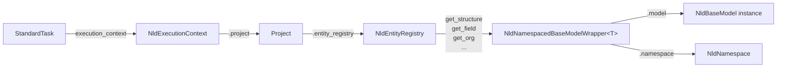

# NLD Project & Execution Context

This document describes how a running task consumes entities: the context
classes (`TaskRequest`, `NldExecutionContext`), the `Project` container that
holds the entity registry, and `StandardTask`.

It builds on `base-model-design.md` (core models) and `entity-registry-design.md`
(the registry the project owns). For the platform-level catalogue of multiple
projects, see `project-catalog-design.md`.

---

## 1. Entity Access Chain

The following diagram shows how a running task accesses entities through the
context hierarchy.



## 2. TaskRequest

**File:** `core/nld/task/context/request.py`

Represents the input parameters for a task execution. Holds execution parameters
and configuration paths used to initialize the execution context.

| Attribute | Type | Description |
|-----------|------|-------------|
| `execution_name` | `str` | Unique identifier for this execution |
| `params` | `dict[str, Any]` | Task parameters (deep copied at init) |
| `extra_args` | `dict[str, Any]` | CLI arguments parsed from `--key=value` format |

**Key methods:**

- `get_parameters(exclude_extra_args)`: Merges `params` and `extra_args`. When both
  contain the same key, `params` takes precedence.
- `nld_root_folder_path` (property): Extracts `ROOT_FOLDER_PATH` from params.
- `nld_config_folder_path` (property): Extracts `CONFIG_FOLDER_PATH` from params.

## 3. NldExecutionContext

**File:** `core/nld/task/context/context.py`

Central execution context accessible throughout task execution via `contextvars`
(thread-safe, async-safe). Holds the project, connectors, and execution metadata.

**Key attributes:**

| Attribute | Type | Description |
|-----------|------|-------------|
| `task_request` | `TaskRequest` | Input execution request |
| `exec_info` | `ExecutionInfo` | Execution metadata (name, UUID, start time) |
| `nld_config_folder_path` | `str` | Absolute path to `.nld` configuration folder |
| `connection_configs` | `ConnectionConfigs` | Available connector configurations |
| `connector_factory` | `ConnectorFactory` | Factory for creating data connectors |

**Initialization:**

```python
context = NldExecutionContext(
    task_request=request,
    with_project=True,  # optionally load project at init
)
```

Resolves folder paths from: task request → environment variables → defaults.

**Context variable pattern (global access without parameter passing):**

```python
# Set context for the current thread / async task
with NldExecutionContext(task_request=request) as context:
    context.load_entities()

    # Any code in this block (including nested calls) can access:
    ctx = NldExecutionContext.require_current()
    registry = ctx.entity_registry
```

**Key methods:**

| Method | Description |
|--------|-------------|
| `init_project()` | Load `Project` from `nld_project.yml` |
| `load_entities()` | Load entities into project's registry (optionally selective — see `entity-registry-design.md`) |
| `project` (property) | Get project (raises `RuntimeError` if not initialized) |
| `entity_registry` (property) | Shortcut to `project.entity_registry` |
| `load_connector(name)` | Load a data connector on demand |
| `get_data_connector(name)` | Get connector, loading if needed |
| `set_current()` | Store in `contextvars` for global access |
| `require_current()` (static) | Retrieve current context or raise `RuntimeError` |
| `clear_current()` | Clean up context variable |

## 4. Project

**File:** `core/nld/project/project.py`

Root container representing an NLD project. Instantiates `NldEntityRegistry`, loads
entities from filesystem, and is held by the execution context.

| Attribute | Type | Description |
|-----------|------|-------------|
| `root_folder_path` | `str` | Absolute path to project root |
| `name` | `str` | Project name |
| `version` | `str \| None` | Optional version string |
| `entity_path` | `str` | Relative path to entities folder (default: `"."`) |
| `environments` | `EnvironmentsConfig` | Named environments (connection profile + variable overrides); active env resolved by `--env` → `NLD__ENVIRONMENT` → `default`. See `guide-scheduling`. |
| `properties` | `dict[str, Any]` | Free-form key-value metadata the core does not interpret (platform hints). |
| `entity_registry` | `NldEntityRegistry` | Manages all project entities |

**Loading a project:**

```python
project = Project.from_yaml(
    root_path="/path/to/project",
    load_entities=True,
)
```

This reads `nld_project.yml` from the root path, creates the `NldEntityRegistry`,
and optionally loads all entities from the filesystem.

**Project file format (`nld_project.yml`):**

```yaml
name: my_project
version: 1.0.0
entity_path: .
python_additional_paths:
  flows:
    - custom.flows.module
environments:                  # optional — see guide-scheduling
  default: prd
  values:
    dev:
      connection_profile: dev
      variables:
        schema_name: opendata_dev
    prd:
      connection_profile: default
properties:                    # optional — free-form platform metadata
  data_domain: clh
```

## 5. StandardTask

**File:** `core/nld/task/base/std_task.py`

Abstract base class for standard NLD tasks. Automatically retrieves the current
`NldExecutionContext` on initialization, providing tasks with access to the full
entity registry and connector infrastructure.

```python
class MyTask(StandardTask):
    def run(self):
        # Access entities through the execution context
        registry = self.execution_context.entity_registry
        structure = registry.get_structure("my_table")
        org = registry.get_org("default")
```

**Initialization:** Calls `NldExecutionContext.require_current()` to obtain the
context. This means tasks can only be instantiated within an active context block.

---

## 6. Complete Entity Access Chain

The full chain from task instantiation to entity access:

```python
# 1. Create request and context
request = TaskRequest(execution_name="my_run", params={...})

with NldExecutionContext(task_request=request, with_project=True) as context:
    # 2. Load entities from filesystem
    context.load_entities()

    # 3. Task automatically picks up the context
    task = MyTask()

    # 4. Inside the task: access entities
    registry = task.execution_context.entity_registry

    # 5. Retrieve a structure (search_direction="children")
    ns_structure = registry.get_structure(
        entity_key="raw_orders",
        namespace=NldNamespace("source.raw"),
    )
    # Returns: NamespacedStructure
    #   .model     → Structure instance
    #   .namespace → NldNamespace where it was found

    # 6. Retrieve org config (search_direction="parents")
    ns_org = registry.get_org(
        entity_key="default",
        namespace=NldNamespace("source.raw"),
    )
    # Searches: "source.raw" → "source" → "." until found
```
