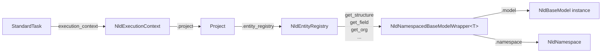

# NLD Project & Execution Context

This document describes how a running task consumes entities: the context
classes (`TaskRequest`, `NldExecutionContext`), the `Project` container that
holds the entity registry, and `StandardTask`.

It builds on `base-model-design.md` (core models) and `entity-registry-design.md`
(the registry the project owns). For the platform-level catalogue of multiple
projects, see `project-catalog-design.md`.

---

## 1. Entity Access Chain

The following diagram shows how a running task accesses entities through the
context hierarchy.


```mermaid
flowchart LR
    A[StandardTask] -->|execution_context| B[NldExecutionContext]
    B -->|.project| C[Project]
    C -->|.entity_registry| D[NldEntityRegistry]
    D -->|get_structure<br/>get_field<br/>get_org<br/>...| E["NldNamespacedBaseModelWrapper&lt;T&gt;"]
    E -->|.model| F[NldBaseModel instance]
    E -->|.namespace| G[NldNamespace]
```

## 2. TaskRequest

**File:** `core/nld/task/context/request.py`

Represents the input parameters for a task execution. Holds execution parameters
and configuration paths used to initialize the execution context.

| Attribute | Type | Description |
|-----------|------|-------------|
| `execution_name` | `str` | Unique identifier for this execution |
| `params` | `dict[str, Any]` | Task parameters (deep copied at init) |
| `extra_args` | `dict[str, Any]` | CLI arguments parsed from `--key=value` format |

**Key methods:**

- `get_parameters(exclude_extra_args)`: Merges `params` and `extra_args`. When both
  contain the same key, `params` takes precedence.
- `nld_root_folder_path` (property): Extracts `ROOT_FOLDER_PATH` from params.
- `nld_config_folder_path` (property): Extracts `CONFIG_FOLDER_PATH` from params.

## 3. NldExecutionContext

**File:** `core/nld/task/context/context.py`

Central execution context accessible throughout task execution via `contextvars`
(thread-safe, async-safe). Holds the project, connectors, and execution metadata.

**Key attributes:**

| Attribute | Type | Description |
|-----------|------|-------------|
| `task_request` | `TaskRequest` | Input execution request |
| `exec_info` | `ExecutionInfo` | Execution metadata (name, UUID, start time) |
| `nld_config_folder_path` | `str` | Absolute path to `.nld` configuration folder |
| `connection_configs` | `ConnectionConfigs` | Available connector configurations |
| `connector_factory` | `ConnectorFactory` | Factory for creating data connectors |

**Initialization:**

```python
context = NldExecutionContext(
    task_request=request,
    with_project=True,  # optionally load project at init
)
```

Resolves folder paths from: task request → environment variables → defaults.

**Context variable pattern (global access without parameter passing):**

```python
# Set context for the current thread / async task
with NldExecutionContext(task_request=request) as context:
    context.load_entities()

    # Any code in this block (including nested calls) can access:
    ctx = NldExecutionContext.require_current()
    registry = ctx.entity_registry
```

**Key methods:**

| Method | Description |
|--------|-------------|
| `init_project()` | Load `Project` from `nld_project.yml` |
| `load_entities()` | Load entities into project's registry (optionally selective by entity type, or scoped to a namespace lineage with `namespace=` — see `entity-registry-design.md`) |
| `project` (property) | Get project (raises `RuntimeError` if not initialized) |
| `entity_registry` (property) | Shortcut to `project.entity_registry` |
| `load_connector(name)` | Load a data connector on demand |
| `get_data_connector(name)` | Get connector, loading if needed |
| `set_current()` | Store in `contextvars` for global access |
| `require_current()` (static) | Retrieve current context or raise `RuntimeError` |
| `clear_current()` | Clean up context variable |

## 4. Project

**File:** `core/nld/project/project.py`

Root container representing an NLD project. Instantiates `NldEntityRegistry`, loads
entities from filesystem, and is held by the execution context.

| Attribute | Type | Description |
|-----------|------|-------------|
| `root_folder_path` | `str` | Absolute path to project root |
| `name` | `str` | Project name |
| `version` | `str \| None` | Optional version string |
| `entity_path` | `str` | Relative path to entities folder (default: `"."`) |
| `environments` | `EnvironmentsConfig` | Named environments (connection profile + variable overrides); active env resolved by `--env` → `NLD__ENVIRONMENT` → `default`. See `guide-scheduling`. |
| `properties` | `dict[str, Any]` | Free-form key-value metadata the core does not interpret (platform hints). |
| `metadata_backend_connector` | `str \| None` | Connection holding the deployment metadata tables (`_nld_structure_*`, `_nld_flow_*`). Required by `nld flow deploy` and change files. See `guide-deployment`. |
| `variables` | `dict[str, str]` | Jinja variables for SQL hooks (structure and flow `pre/post` hooks). An `NLD__VAR__<NAME>` environment variable overrides `<name>`. |
| `python_additional_paths` | `dict[str, list[str]]` | Extra Python modules (dotted notation, no slash) searched for flow task classes (`flows`) and SQL rendering transformations (`sql_transformations`). Unknown keys are rejected. |
| `additional_entity_paths` | `list[str]` | Extra entity roots loaded *before* the project ones, so a project entity overrides a packaged one: a path relative to the project root, or `pkg://<package>[/<subdir>]` for an installed package. |
| `additional_entities` | `list[AdditionalEntityConfig]` | Project-defined entity types (`name`, `model_type`, `folder_name`, optional `display_name`, `category`, `search_direction`, `always_load`, `file_format`). A name colliding with a built-in type is rejected. |
| `flow_config` | `FlowProjectConfig` | General flow configuration from the `flow` block: `additional_flow_task_types`, `additional_incremental_types`, `additional_quality_rules`, `additional_alert_transports`. |
| `flow_namespace_config` | `FlowNamespaceConfig` | Namespace-scoped flow settings from `namespaces.<ns>.flow`. |
| `scheduling_namespace_config` | `SchedulingNamespaceConfig` | Namespace-scoped scheduling settings (retry budget, alerting) from `namespaces.<ns>.scheduling`. |
| `structure_namespace_config` | `StructureNamespaceConfig` | Namespace-scoped structure settings from `namespaces.<ns>.structure`. |
| `folder_namespaces` | `list[str]` | Namespaces declared with `namespaces.<ns>.folder: true`; `project.entity_layout` (`NldEntityLayout`) combines them with `entity_path`. |
| `deploy_namespace_config` | `DeployNamespaceConfig` | Deploy units and groups from `namespaces.<ns>.deploy`; `get_deployable_namespaces()` lists the namespaces `--namespace` accepts, `get_groups()` the members by group. |
| `entity_registry` | `NldEntityRegistry` | Manages all project entities |

**Loading a project:**

```python
project = Project.from_yaml(
    root_path="/path/to/project",
    load_entities=True,
)
```

This reads `nld_project.yml` from the root path, creates the `NldEntityRegistry`,
and optionally loads all entities from the filesystem.

**Project file format (`nld_project.yml`):**

```yaml
name: my_project
version: 1.0.0
entity_path: .
metadata_backend_connector: pg_main   # optional — needed by nld flow deploy
variables:                     # optional — Jinja variables of SQL hooks
  expo_role: reporting_reader
python_additional_paths:
  flows:
    - custom.flows.module
additional_entity_paths:       # optional — packaged entity roots
  - pkg://shared_assets/assets
flow:                          # optional — general flow configuration
  additional_flow_task_types:
    custom: custom.flows.custom_task.CustomFlowTask
  additional_incremental_types: []
  additional_quality_rules: []
  additional_alert_transports: []
namespaces:                    # optional — namespace-scoped settings
  .:
    structure:
      default_connection_name: pg_main
      database_name: main_db
      schema_name: public
    flow:
      default_state_backend_connector: pg_main
    scheduling:
      alerting:
        transports: [slack]
        alert_on: [FAILED, WARNING]
        slack:
          channel: data-alerts
  "*.extraction":
    scheduling:
      max_attempts: 2           # one retry for flows calling external APIs
  source.raw:
    structure:
      default_connection_name: pg_main
      database_name: main_db
      schema_name: raw
  source.web:
    folder: true               # entities stored under <entity_path>/source/web/
environments:                  # optional — see guide-scheduling
  default: prd
  values:
    dev:
      connection_profile: dev
      variables:
        schema_name: opendata_dev
    prd:
      connection_profile: default
properties:                    # optional — free-form platform metadata
  data_domain: clh
```

### The `namespaces` block

Each key is a namespace (`.` being the root) declaring the settings that apply
to the entities under it. The `structure`, `flow`, `scheduling` and `deploy`
facets carry settings, and a namespace may declare any of them. The boolean `folder` facet does not
configure entities but says where they are stored: `folder: true` makes the
namespace a **namespace folder**, its entities grouped under
`<entity_path>/<namespace path>/<entity folder>/` instead of
`<entity_path>/<entity folder>/<namespace path>/` (see
`entity-registry-design.md` → "Namespace folders").

Resolution walks the namespace hierarchy from the most specific level down to
the root, and at each level prefers an **exact** key over a **wildcard** one.
Keys may use shell-style wildcards (`"*.extraction"`); matching level by level
is what lets a wildcard win over a broader exact key, so with both `.` and
`"*.extraction"` declared, `apec.extraction` resolves to the wildcard while
`apec.refinement` falls back to `.`.

| Facet | Fields | Model |
|-------|--------|-------|
| `structure` | `default_connection_name`, `database_name`, `schema_name`, `tags` | `StructureNamespaceMapping` |
| `flow` | `default_state_backend_connector` (a connection name, or `{primary, secondary}`) | `FlowNamespaceMapping` |
| `scheduling` | `max_attempts` (1–10, default 1), `alerting` | `SchedulingNamespaceMapping` |
| `folder` | `true` / `false` — exact, non-root keys only (nld-core ≥ 0.1.2a5) | collected into `Project.folder_namespaces` |
| `deploy` | `unit` (bool) and/or `group` — at least one, exact (non-wildcard) keys only, applied to the declaring namespace without hierarchy resolution; a group needs at least two members (nld-core > 0.1.2a5) | `DeployNamespaceMapping`, collected into `Project.deploy_namespace_config` — `unit: true` allows `--namespace` deploys of that namespace (opt-in), the namespaces sharing a group always deploy together (see `flow-deployment.md` §4b) |

The block is transposed at load into one config per facet, reachable on the
project as `structure_namespace_config`, `flow_namespace_config` and
`scheduling_namespace_config` (all `NamespaceMappingConfig` subclasses,
`core/nld/pydantic/namespace_mapping.py`). An unknown facet name raises rather
than being ignored.

#### The `scheduling` facet: retries and alerting

`max_attempts` is the attempt budget the scheduler gives each flow of the
namespace (1 = no retry). nld reads the current attempt from the environment
and alerts on a failure only at the final attempt.

`alerting` declares through which technologies, and on what, the flows of the
namespace alert:

| Key | Default | Meaning |
|-----|---------|---------|
| `transports` | — (required when enabled) | Transport names: built-in `slack`, `telegram`, or one registered through `flow.additional_alert_transports` (`name`, `transport_class`) |
| `alert_on` | `[FAILED]` | Execution states raising an alert: `SUCCESS`, `WARNING`, `FAILED` |
| `alert_after_consecutive_failures` | `1` | Scheduler-side threshold before alerting |
| `enabled` | `true` | `false` is the explicit opt-out of a namespace (needs no transport) |
| `<transport>` | — | Non-secret settings of one transport: `slack.channel`, `telegram.chat_id` |

Secrets never live in the project file: each transport reads them from
`NLD__ALERTING__<TRANSPORT>__<SETTING>` (`NLD__ALERTING__SLACK__WEBHOOK_URL`,
`NLD__ALERTING__TELEGRAM__BOT_TOKEN`), and a transport whose secret is absent is
silently disabled. Resolution walks past levels that declare no `alerting`, so a
root declaration covers every namespace until one declares its own. Unknown
transports and unknown settings keys fail the project load.

> **Upgrade note (0.1.2a3).** `namespaces` replaces the former
> `config/structure.yaml` and `config/flow.yaml`, and the top-level
> `flow` block absorbs `additional_flow_task_types` (previously in
> `config/flow.yaml`) together with `additional_incremental_types` and
> `additional_quality_rules` (previously top-level keys). Those files are no
> longer read, and a project that still carries either one fails to load with an
> error naming the file — they must be merged into `nld_project.yml` and
> deleted. `additional_entities` and `python_additional_paths` stay top-level.

## 5. StandardTask

**File:** `core/nld/task/base/std_task.py`

Abstract base class for standard NLD tasks. Automatically retrieves the current
`NldExecutionContext` on initialization, providing tasks with access to the full
entity registry and connector infrastructure.

```python
class MyTask(StandardTask):
    def run(self):
        # Access entities through the execution context
        registry = self.execution_context.entity_registry
        structure = registry.get_structure("my_table")
        org = registry.get_org("default")
```

**Initialization:** Calls `NldExecutionContext.require_current()` to obtain the
context. This means tasks can only be instantiated within an active context block.

---

## 6. Complete Entity Access Chain

The full chain from task instantiation to entity access:

```python
# 1. Create request and context
request = TaskRequest(execution_name="my_run", params={...})

with NldExecutionContext(task_request=request, with_project=True) as context:
    # 2. Load entities from filesystem
    context.load_entities()

    # 3. Task automatically picks up the context
    task = MyTask()

    # 4. Inside the task: access entities
    registry = task.execution_context.entity_registry

    # 5. Retrieve a structure (search_direction="children")
    ns_structure = registry.get_structure(
        entity_key="raw_orders",
        namespace=NldNamespace("source.raw"),
    )
    # Returns: NamespacedStructure
    #   .model     → Structure instance
    #   .namespace → NldNamespace where it was found

    # 6. Retrieve org config (search_direction="parents")
    ns_org = registry.get_org(
        entity_key="default",
        namespace=NldNamespace("source.raw"),
    )
    # Searches: "source.raw" → "source" → "." until found
```
