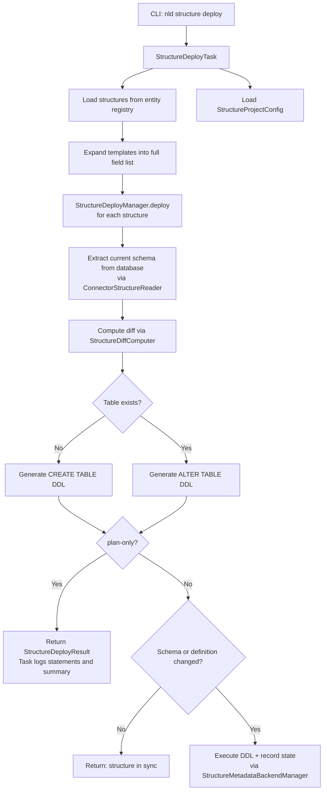
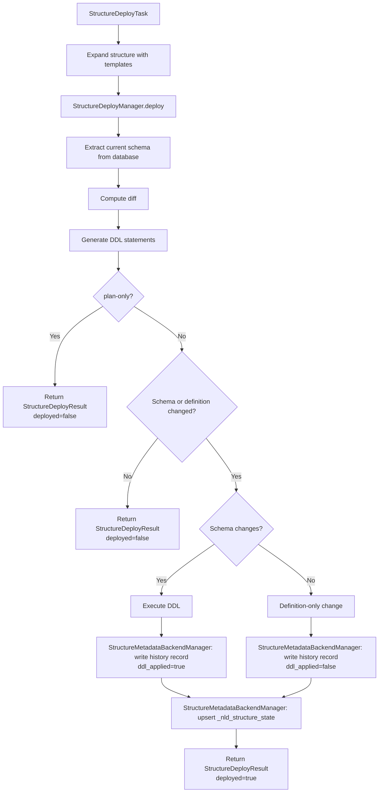

## Structure Deployment

This document describes the structure deployment feature, including the current
deployment mechanism and the schema history tracking system.

### Overview

Structure deployment synchronizes YAML structure definitions with a target
database (PostgreSQL, BigQuery, Snowflake). The process compares the desired
state from YAML against the current database state, computes differences,
generates DDL, and optionally executes it.

### Current Deployment Flow

**Key files:**

| File | Purpose |
|------|---------|
| `nld/structure/task/structure_deploy_task.py` | Orchestrates the deployment, resolves structures, logs results |
| `nld/structure/deploy/structure_deploy_manager.py` | Per-structure deployment logic (diff, DDL, plan-only, state recording) |
| `nld/structure/deploy/structure_metadata_backend_manager.py` | Manages metadata tables and persists schema state/history |
| `nld/structure/deploy/structure_diff_computer.py` | Compares desired vs actual schema |
| `nld/structure/deploy/structure_diff.py` | Diff data models (StructureDiff, FieldDiff, CharacterisationDiff) |
| `nld/structure/deploy/ddl_generator.py` | Abstract base DDL generator |
| `nld/structure/config/structure_config.py` | Namespace-to-connector mapping |
| `nld/connector/postgresql/service/ddl_generator.py` | PostgreSQL DDL generation |
| `nld/connector/bigquery/service/ddl_generator.py` | BigQuery DDL generation |
| `nld/utils/sqlglot/ddl.py` | SQL construction utilities via sqlglot |

### Template Expansion

Before comparison, structures are expanded to include all fields from their
templates. The `get_all_fields()` method merges fields in this order:

1. Template fields with `relative_position: start`
2. Structure's own fields (override template fields with same name)
3. Template fields with `relative_position: end`

The expanded structure represents the full schema as it should exist in the
database. This expanded form is what must be stored in schema history.

### Diff Computation

The `StructureDiffComputer` compares the expanded desired structure against
the database-extracted structure and produces:

- **FieldDiff:** ADD, DROP, or MODIFY actions for columns. MODIFY detects
  changes in data_type, length, precision, and nullability (mandatory
  characterisation).
- **CharacterisationDiff:** ADD, DROP, or MODIFY actions for constraints
  (PRIMARY_KEY, UNIQUE, INDEX).

When no diff exists, the structure is already in sync.

### DDL-Triggering vs Non-DDL-Triggering Changes

Not all schema differences require DDL execution. This distinction is central
to the schema history feature.

**Changes that trigger DDL:**

| Change | DDL Impact |
|--------|-----------|
| Field added | ALTER TABLE ADD COLUMN |
| Field removed | ALTER TABLE DROP COLUMN |
| Field data_type changed | ALTER COLUMN TYPE |
| Field length changed | ALTER COLUMN TYPE |
| Field precision changed | ALTER COLUMN TYPE |
| Field nullability changed | ALTER COLUMN SET/DROP NOT NULL |
| Primary key added/removed/modified | ALTER TABLE ADD/DROP CONSTRAINT |
| Unique constraint added/removed/modified | ALTER TABLE ADD/DROP CONSTRAINT |
| Index added/removed/modified | CREATE/DROP INDEX |

**Changes that do NOT trigger DDL:**

| Change | Nature |
|--------|--------|
| Field description changed | Metadata only |
| Field short_description changed | Metadata only |
| Field characterisation changed (non-mandatory, non-structural) | Metadata only (e.g. rec_insert_tst, rec_last_update_tst) |
| Structure description changed | Metadata only |
| Structure tags changed | Metadata only |
| Structure properties changed | Metadata only |
| Structure business_metadata changed | Metadata only |

### Schema History Tracking

#### Goal

Track the full history of deployed schemas to:

1. Know the exact schema state at any point in time.
2. Record whether a deployment resulted in DDL execution or was metadata-only.
3. Enable auditing of schema evolution over time.
4. Detect drift between the desired YAML definition and the actual database
   state across deployments.

#### What Gets Stored

Two artifacts are persisted in the target connector:

1. **Current schema:** the latest expanded structure snapshot, representing
   the full schema as currently deployed.
2. **Schema history:** an append-only log of all deployment events, each
   recording the expanded structure snapshot, the diff, and whether DDL
   was applied.

Schema history is only written during actual deployments (not in plan-only mode).

#### Schema Snapshot

The schema snapshot is the fully expanded representation of a structure,
including all fields inherited from templates. It captures every attribute
relevant to the physical schema:

| Attribute | Description |
|-----------|-------------|
| `structure_name` | Name of the structure |
| `structure_type` | TABLE or VIEW |
| `namespace` | Deployment namespace |
| `fields` | Ordered list of all fields (name, data_type, length, precision, nullable, default_value) |
| `characterisations` | All structure-level characterisations (primary_key, unique, index) with linked fields |
| `snapshot_timestamp` | UTC timestamp when the snapshot was taken |

The snapshot intentionally excludes non-physical metadata (description,
tags, properties, business_metadata) to keep it focused on what defines
the database schema.

#### Schema History Record

Each deployment creates a history record:

| Attribute | Description |
|-----------|-------------|
| `deployment_id` | Unique identifier for this deployment event |
| `structure_name` | Name of the deployed structure |
| `namespace` | Deployment namespace |
| `deployed_at` | UTC timestamp of the deployment |
| `structure_schema_snapshot` | Full expanded schema snapshot at deploy time |
| `structure_snapshot` | Complete YAML structure definition snapshot for tracking definition-only changes |
| `diff_summary` | Serialized StructureDiff (field diffs + characterisation diffs) |
| `ddl_applied` | Boolean: whether DDL statements were executed |
| `ddl_statements` | List of DDL statements generated |
| `previous_deployment_id` | Reference to the prior deployment for this structure (nullable for first deploy) |

#### Storage Location

Schema history is stored in the target connector itself, in the same schema
as the deployed structures. This ensures history travels with the database
and is accessible without external dependencies.

**Storage tables:**

- `<schema_name>._nld_structure_state` - One row per structure,
  always reflecting the latest deployed schema snapshot.
- `<schema_name>._nld_structure_history` - Append-only log of all
  deployment events.

The schema name is derived from the namespace mapping's `schema_name`
property in the structure project configuration.

#### Deployment Flow with History

#### Querying Schema History

Schema history enables answering questions like:

- What was the schema of structure X on date Y?
- When was column Z added to structure X?
- How many deployments changed the DDL vs were metadata-only?
- What DDL was generated for a specific deployment?
- Has the schema drifted from the last deployment?

#### Connector Support

All SQL connectors (PostgreSQL, BigQuery, Snowflake) must support the
schema history tables. The DDL for these metadata tables is generated
by StructureMetadataBackendManager on first run if the tables do not exist.

Non-SQL connectors (flat_file, pandas, pydantic) do not participate
in schema history tracking.
